# Different types of organic reactions

Organic compounds undergo many number of reactions, however in actual sense we can fit all those reactions into the below mentioned six categories.

1. Substitution reactions

2. Addition reactions

3. Elimination reactions

4. Oxidation and reduction reactions

5. Rearrangement reactions

6. Combination of the above

# Substitution reaction (Displacement reaction)

In this reaction an atom or a group of atoms attached to a carbon atom is replaced by a new atom or a group of atoms. Based on the nature of the attacking reagent, this reactions can be classified as

1. Nucleophilic substitution

2. Electophilic substitution

 Free radical substitution

**Nucelophilic substituion:**

This reaction can be represented as

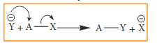 

Example: Hydrolysis of alkyl halides

$\ce{CH3Br ->[{aqeuous OH-}] CH3OH +BR-}$

_Aliphatic nucleophilic substitution reactions take places either by SN1or SN2 mechanism. Detailed study of the mechanisms is given in unit 14._

**Electrophilic Substitution**

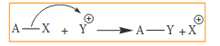

**Example: Nitration of Benzene**

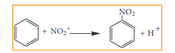

_Mechanism of aromatic electrophilic substitution reactions (EAS) is discussed in detail in unit 13._

**Free radical substitution** 


A- X + Y^{\cdot} \xrightarrow{} A-Y+X^{\cdot}



\mathrm{CH_4 + Cl^{\cdot} \rightarrow CH_3^{\cdot} + HCl}


Aliphatic electrophilic substitution

A general aliphatic electrophilic substitution is represented as


R- X + E^{\oplus} \rightarrow R - E + X^{\oplus}



R_2NH + NO^+ \rightarrow R_2N-NO + H^+


# Addition reactions

It is a characteristic reaction of an unsaturated compound (compounds containing C-C localised double or triple bond). In this reaction two molecules combine to give a single product. Like substitution this reaction also can be classified as nucleophilic, electrophilic and freeradical addition reactions depending the type of reagent which initiates the reaction. During the addition reaction the hydridisation of the substrate changes (from sp2 → sp3 in the addition reaction of alkenes or sp → sp2 in the addition reaction of alkynes) as only one bond breaks and two new bonds are formed.

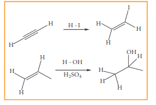

**Electrophilic Addition reaction**

A general electrophilic addition reaction can be represented as below.

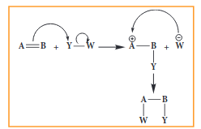

Brominatin of alkene to give bromo alkane is an example for this reaction.  

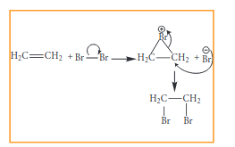

**Nucleophilic addition reaction**

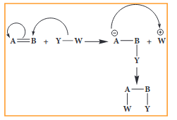

**Example:** addition of HCN to acetaldehyde

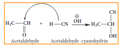

**Free radical addition Reaction:**

A General freeradical addition reaction can be represented as below.

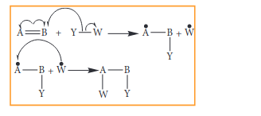

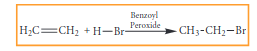

In the above reaction, Benzoyl peroxide acts as a radical initiator. The mechanism involves free radicals.

**Elimination reactions:**

In this reaction two substituents are eliminated from the molecule, and a new C=C double bond is formed between the carbon atoms to which the eliminated atoms/groups are previously attached. Elimination reaction is always accompanied with change in hybridisation.

**Example:** n-Propyl bromide on reaction with alcoholic KOH gives propene. In this reaction hydrogen and Br are eliminated.

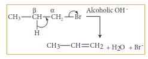

**Oxidation and reduction reactions:**

Many oxidation and reduction reactions of organic compounds fall into one of the four types of reaction that we already discussed but others do not. Most of the oxidation reaction of organic compounds involves gain of oxygen or loss of hydrogen Reduction involves gain of hydrogen and loss of oxygen.

**Examples:**

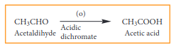

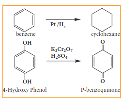

Apples contain an enzyme called polyphenol oxidase (PPO), also known as tyrosinase. Cutting an apple exposes its cells to the atmospheric oxygen and oxidizes the phenolic compounds present in apples. This is called the enzymatic browning that turns a cutapple brown. In addition to apples, enzymatic browning is also evident in bananas, pears, avocados and even potatoes
