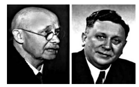

A chemical reaction can be treated as a process by which some existing bonds in nds are formed. i.e., in a chemical reaction, onversion involves one or more steps. A In d asch undergoes chemical change. The reagent ent like heat, photons etc., that brings about
more simple steps. Each step passes through of short lived intermediates or transition tively represent the chemical change, from sm of the reaction. The slowest step in the
mechanism determines the overall rate of the reaction.

# Fundamental concepts in organic reaction mechanism

The mechanism is the theoretical pathway which describes the changes occurring in each step during the course of the chemical change. An organic reaction can be understood by following the direction of flow of electrons and the type of intermediate formed during the course of the reaction. The direction of flow of electron is represented by curved arrow. The movement of a pair of electron is represented by a double headed arrow which starts from the negative and ends with the atom to which the electrons needs to be transferred.

# Fission of a covalent bond

All organic molecules contain covalent bonds which are formed by the mutual sharing of electrons between atoms. These covalent bonds break in two different ways, namely homolytic cleavage (symmetrical splitting) and heterolytic cleavage (unsymmetrical splitting). The cleavage of a bond in the substrate is influenced by the nature of the reagent (attacking agent).

**Homolytic Cleavage**

Homolytic cleavage is the process in which a covalent bond breaks symmetrically in such way that each of the bonded atoms retains one electron. It is denoted by a half headed arrow (fish hook arrow). This type of cleavage occurs under high temperature or in the presence of UV light in a compound containing non polar covalent bond formed between atoms of similar electronegativity. In such molecules, the cleavage of bonds results into free radicals. They are short lived and are highly reactive. The type of reagents that promote homolytic cleavage in substrate are called as free radical initiators. For example Azobisisobutyronitrile (AIBN) and peroxides such as benzoyl peroxide are used as free radical initiators in polymerisation reactions.

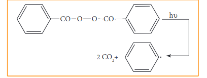

As a free radical with an unpaired electron is neutral and unstable, it has a tendency to gain an electron to attain stability. Organic reactions involve homolytic fission of C-C bonds to form alkyl free radicals. The stability of alkyl free radicals is in the following order

C(CH3)3 > C(CH3)2  > CH2CH3 > CH3

**Heterolytic Cleavage**

Heterolytic cleavage is the process in which a covalent bond breaks unsymmetrically such that one of the bonded atoms retains the bond pair of electrons. It results in the formation of a cation and an anion. Of the two bonded atoms, the most electronegative atom becomes the anion and the other atom becomes the cation. The cleavage is denoted by a curved arrow pointing towards the more electronegative atom.For example, in tert-butyl bromide, the C-Br bond is polar as bromine is more electronegative than carbon. The bonding electrons of the C-Br bond are attracted more by bromine than carbon. Hence, the C-Br undergoes heterolytic cleavage to form a tert-butyl cation during hydrolysis.

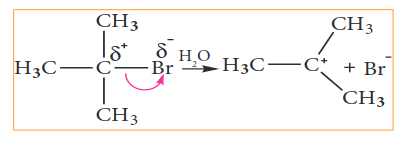

Let us consider the cleavage in a carbon-hydrogen (C-H) bond of aldehydes or ketones We know that the carbon is more electronegative than hydrogen and hence the heterolytic cleavage of C-H bonds results in the formation of carbanion (carbon bears a negative charge). For example in aldol condensation the OH- ion abstracts a α-hydrogen from the aldehyde, which leads to the formation of the below mentioned carbanion.

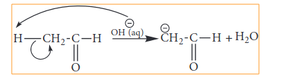

**Hybridisation of carbon in carbocation:**

In a carbocation, the carbon bearing positive charge is sp2 hybridised and hence it has a planar structure. In the reaction involving such a carbocation, the attack of a negatively charged species (nucleophiles) take place on either side of the carbocation as shown below.  

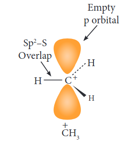

The carbanions are generally pyramidal in shape and the lone pair occupies one of the sp3 hybridised orbitals. An alkyl free radical may be either pyramidal or planar.

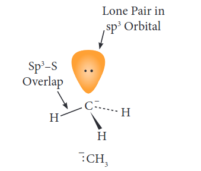

The relative stability of the alkyl carbocations and carbanions are given below.

Relative stability carbocations.

C(CH3)3 > CH(CH3)2  > CH2CH3 > CH3 

relative stability of carbanions

C(CH3)3  < CH(CH3)2  < CH2CH3 < CH3 

The energy required to bring about homolytic splitting is greater than that of heterolytic splitting.

| Types |Examples |Electron rich site |
|------|------|------|
| Neutral molecules having unshared pair of electron |Ammonia (NH ) and amines (RNH ) 3 2 |N: |
| Water (H O), alcohols (ROH) and ethers (R-O-R)2 |:O: |
| Hydrogen sulphide (H S) and thiols (RSH)2 |:S: |
| Negatively charged nucleophiles |Chlorides (Cl ), bromides (Br ) and iodides (I )– – – |X- |
| Hydroxide (HO ), alkoxide (RO ) and Carboxlate ions (RCOO )–  -– |O- |
| Cyanide (CN )– |N- |

Electrophiles are reagents that are attracted They are either positively charged ions or electro act as electrophiles. Neutral molecules like SnCl d-orbitals which can accommodate the electrons

| Types |Examples |Electron de¿cient  entity |
|------|------|------|
| Neutral electrophiles |Carbon dioxide (CO ), dichlorocarbene (:CCl )2 2 |C |
| Aluminium chloride (AlCl ), boron triÀuoride (BF ) and ferric chloride (FeCl )33 3 |Metal (M) |
| Positively charged electrophiles |Carbocations (R )+ |C+ |
| Proton (H )+ |H+ |
| Alkyl halides (RX) |X+ |
| Nitrosonium ion (NO )+ |O+ |
| Nitronium ion ( NO )+2 |N+ |

# Nucleophiles and elctrophiles

Nucleophiles are reagents that has high affinity for electro positive centers. They possess an atom has an unshared pair of electrons, and hence it is in search for an electro positive centre where it can have an opportunity to share its electrons to form a covalent bond, and gets stabilised. They are usually negatively charged ions or electron rich neutral molecules (contains one or more lone pair of electrons). All Lewis bases act as nucleophiles.Human body produces free radicals when it is exposed to x-rays, cigarette smoke, industrial chemicals and air pollutants. Free radicals can disrupt cell membranes, increase the risk of many forms of cancer, damage the interior lining of blood vessels and lead to a high risk of heart disease and stroke. Body uses vitamins and minerals to counter the effects of free radicals. Fruits contains antioxidants which decrease the effects of free radicals.

# Electron movement in organic reactions

All organic reactions can be understood by following the electron movements, i.e. the electron redistribution during the reaction. The electron movement depends on the nature of the substrate, reagent and the prevailing conditions. The flow of electrons is represented by curved arrows which show how electrons move as shown in the figure. These electron movements result in breaking or formation of a bond (sigma or pi bond). The movement of single electron is indicated by a half -headed curved arrows.

There are three types of electron movement viz.,

• lone pair becomes a bonding pair.

• bonding pair becomes a lone pair

• a bond breaks and becomes another bond.  

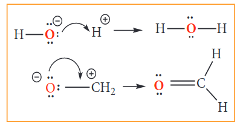

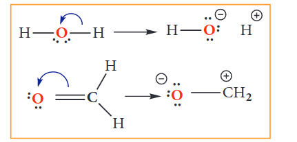

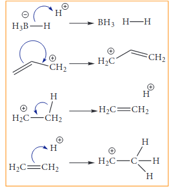

# Electron displacement effects in co-valent bonds

Some of the properties of organic molecules such as stability, reactivity,basicity etc., are affected by the displacement of electrons that takes place in its covalent bonds. This movement can be influenced by either the atoms/groups present in close proximity to the bond or when a reagent approaches a molecule. The displacement effects can either be permanent or a temporary. In certain cases, the electron displacement due to an atom or a substituent group present in the molecule cause a permanent polarisation of the bond and it leads to fission of the bond under suitable conditions. The electron displacements are catagorised into inductive effect (I), resonance effect (R), electromeric effect (E) and hyper conjugation.

**Inductive effect (I)**

Inductive effect is defined as the change in the polarisation of a covalent bond due to the presence of adjacent bonds, atoms or groups in the molecule. This is a permanent phenomenon.
Let us explain the inductive effect by considering ethane and ethylchloride as examples. The C-C bond in ethane is non polar while the C-C bond in ethyl chloride is polar. We know that chlorine is more electronegative than carbon, and hence it attracts the shared pair of electron between C-Cl in ethyl chloride towards itself. This develops a slight negative charge on chlorine and a slight positive charge on carbon to which chlorine is attached. To compensate it, the C1  draws the shared pair of electron between itself and C2 . This polarisation effect is called inductive effect. This effect is greatest for the adjacent bonds, but they also be felt farther away. However, the magnitude of the charge separation decreases rapidly, as we move away from C1  and is observed maximum for 2 carbons and almost insignificant after 4 bonds from the active group.

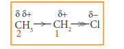

It is important to note that the inductive effect does not transfer electrons from one atom to another but the displacement effect is permanent. The inductive effect represents the ability of a particular atom or a group to either withdraw or donate electron density to the attached carbon. Based on this ability the substituents are classified as +I groups and -I groups. Their ability to release or withdraw the electron through sigma covalent bond is called +I effect and -I effect respectively.Highly electronegative atoms and groups with an atom carrying a positive charge are electron withdrawing groups or –I groups.

**Example: -F, -Cl, -COOH, -NO2 , -NH2 **

Higher the electronegativity of the substitutent, greater is the -I effect. The order of the –I effect of some groups are given below.

NH3 > NO2 > CN > SO3H > CHO > CO > COOH > COC1 > CONH2 > F > C1 > Br > I > OH > OR > NH2 > C6H5 > H

Highly electropositive atoms and atoms are groups which carry a negative charge are electron donating or +I groups.
Example. Alkali metals, alkyl groups such as methyl, ethyl, negatively charged groups such as CH3 O –, C2 H5 O–, COO– etc

Lesser the electronegativity of the elements, greater is the +I effect. The relative order of +I effect of some alkyl groups is given below

–C(CH3)3  > –CH(CH3)2  > –CH2CH3 > –CH3 

Let us understand the influence of inductive effect on some properties of organic compounds.

**Reactivity:**

When a highly electronegative atom such as halogen is attached to a carbon then it makes the C-X bond polar. In such cases the -I effect of halogen facilitates the attack of an incoming nucleophile at the polarised carbon, and hence increases the reactivity.

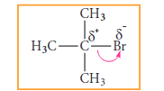

If a -I group is attached nearer to a carbonyl carbon, it decreases the availability of electron density on the carbonyl carbon, and hence increases the rate of the nucelophilic addition reaction.

**Acidity of carboxylic acids:**

When a halogen atom is attached to the carbon which is nearer to the carboxylic acid group, its -I effect withdraws the bonded electrons towards itself and makes the ionisation of H+ easy. The acidity of various chloro acetic acid is in the following order. The strength of the acid increases with increase in the -I effect of the group attached to the carboxyl group.

Trichloro acetic acid > Dichloro acetic acid > Chloro acetic acid > acetic acid

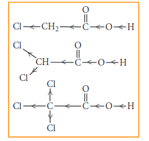

Similarly, the following order of acidity in the carboxylic acids is due to the +I effect of alkyl group.

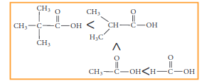

**Electromeric effect (E)**

Electromeric is a temporary effect which operates in unsaturated compounds (containing >C=C<, >C=O, etc...) in the presence of an attacking reagent.

Let us consider two different compounds (i) compounds containing carbonyl group (>C=O) and (ii) unsaturated compounds such as alkenes (>C=C< ).

When a nucleophile approaches the carbonyl compound, the **π** electrons between C and O is instantaneously shifted to the more electronegative oxygen. This makes the carbon electron deficient and thus facilitating the formation of a new bond between the incoming nucleophile and the carbonyl carbon atom.

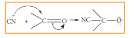

On the other hand when an electrophile such as H+ approaches an alkene molecule, the **π electrons** are instantaneously shifted to the electrophile and a new bond is formed between carbon and hydrogen. This makes the other carbon electron deficient and hence it acquires a positive charge.

The electromeric effect, is denoted as E effect. Like the inductive effect, the electromeric effect is also classified as +E and -E based on the direction in which the pair of electron is transfered to form a new bond with the attacking agent.

When the **π** electron is transferred towards the attacking reagent, it is called + E (positive electromeric) effect.

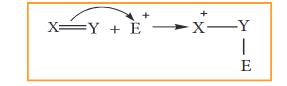

The addition of H+ to alkene as shown above is an example of +E effect.  

When the **π** electron is transfered away from the attacking reagent, it is called, -E (negative electromeric) effect

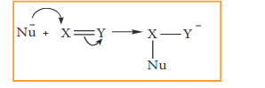

The attack of CN- on a carbonyl carbon, as shown above, is an example of -E effect.

**Resonance or Mesomeric effect**

The resonance is a chemical phenomenon which is observed in certain organic compounds possessing double bonds at a suitable position. Certain organic compounds can be represented by more than one structure and they differ only in the position of bonding and lone pair of electrons. Such structures are called resonance structures (canonical structures) and this phenomenon is called resonance. This phenomenon is also called mesomerism or mesomeric effect.

For example, the structure of aromatic compounds such as benzene and conjugated systems like 1,3-butadiene cannot be represented by a single structure, and their observed properties can be explained on the basis of a resonance hybrid.

In 1,3 buta diene, it is expected that the bond between C1-C2 and C3 –C4 should be shorter than that of C2-C3, but the observed bond lengths are of same. This property cannot be explained by a simple structure in which two π bonds localised between C1-C2 and C3–C4. Actually the π electrons are delocalised as shown below.

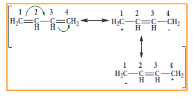

These resonating structures are called canonical forms and the actual structure lies between these three resonating structures, and is called a resonance hybrid. The resonance hybrid is represented as below.

Similar to the other electron displacement effect, mesomeric effect is also classified into positive mesomeric effect (+M or +R) and negative mesomeric effect (-M of -R) based on the nature of the functional group present adjacent to the multiple bond.

**Positive Mesomeric Effect:**

Positive resonance effect occurs, when the electrons move away from substituent attached to the conjugated system. It occurs, if the electron releasing substituents are attached to the conjugated system. In such cases, the attached group has a tendency to release electrons through resonance. These electron releasing groups are usually denoted as +R or +M groups.

 **Examples : -OH, -SH, -OR,-SR, -NH2, -O- etc.**

**Negative Mesomeric Effect**

Negative resonance effect occurs, when the electrons move towards the substituent attached to the conjugated system. It occurs if the electron withdrawing substituents are attached to the conjugated system. In such cases, the attached group has a tendency to withdraw electrons through resonance. These electron withdrawing groups are usually denoted as -R or -M groups. 

**Examples : NO2, >C=O, -COOH,- C**≡**N etc**

Resonance is useful in explaining certain properties such as acidity of phenol. The phenoxide ion is more stabilised than phenol by resonance effect(+M effect) and hence resonance favours ionisation of phenol to form H+ and shows acidity.

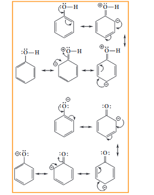

The above structures shows that there is a charge separation in the resonance structure of phenol which needs energy, where as there is no such hybrid structures in the case of phenoxide ion. This increased stability accounts for the acidic character of phenol.

**Hyper conjugation**

The delocalisation of electrons of **σ** bond is called as hyper conjugation. It is a special stabilising effect that results due to the interaction of electrons of a **σ**\-bond (usually **C-H** or **C-C**) with the adjacent, empty non-bonding p-orbital or an anti- bonding **σ\*** or **π\*-**orbitals resulting in an extended molecular orbital. Unlike electromeric effect, hyper conjugation is a permanent effect.

It requires an α-CH group or a lone pair on atom like N, O adjacent to a **π** bond (sp2 hybrid carbon). It occurs by the overlapping of the σ-bonding orbital or the orbital containing a lone pair with the adjacent π-orbital or p-orbital.

**Example 1:**

In propene, the _σ_\-electrons of C-H bond of methyl group can be delocalised into the _π_\-orbital of doubly bonded carbon as represented below.

In the above structure the sigma bond is involved in resonance and breaks in order to supply electrons for delocalisation giving rise to 3 new canonical forms. In the contributing canonical structures: (II), (III) & (IV) of propene, there is no bond between an α-carbon and one of the hydrogen atoms. Hence the hyperconjugation is also known as “no bond resonance” or “Baker-Nathan effect”. The structures (II), (III) & (IV) are polar in nature.

**Example 2:**

Hyper conjugation effect is also observed when atoms / groups having lone pair of electrons are attached by a single bond, and in conjugation with a π bond. The lone pair of electrons enters into resonance and displaces **π** electrons resulting in more than one structure

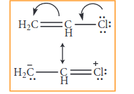

**Example 3:**

When electronegative atoms or group of atoms are in conjugation with a **π -**bond,they pull **π -** electrons from the multiple bond.

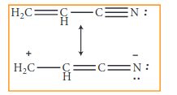

In case of carbocations, greater the number of alkyl groups attached to the carbon bearing positive charge, greater is number of the hyper conjugate structure. thus the stability of various carbocations decreases in the order
  

30Carbocation > 20Carbocation > 10Carbocation

