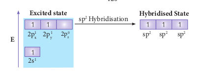
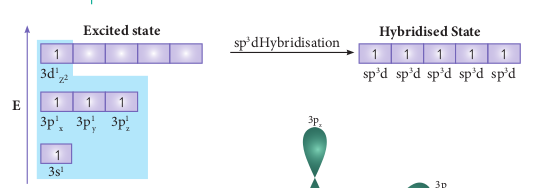
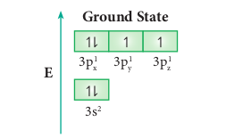

  

**10.9 Hybridisation**

Bonding in simple molecules such as hy on the basis of overlap of the respective ato the observed properties of polyatomic molec chloride etc... cannot be explained on the ba example, it was experimentally proved that m four C-H bonds are equivalent. This fact can atomic orbitals of hydrogen (1s) and the atom (2s2 2px2, 2py, 2pz).

In order to explain these observed fac atomic orbitals in the molecules are different fr the concept of hybridisation. Hybridisation is the same atom with comparable energy to for with same energy. The resultant orbitals are maximum symmetry and definite orientatio repulsion between their electrons .  

**idisation**

drogen and fluorine can easily be explained mic orbitals of the combining atoms. But ules such as methane, ammonia, beryllium sis of simple overlap of atomic orbitals. For

ethane has a tetrahedral structure and the not be explained on the basis of overlap of ic orbitals of carbon with different energies

ts, Linus Pauling proposed that the valence om those in isolated atom and he introduced the process of mixing of atomic orbitals of m equal number of new equivalent orbitals called hybridised orbitals and they posses n in space so as to minimize the force of

  

**10.9.1 Types of hybridisation and geometry of molecules**

**sp Hybridisation:**

Consider the bond formation in beryllium chloride. The ground state valence shell electronic configuration of Beryllium atom is \[He\]2s2 2p0

**Ground State**

**Excited state**

**Overlap with orbital of chlorine**

Each of the sp hybridized orbitals linear form a covalent bond between Be and Cl as sho

In BeCl2 both the Be-Cl bonds are equivalent and it was observed that the molecule is linear. VB theory explain this observed behaviour by sp hybridisation. One of the paired electrons in the 2s orbital gets excited to 2p orbital and the electronic configuration at the excited state is shown.

Now, the 2s and 2p orbitals hybridise and produce two equivalent sp hybridised orbitals which have 50 % s-character and 50 % p-character. These sp hybridised orbitals are oriented in opposite direction as shown in the figure.

**Hybridised State**

**Hybridisation : BeCl2**

Each of the sp hybridized orbitals linearly overlap with 3pz orbital of the chlorine to
form a covalent bond between Be and Cl as shown in the Figure.

  

**sp2 Hybridisation:** Consider the bond formation in boron trifluoride.The ground state valence shell electronic configuration of Boron atom is \[He\]2s2 2p1.

**Ground State**

**Excited state**

**Overlap with 2pz orbitals of fluorine:**

The three sp2 hybridised orbitals of boron now overlap with the 2pz orbitals of fluorine
(3 atoms). This overlap takes place along the axis as shown below.

**sp3 Hybridisation:**

sp3 hybridisation can be explained by considering methane as an example. In methane molecule the central carbon atom bound to four hydrogen atoms. The ground state valence shell electronic configuration of carbon is [He]2s2 2px1 2py1 2pz0.

**Ground State**

**Excited state**

**Fig 10.24 sp3 Hyb**  

In order to form four covalent bonds with the four hydrogen atoms, one of the paired electrons in the 2s orbital of carbon is promoted to its 2pz orbital in the excite state. The one 2s orbital and the three 2p orbitals of carbon mixes to give four equivalent sp3 hybridised orbitals. The angle between any two sp3 hybridised orbitals is 109⁰ 28'

**Overlap with 1s orbitals of hydrogen:**

The 1s orbitals of the four hydrogen atoms overlap linearly with the four sp3 hybridised orbitals of carbon to form four C-H σ-bonds in the methane molecule, as shown below.

**Hybridisation : CH4**

  

**sp3d Hybridisation:**

In the molecules such as PCl5, the central atom phosphorus is covalently bound to five chlorine atoms. Here the atomic orbitals of phosphorous undergoes sp3d hybridisation which involves its one 3s orbital, three 3p orbitals and one vacant 3d orbital (dz2). The ground state electronic configuration of phosphorous is [Ne]3s2 3px2 3py1 3pz1.

**Ground State**

**Excited state**

**Fig 10.25 sp3d Hyb**  

One of the paired electrons in the 3s orbital of phosphorous is promoted to one of its vacant 3d orbital (dz2) in the excite state. One 3s orbital, three 3p orbitals and one 3dz2 orbital of phosphorus atom mixes to give five equivalent sp3d hybridised orbitals. The orbital geometry of sp3d hybridised orbitals is trigonal bi-pyramidal as shown in the figure 10.25.

**Overlap with 3pz orbitals of chlorine:**

The 3pz orbitals of the five chlorine atoms linearly overlap along the axis with the five sp3d hybridised orbitals of phosphorous to form the five P-Cl σ-bonds, as shown below.

**sp3d2 Hybridisation:**

In sulphur hexafluoride (SF6) the central atom sulphur extend its octet to undergo sp3d2 hybridisation to generate six sp3d2 hybridised orbitals which accounts for six equivalent S-F bonds. The ground state electronic configuration of sulphur is \[Ne\]3s2 3px2 3py1 3pz1.

One electron each from 3s orbital and 3p orbital of sulphur is promoted to its two vacant 3d orbitals (dz2 and dx2-y2) in the excite state. A total of six valence orbitals from sulphur (one 3s orbital, three 3p orbitals and two 3d orbitals) mixes to give six equivalent sp3d2 hybridised orbitals. The orbital geometry is octahedral as shown in the figure.

**Overlap with 2pz orbitals of fluorine:**

The six sp3d2 hybridised orbitals of sulphur overlaps linearly with 2pz orbitals of six fluorine atoms to form the six S-F bonds in the sulphur hexafluoride molecule.

<h style="color:skyblue">Bonding in Ethylene:</h>

The bonding in ethylene can be explained using hybridisation concept. The molecular formula of ethylene is C2H4. The valency of carbon is 4. The electronic configuration of valence shell of carbon in ground state is \[He\]2s2 2px1 2py1 2pz0. To satisfy the valency of carbon promote an electron from 2s orbital to 2pz orbital in the excited state.

 In ethylene both the carbon atoms undergoes
sp2 hybridisation involving 2s, 2px and 2py
orbitals, resulting in three equivalent sp2
hybridised orbitals lying in the xy plane
at an angle of 1200 to each other. The
unhybridised 2pz orbital lies perpendicular
to the xy plane.
  <h style="color:skyblue">Formation of sigma bond:</h>
 One of the sp2 hybridised orbitals of each
carbon lying on the molecular axis (x-axis)
linearly overlaps with each other resulting
in the formation a C-C sigma bond. Other
two sp2 hybridised orbitals of both carbons
linearly overlap with the four 1s orbitals
of four hydrogen atoms leading to the
formation of two C-H sigma bonds on each
carbon.
 
  <h style="color:skyblue">**Formation of Pi (π ) bond:**</h>
 The unhybridised 2pz orbital of both carb not in the molecular axis. This lateral overlap result in the formation a pi(π) bond between
the two carbon atoms as shown in the figure.
 

<h style="color:skyblue">**Bonding in acetylene:**</h>
 Similar to ethylene, the bonding in acetylene
can also be explained using hybridisation
concept. The molecular formula of acetylene is C2H2. The electronic configuration of valence shell of carbon in ground state is [He]2s2 2px1 2py1 2pz0. To satisfy the valency of carbon promote an electron from 2s orbital to 2pz orbital in the excited state.
 In acetylene molecule, both the carbon atoms are in sp hybridised state.The 2s and 2px orbitals, resulting in two equivalent sp hybridised orbitals lying in a straight line along the molecular axis (x-axis). The unhybridised 2py and 2pz orbitals lie perpendicular to the molecular axis.