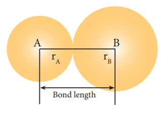
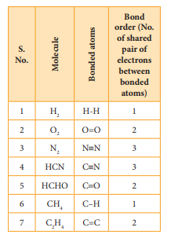
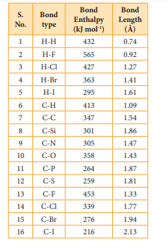
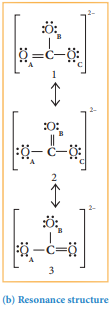
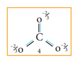
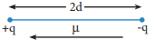
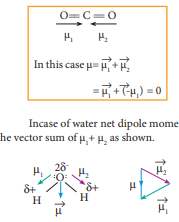

  

**10.5 Bond parameters**

A covalent bond is characterised by parameters such as bond length, bond angle, bond order etc... A brief description of some of the bond parameters is given below.

**10.5.1 Bond length**

The distance between the nuclei of the two covalently bonded atoms is called bond length. Consider a covalent molecule A-B. The bond length is given by the sum of the radii of the bonded atoms (rA + rB). The length of a bond can be determined by spectroscopic, x-ray diffraction and electron-diffraction techniques The bond length depends on the size of the atom and the number of bonds (multiplicity) between the combining atoms.

Bond length

**Fig 10. 13 Bond length of covalent molecule A–B**

Greater the size of the atom, greater will be the bond length. For example, carbon-carbon single bond length (1.54 Å) is longer than the carbon-nitrogen single bond length (1.43 Å).

Increase in the number of bonds between the two atoms decreases the bond  

length. For example, the carbon-carbon single bond is longer than the carbon- carbon double bond (1.33 Å) and the carbon-carbon triple bond (1.20 Å).

**10.5.2 Bond order**

The number of bonds formed between the two bonded atoms in a molecule is called the bond order. In Lewis theory, the bond order is equal to the number of shared pair of electrons between the two bonded atoms. For example in hydrogen molecules, there is only one shared pair of electrons and hence, the bond order is one. Similarly, in H2O, HCl, Methane, etc the central atom forms single bonds with bond order of one.

**Table 10.2 Bond order of some common bonds:**

**10.5.3 Bond angle**

Covalent bonds are directional in nature and are oriented in specific directions in space. This directional nature creates a fixed angle between two covalent bonds in a molecule and this angle is termed as bond angle. It is usually expressed in degrees. The bond angle can be determined by spectroscopic methods and it can give some idea about the shape of the molecule.

**Table 10.3 Bond angles for some common molecules**

1 CH4 H-C-H 109⁰ 28'

2 NH3 H-N-H 107⁰ 18'

3 H2O H-O-H 104⁰ 35'

**10.5.4 Bond enthalpy**

The bond enthalpy is defined as the minimum amount of energy required to break one mole of a particular bond in molecules in their gaseous state. The unit of bond enthalpy is kJ mol-1. Larger the bond enthalpy, stronger will be the bond. The bond energy value depends on the size of the atoms and the number of bonds between the bonded atoms. Larger the size of the atom involved in the bond, lesser is the bond enthalpy.

In case of polyatomic molecules with, two or more same bond types, in the term average bond enthalpy is used. For such  

bonds, the arithmetic mean of the bond energy values of the same type of bonds is considered as average bond enthalpy. For example in water, there are two OH bonds present and the energy needed to break them are not same. H2O(g)→H(g)+OH(g) ΔH1 = 502 kJ mol-1

OH(g)→H(g)+O(g) ΔH2 = 427 kJ mol-1

The average bond enthalpy of OH

bond in water = 502+427 2

\= 464.5 kJ mol-1

**Table 10.4 Bond lengths and bond enthalpies of some common bonds:**

  

**10.5.5 Resonance**

When we write Lewis structures for a molecule, more than one valid Lewis structures are possible in certain cases. For example let us consider the Lewis structure of carbonate ion \[CO3\]2

The skeletal structure of carbonate ion (The oxygen atoms are denoted as OA, OB & OC

Total number of valence electrons = \[1 x 4(carbon)\] + \[3 x 6 (oxygen)\] + \[2 (charge)\] = 24 electrons.

Distribution of these valence electrons gives us the following structure.

Complete the octet for carbon by moving a lone pair from one of the oxygens (OA) and write the charge of the ion (2-) on the upper right side as shown in the figure.

**Fig 10. 14 (a) Lewis Structure of \[CO3\]2**

In this case, we can draw twoadditional Lewis structures by moving the lone pairs from the other two oxygens  

(OB and OC) thus creating three similar structures as shown below in which the relative position of the atoms are same. They only differ in the position of bonding and lone pair of electrons. Such structures are called resonance structures (canonical structures) and this phenomenon is called resonance.

**Fig 10. 14 (b) Resonance structures of \[CO3\]2**

It is evident from the experimental results that all carbon-oxygen bonds in carbonate ion are equivalent. The actual structure of the molecules is said to be the resonance hybrid, an average of these three resonance forms. It is important to note that carbonate ion does not change from one structure to another and vice versa. It is not possible to picturise the resonance hybrid by drawing a single Lewis structure. However, the following structure gives a qualitative idea about the correct structure.

  

**Fig 10. 14 (c) Resonance Hybrid structures of \[CO3\]2**

It is found that the energy of the resonance hybrid (structure 4) is lower than that of all possible canonical structures (Structure 1, 2 & 3). The difference in energy between structure 1 or 2 or 3, (most stable canonical structure) and structure 4 (resonance hybrid) is called resonance energy.

4) Write the resonance structures for

i) Ozone molecule ii) N2O

?**Evaluate Yourself**

**10.5.6 Polarity of Bonds**

**Partial ionic character in covalent bond:**

When a covalent bond is formed between two identical atoms (as in the case of H2, O2, Cl2 etc...) both atoms have equal tendency to attract the shared pair of electrons and hence the shared pair of electrons lies exactly in the middle of the nuclei of two atoms. However, in the case of covalent bond formed between atoms having different electronegativities, the atom with higher electronegativity will have greater tendency to attract the shared pair of electrons more towards itself than the other atom. As a result the cloud of shared electron pair gets distorted.

Let us consider the covalent bond between hydrogen and fluorine in hydrogen  

fluoride. The electronegativities of hydrogen and fluorine on Pauling's scale are 2.1 and 4 respectively. It means that fluorine attracts the shared pair of electrons approximately twice as much as the hydrogen which leads to partial negative charge on fluorine and partial positive charge on hydrogen. Hence, the H-F bond is said to be polar covalent bond.

Here, a very small, equal and opposite charges are separated by a small distance (91 pm) and is referred to as a dipole.

**Dipole moment:**

The polarity of a covalent bond can be measured in terms of dipole moment which is defined as

μ = q × 2d

Where μ is the dipole moment, q is the charge and 2d is the distance between the two charges. The dipole moment is a vector and the direction of the dipole moment vector points from the negative charge to positive charge.

**+**q **\-**q 2d μ

**Fig 10. 15 Representation of Dipole**

The unit for dipole moment is columb meter (C m). It is usually expressed in Debye unit (D). The conversion factor is 1 Debye = 3.336 x 10 -30 C m

Diatomic molecules such as H2, O2, F2 etc... have zero dipole moment and are called non polar molecules and molecules such as HF, HCl, CO, NO etc... have non zero dipole moments and are called polar molecules.

  

Molecules having polar bonds will not necessarily have a dipole moment. For example, the linear form of carbon dioxide has zero dipole moment, even though it has two polar bonds. In CO2, the dipole moments of two polar bonds (CO) are equal in magnitude but have opposite direction. Hence, the net dipole moment of the CO2 is, μ = μ1 + μ2 = μ1 + zx (-μ1) = 0

O== C == O

μ1 μ2

In this case μ= μ1 + μ2

\= μ1 + (-μ1) = 0

Incase of water net dipole moment is the vector sum of μ1+ μ2 as shown.

**Fig 10. 16 Dipole moment in water**

zDipole moment in water is found to be 1.85D

1

**Table 10. 5 Dipole moments of common molecules**

**S. No. Molecule Dipole moment**

**(in D)**

1 HF 1.91

2 HCl 1.03

3 H2O 1.85

4 NH3 1.47

5 CHCl3 1.04  

The extent of ionic character in a covalent bond can be related to the electro negativity difference to the bonded atoms. In a typical polar molecule, Aδ--Bδ+, the electronegativity difference (χA- χB) can be used to predict the percentage of ionic character as follows.

If the electronegativity difference (χA- χB ), is

equal to 1.7, then the bond A-B has 50% ionic character

if it is greater than 1.7, then the bond A-B has more than 50% ionic character,

and if it is lesser than 1.7, then the bond A-B has less than 50% ionic character.
2w
5) Of the two molecules OCS and CS2 which one has higher dipole moment value? why?

?**Evaluate Yourself**

**Partial covalent character in ionic bonds:** Like the partial ionic character in covalent compounds, ionic compounds show partial covalent character. For example, the ionic compound, lithium chloride shows covalent character and is soluble in organic solvents such as ethanol.

The partial covalent character in ionic compounds can be explained on the basis of a phenomenon called polarisation. We know that in an ionic compound, there is an electrostatic attractive force between the cation and anion. The positively charged cation attracts the valence electrons of anion while repelling the nucleus. This causes a distortion in the electron cloud of the anion and its electron density drifts towards the cation, which results in some sharing of the

| . No. |Mole cule |Dipole moment (in D) |
|------|------|------|
| 1 |HF |1.91 |
| 2 |HCl |1.03 |
| 3 |H O2 |1.85 |
| 4 |NH3 |1.47 |
| 5 |CHCl3 |1.04 |
  

valence electrons between these ions. Thus, a partial covalent character is developed between them. This phenomenon is called polarisation.

The ability of a cation to polarise an anion is called its polarising ability and the tendency of an anion to get polarised is called its polarisability. The extent of polarisation in an ionic compound is given by the Fajans rules

**Fajans Rules** (i) To show greater covalent character, both

the cation and anion should have high charge on them. Higher the positive charge on the cation, greater will be the attraction on the electron cloud of the anion. Similarly higher the magnitude of negative charge on the anion, greater is its polarisability. Hence, the increase in charge on cation or in anion increases the covalent character

Let us consider three ionic compounds aluminum chloride, magnesium chloride and sodium chloride. Since the charge of the cation increase in the order Na+ < Mg2+ < Al3+, the covalent character also follows the same order NaCl < MgCl2 < AlCl3.

(ii) The smaller cation and larger anion show greater covalent character due to the greater extent of polarisation.

Lithium chloride is more covalent than sodium chloride. The size of Li+ is smaller than Na+ and hence the polarising power of Li+ is more. Lithium iodide is more covalent than lithium chloride as the size of I- is larger than the Cl- . Hence I- will be more polarised than Cl- by the cation, Li+ .  

(iii) Cations having ns2 np6 nd10 configuration show greater polarising power than the cations with ns2 np6 configuration. Hence, they show greater covalent character.

CuCl is more covalent than NaCl. Compared to Na+ (1.13 Å) . Cu+ (0.6 Å) is small and have 3s2 3p6 3d10 configuration.

Electronic configuration of Cu+ \[Ar\] 3d10

Electronic Configuration of Na+ \[He\] 2s2, 2p6
