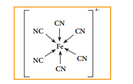
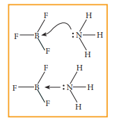

  

**10.4 Coordinate covalent bond**

In the formation of a covalent bond, both the combining atoms contribute one electron each and these electrons are mutually shared among them. However, in certain bond formation, one of the combining atoms donates a pair of electrons i.e. two electrons which are necessary for the covalent bond formation, and these electrons are shared by both the combining atoms. These type of bonds are called coordinate  

covalent bond or coordinate bond. The combining atom which donates the pair of electron is called a donor atom and the other atom an acceptor atom. This bond is denoted by an arrow starting from the donor atom pointing towards the acceptor atom. (Later in coordination compound, we will refer the donor atom as ligand and the acceptor atom as central-metal atom/ion.

For Example, in ferrocyanide ion \[Fe(CN)6\]

**Fig 10. 11 Structure of Ferrocyanide ion**

In certain cases, molecules having a lone pair of electrons such as ammonia donates its pair to an electron deficient molecules such as BF3. to form a coordinate

**Fig 10. 12 Structure of BF3** → **NH3**

