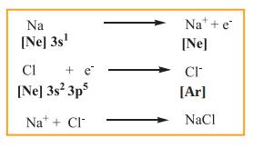

  

**10.1 Introduction**

iamond is very hard while its allotrope is very soft. Gases like hydrogen and oxygen mic while the inert gases are monoatomic.

**l Bonding**

  

Carbon combines with chlorine to form carbon tetrachloride, which is a liquid and insoluble (immiscible) in water. Sodium combines with chlorine atom to form sodium chloride, a hard and brittle compound that readily dissolves in water. The possible reason for these observations lies in the type of interaction that exists between the atoms of these molecules and these interactions are responsible for holding the atoms/ions together. The interatomic attractive forces which hold the constituent atoms/ions together in a molecule are called chemical bonds.

Why do atoms combine only in certain combinations to form molecules? For example oxygen combines with hydrogen to give water (H2O) and with carbon it gives carbon dioxide (CO2). The structure of water is ‘V’ shaped while that of the carbon dioxide is linear. Such questions can be answered using the principles of chemical bonding. In this unit we will analyse the various theories and their principles, which were developed over the years to explain the nature of chemical bonding.

**10.1.1 Kossel – Lewis approach to chemical bonding**

A logical explanation for chemical bonding was provided by Kossel and Lewis in 1916. Their approach to chemical bonding is based on the inertness of the noble gases which have little or no tendency to combine with other atoms. They proposed that the noble gases are stable due to their completely filled outer shell electronic configuration. Elements other than noble gases, try to attain the completely filled electronic configurations by losing, gaining  

or sharing one or more electrons from their outer shell. For example, sodium loses one electron to form Na+ ion and chlorine accepts that electron to give chloride ion (Cl–), enabling both atoms to attain the nearest noble gas configuration. The resultant ions, Na+ and Cl- are held together by electrostatic attractive forces and the attractive force is called a chemical bond, more specifically an electrovalent bond.

**\[Ar\]**

G. N. Lewis proposed that the attainment of stable electronic configuration in molecules such as diatomic nitrogen, oxygen etc… is achieved by mutual sharing of the electrons. He introduced a simple scheme to represent the chemical bond and the electrons present in the outer shell of an atom, called Lewis dot structure. In this scheme, the valence electrons (outer shell electrons) of an element are represented as small dots around the symbol of the element. The first four valence electrons are denoted as single dots around the four sides of the atomic symbol and then the fifth onwards, the electrons are denoted as pairs. For example, the electronic configuration of nitrogen is 1s2, **2s2, 2p3**. It has 5 electrons in its outer shell (valence shell). The Lewis structure of nitrogen is as follows.

**N Fig 10.1 Lewis Structure of Nitrogen atom**

Similarly, Lewis dot structure of carbon, oxygen can be drawn as shown below.

  

**C O**

**Fig 10.2 Lewis Structures of C & O atoms**

Only exception to this is helium which has only two electrons in its valence shell which is represented as a pair of dots (duet).

**He Fig 10.3 Lewis Structures of He atom**

**Octet rule**

The idea of Kossel – Lewis approach to chemical bond lead to the octet rule, which states that “**_the atoms transfer or share electrons so that all atoms involved in chemical bonding obtain 8 electrons in their outer shell (valence shell)_**”.

