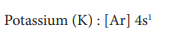
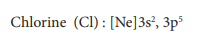

 
**10.3 Ionic or electrovalent bond**

When the electronegativity difference between the two combining atoms is large, the least electronegative atom completely transfers one or more of its valence electrons to the other combining atom so that both atoms can attain the nearest inert gas electronic configuration. The complete transfer of electron leads to the formation of a cation and an anion. Both these ions are held together by the electrostatic attractive force which is known as ionic bond.

Let us consider the formation potassium chloride. The electronic configuration of potassium and chlorine are

Potassium has one electron in its valence shell and chlorine has seven electron in its valence shell. By loosing one electron potassium attains the inert gas electronic configuration of argon and becomes a unipositive cation (K+) and chlorine accepts this electron to become uninegative chloride ion (Cl–) there by attaining the stable electronic configuration of argon. These two ions combine to form an ionic crystal in which they are held together by electrostatic attractive force. The energy required for the formation of one mole of K+ is 418.81 kJ (ionization energy) and the energy released during the formation of one mole of Cl- is -348.56 kJ (electron gain enthalpy). The sum of these two energies is positive (70.25 kJ) However, during the formation of one mole potassium chloride crystal from its constituent ions, 718 kJ energy is released. This favours the formation of KCl and its stability.

3) Explain the ionic bond formation in MgO and CaF2

?**Evaluate Yourself**
