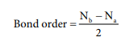
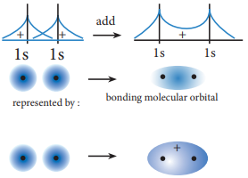
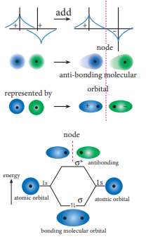

  

**10.10 Molecular orbital theory**

Lewis concept and valence bond theory qualitatively explains the chemical bonding and molecular structure. Both approaches are inadequate to describe some of the observed properties of molecules. For example, these theories predict that oxygen is diamagnetic. However, it was observed that oxygen in liquid form was attracted towards the poles of strong magnet, indicating that oxygen is paramagnetic. As both these theories treated the bond formation in terms of electron pairs and hence they fail to explain the bonding nature of paramagnetic molecules. F. Hund and Robert. S. Mulliken developed a bonding theory called molecular orbital theory which explains the magnetic behaviour of molecules.

**The salient features of Molecular orbital Theory (MOT):**

1\. When atoms combines to form molecules, their individual atomic orbitals lose their identity and forms new orbitals called molecular orbitals.

2\. The shapes of molecular orbitals depend upon the shapes of combining atomic orbitals.  

3\. The number of molecular orbitals formed is the same as the number of combining atomic orbitals. Half the number of molecular orbitals formed will have lower energy than the corresponding atomic orbital, while the remaining molecular orbitals will have higher energy. The molecular orbital with lower energy is called bonding molecular orbital and the one with higher energy is called anti-bonding molecular orbital. The bonding molecular orbitals are represented as σ (Sigma), π (pi), δ (delta) and the corresponding antibonding orbitals are denoted as σ\*, π\* and δ\*.

4\. The electrons in a molecule are accommodated in the newly formed molecular orbitals. The filling of electrons in these orbitals follows Aufbau's principle, Pauli's exclusion principle and Hund's rule as in the case of filling of electrons in atomic orbitals.

5\. Bond order gives the number of covalent bonds between the two combining atoms. The bond order of a molecule can be calculated using the following equation

Bond order Nb

Where,

Nb = Total number of electrons present in the bonding molecular orbitals

Na = Total number of electrons present in the antibonding molecular orbitals and

A bond order of zero value indicates that the molecule doesn't exist.

  

**10.10.1 Linear combination of atomic orbitals**

The wave functions for the molecular orbitals can be obtained by solving Schrödinger wave equation for the molecule. Since solving the Schrödinger equation is too complex, approximation methods are used to obtain the wave function for molecular orbitals. The most common method is the linear combination of atomic orbitals (LCAO).

We know that the atomic orbitals are represented by the wave function Ψ. Let us consider two atomic orbitals represented by the wave function ψA and ψB with comparable energy, combines to form two molecular orbitals. One is bonding molecular orbital(ψbonding) and the other is antibonding molecular orbital(ψantibonding). The wave functions for these two molecular orbitals can be obtained by the linear combination of the atomic orbitals ψA and ψB as below.

ψbonding = ψA + ψB

ψantibonding = ψA - ψB

The formation of bonding molecular orbital can be considered as the result of constructive interference of the atomic orbitals and the formation of anti-bonding molecular orbital can be the result of the destructive interference of the atomic orbitals. The formation of the two molecular orbitals from two 1s orbitals is shown below.  

Constructive interaction: The two 1s orbitals are in phase and have the same sign.

bonding molecular orbital

σ bonding MO

represented by :

**Destructive interaction The two 1s Orbitals are out phase**

anti-bonding molecular

**Fig 10.29 Linear Combination of atomic orbitals**

  

**10.10.2 Bonding in some Homonuclear di-ato**

Atomic orbitals of hydrogen

Molecular orbitals of H2

**Fig 10.31 MO Diagram for Li2 molecule**

Atomic orbitals

of lithium

En er

gy

2s 2s

σ2 \* s

σ2s

Atomic orbitals of

boron Molecular orbitals of B2

Atomic orbitals of boron

**Fig 10.32 MO Diagram for B2 molecule**

En er

gy

π2 \* py

π2py π2pz

π2 \* pz

2px 2px2py 2py2pz 2pz

2s 2s

σ2 \* px

σ2 \* s

σ2s

σ2px

**Fig 10.30 MO Diagram for H2 molecule**  

**mic molecules:**

**Molecular orbital diagram of hydrogen molecule (H2)** Electronic configuration of H atom is 1s1

Electronic configuration of H2 molecule σ1s

2

Nb – Na

2Bond order = 2 2 – 0= = 1

Molecule has _no unpaired electrons._ Hence, it is **diamagnetic**.

**Molecular orbital diagram of lithium molecule (Li2)** Electronic configuration of Li atom is **1s2 2s1**

Electronic configuration of Li2 molecule σ1s

2, σ\* 1s 2 , σ2

2s Nb – Na

2Bond order = 2 4 – 2= = 1

Molecule has _no unpaired electrons._ Hence it is **diamagnetic**.

**Molecular orbital diagram of boron molecule (B2)**

Electronic configuration of B atom is **1s2 2s2 2p1**

Electronic configuration of B2 molecule σ1s

2, σ\* 1s 2 , σ2

2s, σ \*2 2s , π

1 2py , π

1 2pz

Nb – Na

2 Bond order = 2

6 – 4= = 1

Molecule has _two unpaired electrons. H_ence it is **paramagnetic.**

| σ*1s |
|------|------|------|------|------|

| 1sAtomic |

| σ*2s |
|------|------|------|------|------|

| 2 |

| σ2*px |
|------|------|------|------|------|
| π2 |π*py 2*pz |
| 2p 2px y z |
| 2 |
| σ2px |

| σ |2*s |
|------|------|------|------|------|
| s |
| 2A |
  

**M m** E **1** E σ

B

M it

Atomic orbitals of

carbon Molecular

orbitals of C2

Atomic orbitals

of carbon

En er

gy

π2 \* py

π2py π2pz

π2 \* pz

2px 2px2py 2py2pz 2pz

2s 2s

σ2 \* px

σ2 \* s

σ2s

σ2px

**Fig 10.33 MO Diagram for C2 molecule**

Atomic orbitals of nitrogen

Molecular orbitals of N2

Atomic orbitals

of nitrogen

En er

gy π2 \* py

π2py π2pz

π2 \* pz

2px 2px2py 2py2pz 2pz

2s 2s

σ2 \* px

σ2 \* s

σ2s

σ2px

**M m**

E **1**

E σ

B

M it

**Fig 10.34 MO Diagram for N2 molecule**

**M m**

E **1**

E σ

B

M it

Atomic orbitals of oxygen

Molecular orbitals of O2

Atomic orbitals of oxygen

En er

gy

π2 \* py

π2 \* pz

2px 2px2 p y 2 p y2pz 2pz

2 s 2 s

σ2 \* px

σ2 \* s

σ2s

σ2px

π2py π2pz

**Fig 10.35 MO Diagram for O2 molecule**  

**olecular orbital diagram of carbon olecule (C2)**

lectronic configuration of C atom is **s2 2s2 2p2**

lectronic configuration of C2 molecule 1s

2, σ\* 1s 2 , σ2

2s, σ \*2 2s , π

2 2py , π

2 2pz

Nb – Na

2 ond order = 2

8 – 4= = 2

olecule has _no unpaired electrons._ Hence, is **diamagnetic.**

**olecular orbital diagram of nitrogen olecule (N2)**

lectronic configuration of N atom is **s2 2s2 2p3**

lectronic configuration of N2 molecule 1s

2, σ\* 1s 2 , σ2

2s, σ \*2 2s , π

2 2py , π

2 2pz σ2

2px Nb – Na

2 ond order = 2

10 – 4= = 3

olecule has _no unpaired electrons._ Hence, is **diamagnetic.**

**olecular orbital diagram of oxygen olecule (O2)**

lectronic configuration of O atom is **s2 2s2 2p4**

lectronic configuration of O2 molecule 1s

2, σ\* 1s 2 , σ2

2s, σ \*2 2s , σ

2 2px

π2 2py , π

2 2pz, π\*1

2py , π\*1 2pz,

Nb – Na

2 ond order = 2

10 – 6= = 2

olecule has _two unpaired electrons._ Hence, is **paramagnetic**.

| σ2*px |
|------|------|------|------|------|------|
| π π2*py 2*pz |
| 2px |2py z |
| 2 |
| σ2px |

| σ2*s |
|------|------|------|------|------|
| s |
| 2 |

| σ2*px |
|------|------|------|------|------|------|------|
| π π2*py 2*pz |
| 2px |2py z |
| 2p 2p 2px y |
| σ2px |

| σ2*s |
|------|------|------|------|------|
| s |
| 2A |

| σ2*px |
|------|------|------|------|------|------|------|
| π π2*py 2*pz |
| p 2 px |2py z |
| 2p 2 p 2px y |
| π π2py 2p z |

| σ2*s |
|------|------|------|------|------|
| smic |
| A |2tom |
  

**10.10.3 Bonding in some Heteronucleardi-ato**

Atomic orbitals of

carbon

Molecular orbitals of CO

Atomic orbitals

of oxygen

En er

gy

π2 \* py

π2py π2pz

π2 \* pz

2px 2px

2py 2py

2pz 2pz

2s 2s

σ2 \* px

σ2 \* s

σ2s

σ2px

**Fig 10.36 MO Diagram for CO molecule**

Atomic orbitals of nitrogen

Molecular orbitals of NO

Atomic orbitals

of oxygen

En er

gy

π2 \* py

π2py π2pz

π2 \* pz

2px 2px

2py 2py

2pz 2pz

2s 2s

σ2 \* px

σ2 \* s

σ2s

σ2px

**Fig 10.36 MO Diagram for NO molecule**

10) Draw the MO diagram for acetylide ion C ?**Evaluate Yourself**  

**mic molecules**

Molecular orbital diagram of Carbon monoxide molecule (CO) Electronic configuration of C atom is **1s2 2s2 2p2**

Electronic configuration of O atom is **1s2 2s2 2p4**

Electronic configuration of CO molecule σ1s

2, σ\* 1s 2 , σ2

2s, σ \*2 2s , π

2 2py , π

2 2pz, σ

2 2px

Nb – Na

2 Bond order = 2

10 – 4= = 3

Molecule has _no unpaired electrons._ Hence, it is **diamagnetic**.

**Molecular orbital diagram of Nitric oxide molecule (NO)**

Electronic configuration of N atom is **1s2 2s2 2p3**

Electronic configuration of O atom is **1s2 2s2 2p4**

Electronic configuration of NO molecule σ1s

2, σ\* 1s 2 , σ2

2s, σ \*2 2s , π

2 2py , π

2 2pz, σ

2 2px π

\*1 2py

Nb – Na

2 Bond order = 2

10 – 5= = 2.5

Molecule has _one unpaired electron._ Hence, it is **paramagnetic**.

2 2– and calculate its bond order.

| σ2*px |
|------|------|------|------|------|
| π π2*py 2*pz |
| σ2px |

| σ2*s |
|------|------|------|------|------|------|------|
| s |
| 2 |

| σ2*px |
|------|------|------|------|------|------|
| π π2*py 2*pz |
| σ2px |

| σ2*s |
|------|------|------|------|------|------|
| s |
| 2 |
  

**Metallic bonding**

Metals have some special properties of lustre, high density, high electrical and thermal conductivity, malleability and ductility, and high melting and boiling points. The forces that keep the atoms of the metal so closely in a metallic crystal constitute what is generally known as the metallic bond. The metallic bond is not just an electrovalent bond(ionic bond), as the latter is formed between atoms of different electro negativities. Similarly, the metallic bond is not a covalent bond,as the metal atoms do not have sufficient number of valence electrons for mutual sharing with 8 or 12 neighboring metal atoms in a crystal. So, we have to search for a new theory to explain metallic bond. The first successful theory is due to Drude and Lorentz, which regards metallic crystal as an assemblage of positive ions immersed in a gas of free electrons. The free electrons are due to ionization of the valence electrons of the atoms of the metal. As the valence electrons of the atoms are freely shared by all the ions in the crystal, the metallic bonding is also referred to as electronic bonding. As the free electrons repel each other, they are uniformly distributed around the metal ions. Many physical properties of the metals can be explained by this theory, nevertheless there are exceptions.

The electrostatic attraction between the metal ions and the free electrons yields a three-dimensional close packed crystal with a large number of nearest metal ions. So, metals have high density. As the close packed structure contains many slip planes along which movement can occur during mechanical loading, the metal acquires  

ductility. Pure metals can undergo 40 to 60% elongation prior to rupturing under mechanical loading. As each metal ion is surrounded by electron cloud in all directions, the metallic bonding has no directional properties.

As the electrons are free to move around the positive ions, the metals exhibit high electrical and thermal conductivity. The metallic luster is due to reflection of light by the electron cloud. As the metallic bond is strong enough, the metal atoms are reluctant to break apart into a liquid or gas, so the metals have high melting and boiling points.

The bonding in metal is better treated by Molecular orbital theory. As per this theory, the atomic orbitals of large number of atoms in a crystal overlap to form numerous bonding and antibonding molecular orbitals without any band gap. The bonding molecular orbitals are completely filled with an electron pair in each, and the antibonding molecular orbitals are empty. Absence of band gap accounts for high electrical conductivity of metals. High thermal conductivity is due to thermal excitation of many electrons from the valence band to the conductance band. With an increase in temperature, the electrical conductivity decreases due to vigorous thermal motion of lattice ions that disrupts the uniform lattice structure, that is required for free motion of electrons within the crystal. Most metals are black except copper, silver and gold. It is due to absorption of light of all wavelengths. Absorption of light of all wavelengths is due to absence of bandgap in metals.

  

**SUMMARY**

In molecules, atoms are held together by attractive forces, called chemical bonds. Kossel and Lewis are the first people to provide a logical explanation for chemical bonding. They proposed that atoms try to attain the nearest noble gas electronic configuration by losing, gaining or sharing one or more electrons during the bond formation. The noble gases contain eight electrons in their valance shell which is considered to be stable electronic configuration. The idea of Kossel – Lewis approach to chemical bond lead to the octet rule, which states that “the atoms transfer or share electrons so that all atoms involved in chemical bonding obtain 8 electrons in their outer shell (valance shell)”.

There are different types of chemical bonds. In compounds such as sodium chloride, the sodium atom loses an electron which is accepted by the chlorine atom resulting in the formation of Na+ and Cl- ions. These two ions are held together by the electrostatic attractive forces. This type of chemical bond is known as ionic bonds or electrovalent bonds. In certain compounds, instead of the complete transfer of electrons, the electrons are shared by both the bonding atoms. The two combining atoms are held together by their mutual attraction towards the shared electrons. This type of bond is called covalent bonding. In addition, there also another bond type known as coordinate covalent bonds, where the shared electrons of a covalent bond are provided by only one of the combining atoms. Metallic bonding is another type of bonding which is observed in metals.  

Lewis theory in combination with VSEPR theory will be useful in predicting the shape of molecules. According to this theory, the shape of the molecules depends on the number of valance shell electron pair (lone pairs and bond pairs) around the central atom. Each pair of valance electrons around the central atom repels each other and hence, they are located as far away as possible in three-dimensional space to minimise the repulsion between them.

Heitler and London gave a theoretical treatment to explain the formation of covalent bond in hydrogen molecule on the basis of wave mechanics of electrons. It was further developed by Pauling and Slater. According to this theory when half-filled orbitals of two atoms overlap, a covalent bond will be formed between them. Linus Pauling introduced the concept of hybridisation. Hybridisation is the process of mixing of atomic orbitals of the same atom with comparable energy to form equal number of new equivalent orbitals with same energy. There are different types of hybridization such as sp, sp2, sp3, sp3d2 etc..

F. Hund and Robert. S. Mulliken developed a bonding theory called molecular orbital theory. According to this theory, when atoms combines to form molecules, their individual atomic orbitals lose their identity and forms new orbitals called molecular orbitals. The filling of electrons in these orbitals follows Aufbau's principle, Pauli's exclusion principle and Hund's rule as in the case of filling of electrons in atomic orbitals.

  

**Evaluation**

**I. Choose the best answer.**

1\. In which of the following Compounds does the central atom obey the octet rule?

a) XeF4 b) AlCl3

c) SF6 d) SCl2

2\. In the molecule OA C OB, the formal charge on OA, C and OB are respectively.

a) -1, 0, + 1 b) +1, 0,-1

c) -2,0,+2 d) 0,0,0

3\. Which of the following is electron deficient?

a) PH3 b) (CH3)2

c) BH3 d) NH3

4\. Which of the following molecule contain no л bond?

a) SO2 b) NO2

c) CO2 d) H2 O

5\. The ratio of number of sigma (σ) and pi (л) bonds in 2- butynal is

a) 8/3 b) 5/3

c) 8/2 d) 9/2

6\. Which one of the following is the likely bond angles of sulphur tetrafluoride molecule?

a) 1200,800 b) 1090.28

c) 900 d) 890,1170

7\. **Assertion:** Oxygen molecule is paramagnetic.  

**Reason :** It has two unpaired electron in its bonding molecular orbital

a) both assertion and reason are true and reason is the correct explanation of assertion

b) both assertion and reason are true but reason is not the correct explanation of assertion

c) assertion is true but reason is false

d) Both assertion and reason are false

8\. According to Valence bond theory, a bond between two atoms is formed when

a) fully filled atomic orbitals overlap

b) half filled atomic orbitals overlap

c) non- bonding atomic orbitals overlap

d) empty atomic orbitals overlap

9\. In ClF3 ,NF3 and BF3 molecules the chlorine, nitrogen and boron atoms are

a) sp3 hybridised

b) sp3 ,sp3 and sp2 respectively

c) sp2 hybridised

d) sp3d, sp3 and sp2 hybridised respectively

10\. When one s and three p orbitals hybridise,

a) four equivalent orbitals at 900 to each other will be formed

b) four equvivalent orbitals at 1090 28' to each other will be formed.

  

c) four equivalent orbitals, that are lying the same plane will be formed

d) none of these

11\. Which of these represents the correct order of their increasing bond order.

a) C2 < C2 2- < O2

2- < O2

b) C2 2- < C2

\+ < O2 < O2 2-

c) O2 2- < O2 < C2

2- < C2 +

d) O2 2- < C2

+< O2 < C2 2-

12\. Hybridisation of central atom in PCl5 involves the mixing of orbitals.

a) s, px, py, dx2 , dx2-y2

b) s, px . py, pxy . dx2-y2

c) s, px , py , pz , dx2-y2

d) s, px , py , dxy , dx2-y2

13\. The correct order of O-O bond length in hydrogen peroxide, ozone and oxygen is

a) H2O2 > O3 >O2

b) O2 > O3 > H2 O2

c) O2 > H2 O2 > O 3

d) O3 > O2 > H2 O 2

14\. Which one of the following is diamagnetic.?

a) O2 b) O2 2-

c) O2 + d) None of these

15\. Bond order of a species is 2.5 and the number of electons in its bonding molecular orbital is formd to be 8 The no. of electons in its antibonding molecular orbital is  

a) three b) four

c) Zero d) can not be calculated from the given information.

16\. Shape and hybridisation of IF5 are

a) Trigonal bipyramidal, Sp3d2

b) Trigonal bipyramidal, Sp3d

c) Square pyramidal, Sp3d2

d) Octahedral, Sp3d2

17\. Pick out the incorrect statement from the following

a) Sp3 hybrid orbitals are equivalent and are at an angle of 1090 28' with eachother

b) dsp2 hybrid orbitals are equivalent and bond angle between any two of them is 900

c) All five sp3d hybrid orbitals are not equivalent out of these five sp3d hybrid orbitals, three are at an angle of 1200, remainir two are perpendicular to the plane containing the other three

d) none of these

18\. The molecules having same hybridisation, shape and number of lone pairs of electons are

a) SeF4, XeO2 F2 b) SF4, Xe F2

c) XeOF4, TeF4 d) SeCl4, XeF4

19\. In which of the following molecules / ions BF3, NO2

\-, H2 O the central atom is sp2 hybridised?

a) NH2 - and H2O

b) NO2- and H2O

c) BF3 and NO2-

d) BF3 and NH2 -

  

20\. Some of the following properties of two species, NO3

\- and H3O + are described

below. which one of them is correct?

a) dissimilar in hybridisation for the central atom with different structure.

b) isostructural with same hybridisation for the Central atom.

c) different hybridiration for the central atom with same structure

d) none of these

21\. The types of hybridiration on the five carbon atom from right to left in the, 2,3 pentadiene.

a) sp3, sp2, sp, sp2, sp3

b) sp3, sp, sp, sp, sp3

c) sp2, sp, sp2,sp2, sp3

d) sp3, sp3, sp2, sp3, sp3

22\. Xe F2 is isostructural with

a) SbCl2 b) BaCl2

c) TeF2 d) ICl2 –

23\. The percentage of s-character of the hybrid orbitals in methane, ethane, ethene and ethyne are respectively

a) 25, 25,33.3,50

b) 50,50,33.3,25

c) 50,25,33.3,50

d) 50,25,25,50

24\. Of the following molecules, which have shape similar to carbon dioxide?

a) SnCl2 b) NO2

c) C2 H2 d) All of these.  

25\. According to VSEPR theory, the repulsion between different parts of electrons obey the order.

a) l.p – l.p > b.p–b.p> l.p–b.p

b) b.p–b.p> b.p–l.p> l.p–b.p

c) l.p–l.p> b.p–l.p > b.p–b.p

d) b.p–b.p> l.p–l.p> b.p–l.p

26\. Shape of ClF3 is a) Planar triangular

b) Pyramidal

c) 'T' Shaped

d) none of these

27\. Non- Zero dipole moment is shown by a) CO2

b) p-dichlorobenzene

c) carbontetrachloride

d) water.

28\. Which of the following conditions is not correct for resonating structures?

a) the contributing structure must have the same number of unpaired electrons

b) the contributing structures should have similar energies

c) the resonance hybrid should have higher energy than any of the contributing structure.

d) none of these

29\. Among the following, the compound that contains, ionic, covalent and Co- ordinate linkage is

a) NH4Cl b) NH3

c) NaCl d) none of these

  

30\. CaO and NaCl have the same crystal structure and approximately the same radii. It U is the lattice energy of NaCl, the approximate lattice energy of CaO is

a) U b) 2U

c) U/2 d) 4U

**II. Write brief answer to the following questions.**

31\. Define the following

i) Bond order

ii) Hybridisation

iii) σ- bond

32\. What is a pi bond?

33\. In CH4, NH3 and H2O, the central atom undergoes sp3 hybridisation - yet their bond angles are different. why?

34\. Explain Sp2 hybridisation in BF3

35\. Draw the M.O diagram for oxygen molecule calculate its bond order and show that O2 is paramagnetic.

36\. Draw MO diagram of CO and calculate its bond order.

37\. What do you understand by Linear combination of atomic orbitals in MO theory.

38\. Discuss the formation of N2 molecule using MO Theory

39\. What is dipolemoment?

40\. Linear form of carbondioxide molecule has two polar bonds. yet the molecule has Zero dipolement why?

41\. Draw the Lewis structures for the following species.

i) NO3 – ii) SO4

2–

iii) HNO3 iv) O3  

42\. Explain the bond formation in BeCl2

and MgCl2.

43\. Which bond is stronger σ or π? Why?

44\. Define bond energy.

45\. Hydrogen gas is diatomic where as inert gases are monoatomic – explain on the basis of MO theory.

46\. What is Polar Covalent bond? explain with example.

47\. Considering x- axis as molecular axis, which out of the following will form a sigma bond.

i) 1s and 2py ii) 2Px and 2Px

iii) 2px and 2pz iv) 1s and 2pz

48\. Explain resonance with reference to carbonate ion?

49\. Explain the bond formation in ethylene and acetylene.

50\. What type of hybridisations are possible in the following geometeries?

a) octahedral

b) tetrahedral

c) square planer.

51\. Explain VSEPR theory. Applying this theory to predict the shapes of IF7, and SF6

52\. CO2 and H2O both are triatomic molecule but their dipole moment values are different. Why?

53\. Which one of the following has highest bond order?

N2, N2 + or N2

–

54\. Explain the covalent character in ionic bond.

55\. Describe fajan's rule.

  

Chemical Bonding

Types of Bonding

Theories of Bonding

Lewis theory VSEPR thoery

Bond Paramete

• Bond length

• Bond order

• Bond angle • Bond enthalpy

• Dot Structure

• Resonance • Formal Charges

• Electron pair (bp & lp)

• Shape of molecules

**CONC**  

Covalent Partial ionic character

Partial covalent character (Fajan’s Rule)

Ionic

Co-ordinate

Metallic

VBT (hybridisation) MOT

rs

• sp,sp2, sp3

• dsp2

• sp3d, sp3d2, sp2d3

• MO diagram • Bond order • Magnetic

property

**EPT MAP**

| Covalent |Partial ionic character |
|------|------|------|------|------|------|------|------|------|------|------|------|------|------|------|------|------|------|

| Partial covalent character |
| Ionic |
| (Fajan’s Rule) |

| Types of Bonding |

| Co-ordinate |

| Metallic |

| Chemical Bonding |Bond Parameters |

| • Bond length• Bond order• Bond angle• Bond enthal |

| py |

| eories of Bonding |

| eories of Bonding |
|------|------|------|------|------|------|------|------|------|------|------|------|

|------|------|------|

| • Dot Structure |

|------|------|------|

| • sp,sp , sp2 3 |

|------|------|------|

| • Electron p air (bp & lp) |

|------|------|------|

| • MO diagram• Bond order |
  

**Shapes of Molecule**

By using this tool, you will be able to create and visualise molecules with different number of bonds and lone pairs.

Please go https://ph molecul shapes\_e (or) Scan the

**ICT Corner**

**Structure of simple molecules:** By selecting the real molecules icon in indicated in below. In this screen, use the dropdown menu ind option in the box 8 you can visualise the lone pairs a

**Steps** • Open the Browser and type the URL given (or)

• Double click the ‘models’ icon given in this pag figure.

• Now, by selecting the number of bond pairs and fectively, you visualize the corresponding molec

• You can see the angles between the bonds select

• You can also visualize the molecular geometry a ing option in box 2.  

**(VSEPR Theory)**

to the URL et.colorado.edu/sims/html/

e-shapes/latest/molecule- n.html

QR code on the right side

the box 6, you will be able to see a screen as shown icated in box 7 you can select a molecule. Use the nd bond pairs in the molecules.

Scan the QR Code.

e. Now you will see the web page as shown in the

lone pairs using the options in the box 3 and 4 ef- ular geometry.

ing the “Show bond angles” indicated in box 5.

nd the electron geometry by selecting correspond-

