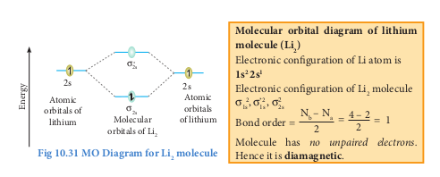
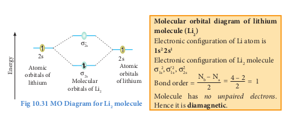
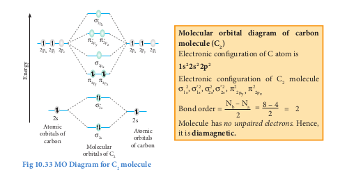
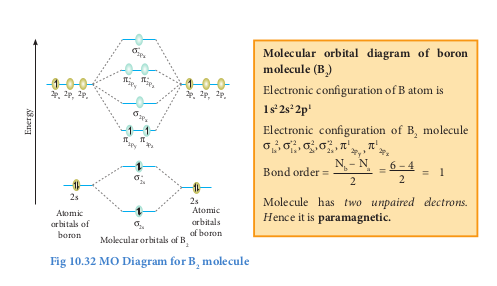
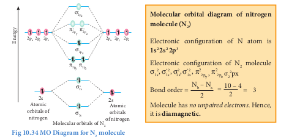
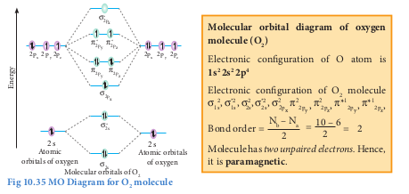
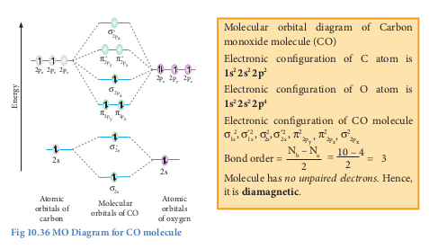
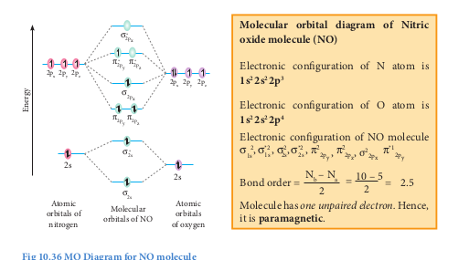

  

**10.10 Molecular orbital theory**

Lewis concept and valence bond theory qualitatively explains the chemical bonding and molecular structure. Both approaches are inadequate to describe some of the observed properties of molecules. For example, these theories predict that oxygen is diamagnetic. However, it was observed that oxygen in liquid form was attracted towards the poles of strong magnet, indicating that oxygen is paramagnetic. As both these theories treated the bond formation in terms of electron pairs and hence they fail to explain the bonding nature of paramagnetic molecules. F. Hund and Robert. S. Mulliken developed a bonding theory called molecular orbital theory which explains the magnetic behaviour of molecules.

**The salient features of Molecular orbital Theory (MOT):**

1\. When atoms combines to form molecules, their individual atomic orbitals lose their identity and forms new orbitals called molecular orbitals.

2\. The shapes of molecular orbitals depend upon the shapes of combining atomic orbitals.  

3\. The number of molecular orbitals formed is the same as the number of combining atomic orbitals. Half the number of molecular orbitals formed will have lower energy than the corresponding atomic orbital, while the remaining molecular orbitals will have higher energy. The molecular orbital with lower energy is called bonding molecular orbital and the one with higher energy is called anti-bonding molecular orbital. The bonding molecular orbitals are represented as σ (Sigma), π (pi), δ (delta) and the corresponding antibonding orbitals are denoted as σ\*, π\* and δ\*.

4\. The electrons in a molecule are accommodated in the newly formed molecular orbitals. The filling of electrons in these orbitals follows Aufbau's principle, Pauli's exclusion principle and Hund's rule as in the case of filling of electrons in atomic orbitals.

5\. Bond order gives the number of covalent bonds between the two combining atoms. The bond order of a molecule can be calculated using the following equation

Bond order Nb

Where,

Nb = Total number of electrons present in the bonding molecular orbitals

Na = Total number of electrons present in the antibonding molecular orbitals and

A bond order of zero value indicates that the molecule doesn't exist.

  

**10.10.1 Linear combination of atomic orbitals**

The wave functions for the molecular orbitals can be obtained by solving Schrödinger wave equation for the molecule. Since solving the Schrödinger equation is too complex, approximation methods are used to obtain the wave function for molecular orbitals. The most common method is the linear combination of atomic orbitals (LCAO).

We know that the atomic orbitals are represented by the wave function Ψ. Let us consider two atomic orbitals represented by the wave function ψA and ψB with comparable energy, combines to form two molecular orbitals. One is bonding molecular orbital(ψbonding) and the other is antibonding molecular orbital(ψantibonding). The wave functions for these two molecular orbitals can be obtained by the linear combination of the atomic orbitals ψA and ψB as below.

ψbonding = ψA + ψB

ψantibonding = ψA - ψB

The formation of bonding molecular orbital can be considered as the result of constructive interference of the atomic orbitals and the formation of anti-bonding molecular orbital can be the result of the destructive interference of the atomic orbitals. The formation of the two molecular orbitals from two 1s orbitals is shown below.  

Constructive interaction: The two 1s orbitals are in phase and have the same sign.

bonding molecular orbital

σ bonding MO

represented by :

**Destructive interaction The two 1s Orbitals are out phase**

anti-bonding molecular

**Fig 10.29 Linear Combination of atomic orbitals**

  

**10.10.2 Bonding in some Homonuclear di-ato**

Atomic orbitals of hydrogen

Molecular orbitals of H2 

**Fig 10.31 MO Diagram for Li2  molecule**

**Fig 10.32 MO Diagram for C2  molecule**

**Fig 10.30 MO Diagram for B2  molecule**  

**mic molecules:**

**Molecular orbital diagram of Nitrogen molecule (N2 )** Electronic configuration of N2  molecule is 

**Molecular orbital diagram of Oxygen molecule (O2 )** Electronic configuration of O2 molecule is

**Molecular orbital diagram of boron molecule (CO)**

Electronic configuration of CO is

**Molecular orbital diagram of oxygen olecule (NO)**

Electronic configuration of NO is

**Metallic bonding**

Metals have some special properties of lustre, high density, high electrical and thermal conductivity, malleability and ductility, and high melting and boiling points. The forces that keep the atoms of the metal so closely in a metallic crystal constitute what is generally known as the metallic bond. The metallic bond is not just an electrovalent bond(ionic bond), as the latter is formed between atoms of different electro negativities. Similarly, the metallic bond is not a covalent bond,as the metal atoms do not have sufficient number of valence electrons for mutual sharing with 8 or 12 neighboring metal atoms in a crystal. So, we have to search for a new theory to explain metallic bond. The first successful theory is due to Drude and Lorentz, which regards metallic crystal as an assemblage of positive ions immersed in a gas of free electrons. The free electrons are due to ionization of the valence electrons of the atoms of the metal. As the valence electrons of the atoms are freely shared by all the ions in the crystal, the metallic bonding is also referred to as electronic bonding. As the free electrons repel each other, they are uniformly distributed around the metal ions. Many physical properties of the metals can be explained by this theory, nevertheless there are exceptions.

The electrostatic attraction between the metal ions and the free electrons yields a three-dimensional close packed crystal with a large number of nearest metal ions. So, metals have high density. As the close packed structure contains many slip planes along which movement can occur during mechanical loading, the metal acquires  

ductility. Pure metals can undergo 40 to 60% elongation prior to rupturing under mechanical loading. As each metal ion is surrounded by electron cloud in all directions, the metallic bonding has no directional properties.

As the electrons are free to move around the positive ions, the metals exhibit high electrical and thermal conductivity. The metallic luster is due to reflection of light by the electron cloud. As the metallic bond is strong enough, the metal atoms are reluctant to break apart into a liquid or gas, so the metals have high melting and boiling points.

The bonding in metal is better treated by Molecular orbital theory. As per this theory, the atomic orbitals of large number of atoms in a crystal overlap to form numerous bonding and antibonding molecular orbitals without any band gap. The bonding molecular orbitals are completely filled with an electron pair in each, and the antibonding molecular orbitals are empty. Absence of band gap accounts for high electrical conductivity of metals. High thermal conductivity is due to thermal excitation of many electrons from the valence band to the conductance band. With an increase in temperature, the electrical conductivity decreases due to vigorous thermal motion of lattice ions that disrupts the uniform lattice structure, that is required for free motion of electrons within the crystal. Most metals are black except copper, silver and gold. It is due to absorption of light of all wavelengths. Absorption of light of all wavelengths is due to absence of bandgap in metals.

  

**SUMMARY**

In molecules, atoms are held together by attractive forces, called chemical bonds. Kossel and Lewis are the first people to provide a logical explanation for chemical bonding. They proposed that atoms try to attain the nearest noble gas electronic configuration by losing, gaining or sharing one or more electrons during the bond formation. The noble gases contain eight electrons in their valance shell which is considered to be stable electronic configuration. The idea of Kossel – Lewis approach to chemical bond lead to the octet rule, which states that “the atoms transfer or share electrons so that all atoms involved in chemical bonding obtain 8 electrons in their outer shell (valance shell)”.

There are different types of chemical bonds. In compounds such as sodium chloride, the sodium atom loses an electron which is accepted by the chlorine atom resulting in the formation of Na+ and Cl- ions. These two ions are held together by the electrostatic attractive forces. This type of chemical bond is known as ionic bonds or electrovalent bonds. In certain compounds, instead of the complete transfer of electrons, the electrons are shared by both the bonding atoms. The two combining atoms are held together by their mutual attraction towards the shared electrons. This type of bond is called covalent bonding. In addition, there also another bond type known as coordinate covalent bonds, where the shared electrons of a covalent bond are provided by only one of the combining atoms. Metallic bonding is another type of bonding which is observed in metals.  

Lewis theory in combination with VSEPR theory will be useful in predicting the shape of molecules. According to this theory, the shape of the molecules depends on the number of valance shell electron pair (lone pairs and bond pairs) around the central atom. Each pair of valance electrons around the central atom repels each other and hence, they are located as far away as possible in three-dimensional space to minimise the repulsion between them.

Heitler and London gave a theoretical treatment to explain the formation of covalent bond in hydrogen molecule on the basis of wave mechanics of electrons. It was further developed by Pauling and Slater. According to this theory when half-filled orbitals of two atoms overlap, a covalent bond will be formed between them. Linus Pauling introduced the concept of hybridisation. Hybridisation is the process of mixing of atomic orbitals of the same atom with comparable energy to form equal number of new equivalent orbitals with same energy. There are different types of hybridization such as sp, sp2, sp3, sp3d2 etc..

F. Hund and Robert. S. Mulliken developed a bonding theory called molecular orbital theory. According to this theory, when atoms combines to form molecules, their individual atomic orbitals lose their identity and forms new orbitals called molecular orbitals. The filling of electrons in these orbitals follows Aufbau's principle, Pauli's exclusion principle and Hund's rule as in the case of filling of electrons in atomic orbitals.

  

