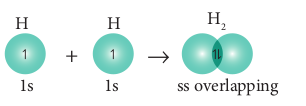
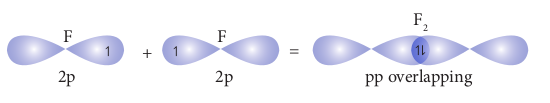
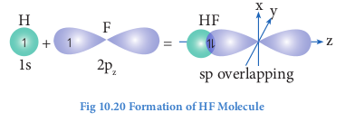
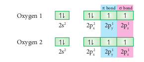
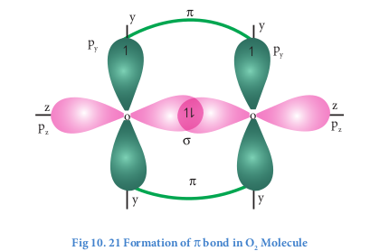

  

**10.8 Orbita**

When atoms combines to form a covalent atoms overlap to form a covalent bond. The bon region of the orbitals. Depending upon the n bonding between the two atoms as sigma (σ) an

**10.8.1 Sigma and Pi bonds**

When two atomic orbitals overlap linear a sigma (σ) bond. This overlap is also called involves an s orbital (s-s and s-p overlaps) will is spherical. Overlap between two p orbitals alo bond formation. When we consider x-axis as m σ-bond.

When two atomic orbitals overlaps sidew (π)bond. When we consider x-axis as molecular the formation of a π-bond.

Following examples will be useful to understand

**10.8.2 Formation of hydrogen (H2) Molecule**

Electronic configuration of hydrogen atom is 1s

During the formation of H2 molecule, the one unpaired electron with opposite spin overla This overlap is called s-s overlap. Such axial ov bond.

**Formation of fluorine molecule (F2):**

Valence shell electronic configuration of fluorine atom : 2s2 2px2, 2py2, 2pz1
 When the half filled pz orbitals of two fluorine overlaps along the z-axis, a σ-covalent bond is formed between them.

**Formation of HF molecule:**

Electronic configuration of hydrogen atom is 1s1
Valence shell electronic configuration of fluorine atom : 2s2 2px2, 2py2, 2pz1
When half filled 1s orbital of hydrogen linearly overlaps with a half filled 2pzorbital of fluorine,
a σ-covalent bond is formed between hydrogen and fluorine.

**Formation of oxygen molecule (O2):**
Valence shell electronic configuration of Oxygen atom : 2s2 2px2, 2py1, 2pz1

When the half filled pz orbitals of two oxygen overlaps along the z-axis (considering
molecular axis as z axis), a σ-covalent bond is formed between them. Other two half filled py
orbitals of two oxygen atoms overlap laterally (sideways) to form a π-covalent bond between the oxygen atoms. Thus, in oxygen molecule, two oxygen atoms are connected by two covalent
bonds (double bond). The other two pair of electrons present in the 2s and 2px orbital do not
involve in bonding and remains as lone pairs on the respective oxygen.

**Evaluate Yourself** 
7) Bond angle in PH4+  is higher than in PH3 why ?