  

**10.2 Types of chemical bonds**

The chemical bonds can be classified based on the nature of the interaction between the bonded atoms. Two major types of chemical bonds are covalent bonds and ionic bonds. Generally metals reacts with non-metals to form ionic compounds, and the covalent bonds are present in the compounds formed by nonmetals.

**10.2.1 Covalent bonds:**

Do you know all elements (except noble gases) occurs either as compounds or as polyatomic molecules? Let us consider hydrogen gas in which two hydrogen atoms bind to give a dihydrogen molecule. Each hydrogen atom has one electron and it requires one more electron to attain the electronic configuration of the nearest noble gas helium. Lewis suggested that both hydrogen atoms will attain the stable  

configuration by mutually sharing the electrons available with them. Similarly, in the case of oxygen molecule, both the oxygen atoms share two electron pairs between them and in nitrogen molecule three electron pairs are shared between two nitrogen atoms. This type of mutual **_sharing of one or more pairs of electrons between two combining atoms results in the formation of a chemical bond called a covalent bond_**. If two atoms share just one pair of electron a single covalent bond is formed as in the case of hydrogen molecule. If two or three electron pairs are shared between the two combining atoms, then the covalent bond is called a double bond or a triple bond, respectively.

**(H2) Single Covalent Bond**

**(O2) Double Covalent Bond**

**(N2) Triple Covalent Bond**

**Fig 10. 4 Representation of Lewis Structures of covalent bonds**
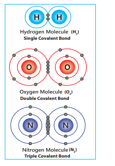

  

**10.2.2 Representing a covalent bond - Lewis structure (Lewis dot structure)** Lewis structure (Lewis dot structure) is a pictorial representation of covalent bonding between the combining atoms. In this structure the shared valence electrons are represented as a pair of dots between the combining atoms and the unshared electrons of the atoms are represented as a pair of dots (lone pair) on the respective individual atoms.

The Lewis dot structure for a given compound can be written by following the steps given below. Let us understand these steps by writing the Lewis structure for water.

1\. **Draw the skeletal structure of the molecule**. In general, the less electronegative atom is placed at the centre. Hydrogen and fluorine atoms should be placed at the terminal positions. For water, the skeletal structure is

**H2O**
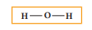

2\. **Calculate the total number of valence electrons of all the atoms in the molecule**. In case of polyatomic ions the charge on ion should also be considered during the calculation of the total number of valence electrons. In case of anions the number of negative charges should be added to the number of valence electrons. For positive ions the total number of positive charges should be subtracted from the total number of valence electrons.

In water, total number of valence electron =\[2×1 (valence electron of  

hydrogen)\] + \[1 × 6 (valence electrons of oxygen)\] = 2 + 6 = 8.

3\. **Draw a single bond between the atoms in the skeletal structure of the molecule**. Each bond will account for two valence electrons (a bond pair). For water, we can draw two bonds accounting for four valence electrons as follows.

**H2O**

4\. **Distribute the remaining valence electrons as pairs (lone pair), giving octet (only duet for hydrogen) to the atoms in the molecule. The** distribution of lone pairs starts with the most electronegative atoms followed by other atoms.

In case of water, the remaining four electrons (two lone pairs) are placed on the most electronegative central oxygen, giving octet.

**H2O**

5\. **Verify weather all the atoms satisfy the octet rule (for hydrogen duet).** If not, use the lone pairs of electrons to form additional bond to satisfy the octet rule.

In case of water, oxygen has octet and the hydrogens have duets, hence there is no need for shifting the lone pairs. The Lewis structure of water is as follows

**H2O**

**Fig 10. 5 Lewis structure of water**

Let us draw the Lewis structure for nitric acid.

1\. Skeletal structure

  

**HNO3**

**O**

2\. Total number of valence electrons in HNO3

\= \[1 × 1(hydrogen)\] + \[1 × 5(nitrogen)\] + \[3× 6(oxygen)\] = 1+ 5 + 18 = 24

3\. Draw single bonds between atoms. Four bonds can be drawn as shown in the figure for HNO3 which account for eight electrons (4 bond pairs).

4\. Distribute the remaining sixteen (24 - 8= 16) electrons as eight lone pairs starting from most electronegative atom, the oxygen. Six lone pairs are distributed to the two terminal oxygens

**Table 10.1 : The Lewis dot structures for s**
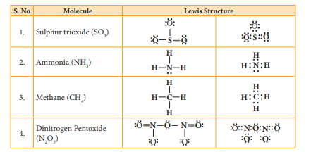
**S. No Molecule**

1\. Sulphur trioxide (SO3)

2\. Ammonia (NH3) **H**

3\. Methane (CH4) **H**

4\. Dinitrogen Pentoxide (N2O5)

It is to be noted that nearly in all their co number of bonds. For example, Fluorine f nitrogen and carbon atoms form one, two

**Note**  

(three each) to satisfy their octet and two pairs are distributed to the oxygen that is connected to hydrogen to satisfy its octet.

5\. Verify weather all the atoms have octet configuration. In the above distribution, the nitrogen has one pair short for octet. Therefore, move one of the lone pair from the terminal oxygen to form another bond with nitrogen.

The Lewis structure of nitric acid is given as

**Fig 10. 6 Lewis structure of Nitric acid**

**ome molecules**

**Lewis Structure**

mpounds, certain elements form a fixed orms only one bond. Hydrogen, oxygen,

, three and four bonds, respectively.

| S. No |Mole cule |
|------|------|
| 1. |Sulphur trioxide (SO3)|
| 2. |Ammonia (NH3) |
| 3. |Methane (CH4)4|
| 4. |Dinitrogen Pentoxide (N2O5)|
  

1) Draw the lewis structures for

i) Nitrous acid (HNO2)

ii) Phosphoric acid

iii) Sulphur trioxide (SO3)

?**Evaluate Yourself**

**10.2.3 Formal charge:**

Let us draw the Lewis structure for carbon dioxide.

1\. Skeletal structure

CO2

2\. Total number of valence electrons in CO2

\= \[1 x 4(carbon)\] +\[2 x 6(oxygen)\] = 4+ 12 = 16

3\. Draw single bonds between atoms. Two bonds can be drawn as shown in the figure for CO2 which accounts for four electrons (2 bond pairs).

O OC

4\. Distribute the remaining twelve electrons (16 - 4= 12) as six lone pairs starting from most electronegative atom, the oxygen. Six lone pairs are distributed to the two terminal oxygens (three each) to satisfy their octet.

5\. Verify weather all the atoms have octet configuration. In the above distribution, the central carbon has two pair short  

for octet. Therefore, to satisfy the octet rule two lone pairs from one oxygen or one pair from each oxygen can be moved to form multiple bonds, leading the formation of two possible structures for carbon dioxide as shown below

CO2 structure 1 structure 2

**Fig 10. 7 (a) two possible structures for carbon dioxide**

Similarly, the Lewis structure for many molecules drawn using the above steps gives more than one acceptable structure. Let us consider the above mentioned two structures of carbon dioxide.

Which one the above forms represents the best distribution of electrons in the molecule. To find an answer, we need to know the formal charge of each atom in the Lewis structures. Formal charge of an atom in a molecule, is the electrical charge difference between the valence electron in an isolated atom and the number of electrons assigned to that atom in the Lewis structure.

Formal charge of an atom = 
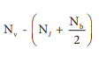

Where,

Nv - Number of valence electron of atom in its isolated state.

Nl - Number of electrons present as lone pairs around the atom in the Lewis structure

Nb - Number of electrons present in bonds around the atom (bond pairs) in the Lewis structure\]

  

Now let us calculate the formal charge on all atoms in both structures,

For Structure 1,

Formal charge on carbon = 

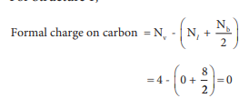

Formal charge on oxygen = 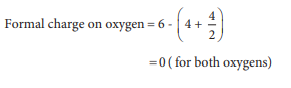

Formal charge on carbon = 
Formal charge on oxygen = 

( )for both oxygens

**For structure 2** Formal charge on carbon

Formal charge on singly bonded oxygen
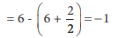

Formal charge on triply bonded oxygen
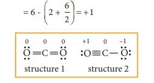

**Fig 10. 7 (b) two possible structures for carbon dioxide (with formal charges)**

After calculating the formal charges, the best representation of Lewis structure can be selected by using following guidelines.

1\. A structure in which all formal charges are zero preferred over the one with charges.  

2\. A structure with small formal charges is preferred over the one with higher formal charges.

3\. A structure in which negative formal charges are placed on the most electronegative atom is preferred.

In case of CO2 structures, the structure one is preferred over the structure 2 as it has zero formal charges for all atoms.

**10.2.4 Lewis structures for exceptions to octet rule**

The octet rule is useful for writing Lewis structures for molecules with second period element as central atoms. In some molecules, the central atoms have less than eight electrons around them while some others have more than eight electrons. Exception to the octet rule can be categorized into following three types.

1\. Molecules with electron deficient central atoms

2\. Molecules containing odd electrons

3\. Molecules with expanded valence shells

**Molecules with electron deficient central atoms**

Let us consider boron trifluoride, as an example. The central atom boron has three valence electron and each fluorine has seven valence electrons. The Lewis structure is

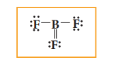

**Fig 10. 8 (a) Lewis structure of BF3**

In the above structure, only six electrons around boron atom. Moving a

  

lone pair from one of the fluorine to form additional bond as shown below.

BF3

**Fig 10. 8 (b) Lewis structure of BF3**

However, the above structure is unfavourable as the most electronegative atom fluorine shows positive formal charge and hence the structure with incomplete octet is the favourable one. Molecules such as BCl3, BeCl2, etc... also have incomplete octets.

**Molecules containing odd electrons**

Few molecules have a central atom with an odd number of valence electrons. For example, in nitrogen dioxide and nitric oxide all the atoms does not have octet configuration. The lewis structure of the above molecules are shown in the figure.

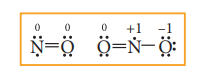

**Fig 10. 9 Lewis structures of Nitric oxide and Nitrogen dioxide (with formal charges)**

**Molecules with expanded valence shells**

In molecules such as sulphur hexafluoride (SF6), phosphorous pentachloride (PCl5) the central atom has more than eight valence electrons around them. Here the central atom can accommodate additional electron pairs by using outer vacant d orbitals. In SF6 the central atom sulphur is surrounded by six bonding pair of electrons or twelve electrons.  
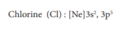

**Fig 10. 10 Lewis structures for SF6 and PCl5**

2) Calculate the formal charge on each atom of carbonyl chloride (COCl2)

?**Evaluate Yourself**