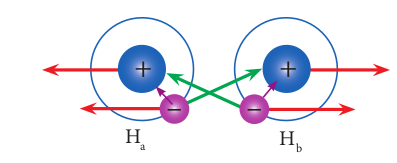
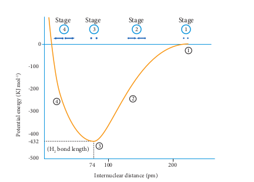

  

**10.7 Valence B**

Heitler and London gave a theoretical tr bond in hydrogen molecule on the basis of developed by Pauling and Slater. The wave m the scope of this textbook. A simple qualitative hydrogen molecule is discussed below.

Consider a situation wherein two hydrogen atoms (Ha and Hb) are separated by infinite distance. At this stage there is no interaction between these two atoms and the potential energy of this system is arbitrarily taken as zero. As these two atoms approach each other, in addition to the electrostatic attractive force between the nucleus and its own electron (purple arrows), the following new forces begins to operate.

**Fig 10. 17 (a) VB theory for the f**

The new attractive forces (green arrows) arise between
 (i)nucleus of Ha and valence electron of Hb>
 (ii)nucleus of Hb and the valence electron of Ha.
 The new repulsive forces (red arrows) arise between
  (i)the nucleus of Ha and Hb
 (ii)valence electrons of Ha and Hb.
 The attractive forces tend to bring Ha and Hb together whereas the repulsive forces tends to push them apart. At the initial stage, as the two hydrogen atoms approach each other, the attractive forces are stronger than the repulsive forces and the potential energy decreases. A stage is reached where the net attractive forces are exactly balanced by repulsive forces and the potential energy of the system acquires a minimum energy.

 Fig 10. 17 (b) VB theory for the formation of hydrogen molecule

At this stage, there is a maximum overlap the atoms Ha and Hb are now said to be bonded distance at this stage gives the H-H bond lengt is 436 kJ mol-1 and is known as bond energy. S formation, the resultant molecule is more stab decreased further, the repulsive forces dominate of the system sharply increases

**10.7.1 Salient features of VB Theory:**

 (i) When half filled orbitals of two atoms overlap, a covalent bond will be formed between them.
 (ii) The resultant overlapping orbital is occupied by the two electrons with opposite spins. For example, when H2 is formed, the two 1s electrons of two hydrogen atoms get paired up and occupy the overlapped orbital.
 (iii) The strength of a covalent bond depends upon the extent of overlap of atomic orbitals. Greater the overlap, larger is the energy released and stronger will be the bond formed. 
 (iv) Each atomic orbital has a specific direction (except s-orbital which is spherical) and hence orbital overlap takes place in the direction that maximizes overlap
Let us explain the covalent bond formation in hydrogen, fluorine and hydrogen fluoride
using VB theory.