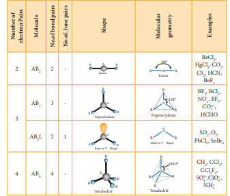
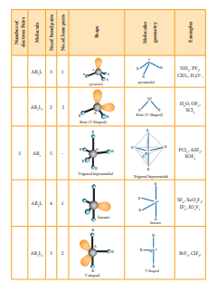
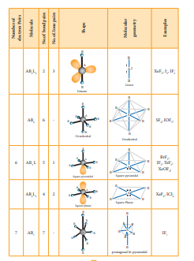

  

**10.6 Valence Shell Electron Pair Repulsion (VSEPR) theory** Lewis concept of structure of molecules deals with the relative position of atoms in the molecules and sharing of electron pairs between them. However, we cannot predict the shape of the molecule using Lewis concept. Lewis theory in combination with VSEPR theory will be useful in predicting the shape of molecules.

**Important principles of VSEPR Theory are as follows:**

1\. The shape of the molecules depends on the number of valence shell electron pair around the central atom.

2\. There are two types of electron pairs namely bond pairs and lone pairs. The bond pair of electrons are those shared between two atoms, while the lone pairs are the valence electron pairs that are not involved in bonding.

3\. Each pair of valence electrons around the central atom repels each other and hence, they are located as far away as possible in three dimensional space to minimize the repulsion between them.

