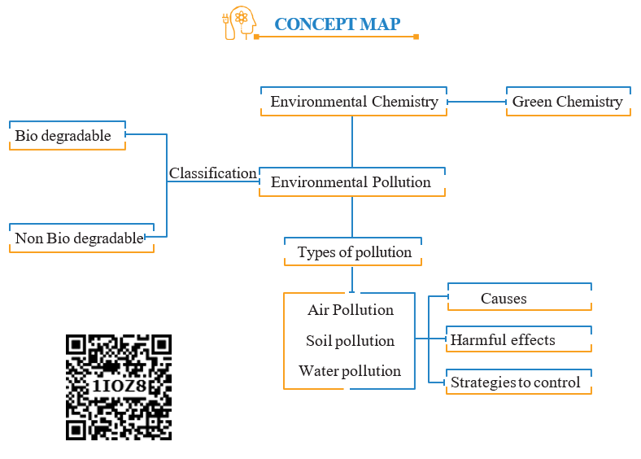

Green chemistry is a chemical philosophy encouraging the design of products and processes that reduce or eliminate the use and generation of hazardous substances.

For this, scientist are trying to develop methods to produce eco-friendly compounds. This can be best understood by considering the following example in which styrene is produced both by traditional and greener routes.

**Traditional route**

This method involves two steps. Carcinogenic benzene reacts with ethylene to form ethyl benzene. Then ethyl benzene on dehydrogenation using Fe2O3/ Al2O3 gives styrene.

**Greener route**

To avoid carcinogenic benzene, greener route is to start with cheaper and environmentally safer xylenes.

# Green chemistry in day-to-day life

A few contribution of green chemistry in our day to day life is given below

**(1) Dry cleaning of clothes**

Solvents like tetrachloroethylene used in dry cleaning of clothes, pollute the ground water and are carcinogenic. In the place of tetrachloroethylene, liquefied CO2 with suitable detergent, is an alternate solvent used. Liquified CO2 is not harmful  

to the ground water. Now a days H2O2 used for bleaching clothes in laundry, gives better results and utilises less water.

**(2) Bleaching of paper**

Conventional method of bleaching was done with chlorine. Now a days H2O2can be used for bleaching paper in presence of catalyst.

**(3) Synthesis of chemicals**

Acetaldehyde is now commercially prepared by one step oxidation of ethene in the presence of ionic catalyst in aqueous medium with 90% yield.

$\ce{CH2 = CH2 + O  ->[{Catalyst}][{Pd(II) /Cu (II)}] CH3CHO}$

**(4) Instead of petrol, methanol is used as a fuel in automobiles.**

**(5) Neem based pesticides have been synthesised, which are safer than the chlo- rinated hydrocarbons.**

Every individual has an important role for preventing pollution and improving our environment. We are responsible for environmental protection. Let us begin to save our environment and provide a clean earth for our future generations.

**SUMMARY**

Environmental chemistry plays a vital role in environment. Environmental chemistry means scientific study of chemical and bio chemical process occurring in environment. World Environmental Day is celebrated on fifth of June of every year.

**Environmental Pollution:**

Environmental pollution is the effect of undesirable changes in the surrounding that haveharmful effects on living things.

Pollutants are generally classified as rapidly degradable (e.g. discarded vegetables),slowly degradable(e.g. Agriculture waste) and non-bio degradable pollutants (e.g. DDT, plastic materials).

**Atmospheric pollution**

Atmospheric pollutions include tropospheric and stratospheric pollution. Troposphere and stratosphere greatly affect the biosphere of the earth due to which the study of pollutions in these regions is most important.

**Tropospheric pollution:**

Troposphere is the lowest region of atmosphere in which man, animal and plants exist. Gaseous pollutants like SOx,NOx,CO,CO2,O3 hydrocarbons and particulate pollutants like dust, mist, fumes, smog cause pollutions in troposphere

**Acid rain:**

When the PH of rain water becomes lower than 5.6 it is called acid rain. Acid rain is a byproduct of various human activities that emit sulphuroxides and nitrogen oxides in atmosphere. It damages buildings, statues and other monuments..  

The acid rain in water reservoir like rivers, ponds adversely affects microbes ,aquatic plants and fishes.

**Greenhouse effect:**

The process of warming up of earth is known as greenhouse effect or global warming. CO2>, CH4, O3, CFC, N2 and water vapour present in atmosphere act as a greenhouse gases. Heat retaining capacity of greenhouse gases are called Global Warming Potential (GWP).The GWP based sequence of greenhouse gases is as CFC>N2O>CH4>CO2.

**Stratospheric pollution:**

Stratosphere extends above troposphere up to 50Km above.

**Depletion of ozone layer:**

Ozone layer present in stratosphere protect the living species against harmful UV rays from space but Ozone Depletion Substance (ODS) used by humans deplete ozone layer. To create awareness in the Whole world, United Nations decided to celebrate 16th September of every year as “Ozone Layer Protection Day”.

**Water pollution**

Water is the elixir of life, but it is polluted by point and nonpoint sources.Institutions like World Health Organization (WHO) and Bureau of Indian standards (BIS) and Indian Council of Medical Research (ICMR) have prescribed standards for quality of drinking water.

 

**Soil pollution**

Lithosphere with humus cover is known as soil. The topsoil provides water and all nutrients required by plants for their growth. Industrial waste, artificial fertilisers and pesticides result in soil pollution.

**Waste management**

The strategies for controlling environmental pollution are called can be waste management.Waste management involves reduction and proper disposal of waste. Wastes are produced in three forms, solid, liquid and gase. Solid waste can be disposed by segregation, dumping, incineration and composting.

**Green chemistry**

Efforts to control environmental pollution resulted in development of science for synthesis of chemicals favorable to environment which is called green chemistry.Green chemistry means science of environmentally favorable chemical synthesis.

**Evaluation**

**I. Choose the best answer.**

1. The gaseous envelope around the earth is known as atmosphere. The region lying between an altitudes of 11-50 km is \_\_\_\_\_\_\_\_\_\_

    a) Troposphere b) Mesosphere

    c) Thermosphere d) stratosphere

2. Which of the following is natural and human disturbance in ecology?  

    a) Forest fire b) Floods

    c) Acid rain d) Green house effect

3. Bhopal Gas Tragedy is a case of \_\_\_\_\_\_\_\_\_\_\_\_\_

    a) thermal pollution

    b)air pollution

    c) nuclear pollution

    d) land pollution

4. Haemoglobin of the blood forms carboxy haemoglobin with

    a) Carbon dioxide

    b) Carbon tetra chloride

    c) Carbon monoxide

    d) Carbonic acid

5. Which sequence for green house gases is based on GWP?

    a) $\ce{CFC > N2O > CO2> CH4}$

    b) $\ce{CFC > CO2> N2O > CH4}$

    c) $\ce{CFC > N2O > CH4> CO2}$

    d) $\ce{CFC > CH4> N2O > CO2}$

6. Photo chemical smog formed in congested metropolitan cities mainly consists of

    a) Ozone, SO2 and hydrocarbons

    b) Ozone, PAN and NO2

    c) PAN, smoke and SO2

    d) Hydrocarbons, SO2 and CO2

7. The pH of normal rain water is

    a) 6.5 b) 7.5

    c) 5.6 d) 4.6

 

8. Ozone depletion will cause

    a) forest fires

    b) eutrophication

    c) bio magnification

    d) global warming

9. Identify the wrong statement in the following

    a) The clean water would have a BOD value of more than 5 ppm

    b) Greenhouse effect is also called as Global warming

    c) Minute solid particles in air is known as particulate pollutants

    d) Biosphere is the protective blanket of gases surrounding the earth

10. Living in the atmosphere of CO is dangerous because it

    a) Combines with $\ce{O2}$ present inside to form CO2

    b) Reduces organic matter of tissues

    c) Combines with haemoglobin and makes it incapable to absorb oxygen

    d) Diluted the blood

11. Release of oxides of nitrogen and hydrocarbons into the atmosphere by motor vehicles is prevented by using \_\_\_\_\_\_\_\_\_\_

    a) grit chamber

    b) scrubbers

    c) trickling filters

    d) catalytic convertors  

12. Biochemical oxygen Demand value less than 5 ppm indicates a water sample to be

    a) highly polluted

    b) poor in dissolved oxygen

    c) rich in dissolved oxygen

    d) low COD

13. Match the List I with List II and select the correct answer using the code given below the lists

    | **List I** |                   | **List II** |                   |
    |------------|-------------------|--------------|-------------------|
    | A          | Depletion of ozone layer | 1            | CO2               |
    | B          | Acid rain                 | 2            | NO                |
    | C          | Photochemical smog        | 3            | SO2               |
    | D          | Greenhouse effect         | 4            | CFC               |

    **Code:**

    **A B C D**

    **a** 3 4 1 2

    **b** 2 1 4 3

    **c** 4 3 2 1

    **d** 2 4 1 3

<!-- 14.

    | List I |                       | List II |                   |

    |--------|-----------------------|---------|-------------------|

    | A      | Stone leprosy         | 1       | CO                |

    | B      | Biological magnification | 2     | Greenhouse gases  |

    | C      | Global warming        | 3       | Acid rain         |

    | D      | Combination with haemoglobin | 4 | DDT               |

    

    **Code:**

    **A B C D**

    **a** 1 2 3 4

    **b** 3 4 2 1

    **c** 2 3 4 1

    **d** 4 2 1 3

    The questions gives below consists of an assertion the reason. Choose the correct option out of the choices given below each question

    i) Both (A) and R are correct and (R) is the correct explanation of (A)

    ii) Both (A) and R are correct and (R) is not the correct explanation of (A)

    iii) Both (A) and R are not correct

    iv) (A) is correct but( R) is not correct -->

15. Assertion (A): If BOD level of water in a reservoir is more than 5 ppm it is highly polluted

    **Reason(R) :** High biological oxygen demand means high activity of bacteria in water

    a) i b) ii

    c) iii d) iv

16. **Assertion (A):** Excessive use of chlorinated pesticide causes soil and water pollution.

    **Reason (R) :** Such pesticides are non-biodegradable.

    a) i b) ii

    c) iii d) iv  

17. **Assertion (A):** Oxygen plays a key role in the troposphere

    **Reason (R):** Troposphere is not responsible for all biological activities

    a) i b) ii

    c) iii d) iv

**II. Write brief answer to the following questions.**

18. Dissolved oxygen in water is responsible for aquatic life. What processes are responsible for the reduction in dissolved oxygen in water?

19. What would happen, if the greenhouse gases were totally missing in the earth’s atmosphere?

20. Define smog.

21. Which is considered to be earth’s protective umbrella? Why?

22. What are degradable and non- degradable pollutants?

23. From where does ozone come in the photo chemical smog?

24. A person was using water supplied by corporation. Due to shortage of water he started using underground water. He felt laxative effect. What could be the cause?

25. What is green chemistry?

26. Explain how does greenhouse effect cause global warming

27. Mention the standards prescribed by BIS for quality of drinking water

28. How does classical smog differ from photochemical smog?

 

<!-- **CONC**

Environm

Classification Environ

Type

Ai

So

Wat

Bio degradable

Non Bio degradable -->

29. What are particulate pollutants? Explain any three.

30. Even though the use of pesticides increases the crop production, they adversely affect the living organisms. Explain the function and the adverse effects of the pesticides.

31. Ethane burns completely in air to give CO2, while in a limited supply of air gives CO. The same gases are found in automobile exhaust. Both CO and CO2 are atmospheric pollutants

    i) What is the danger associated with these gases

    ii) How do the pollutants affect the human body?

32. On the basis of chemical reactions involved, explain how do CFC’s cause depletion of ozone layer in stratosphere?

33. How is acid rain formed? Explain its effect

34. Differentiate the following

    (i) BOD and COD

    (ii) Viable and non-viable particulate pollutants

35. Explain how oxygen deficiency is caused by carbon monoxide in our blood? Give its effect

36. What are the various methods you suggest to protect our environment from pollution?

