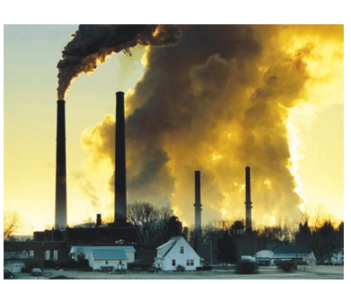
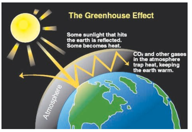
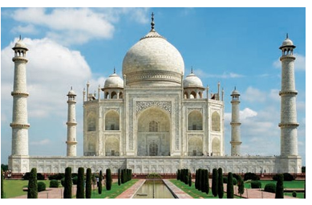
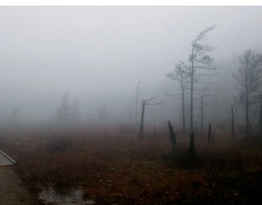

Atmospheric pollution is generally studied as tropospheric pollution. Different types of atmospheric pollutions are
(1) Air pollution   (2) Water pollution
(3) Soil pollution.

# Air pollution

Any undesirable change in air which adversely affects living organisms is called air pollution. Air pollution is limited to troposphere and stratosphere. Air pollution is mainly due to the excessive discharge of undesirable foreign matter in to the atmospheric air.

**Fig 1 Air Pollution**

**types of air pollutants**

Air pollutants may exist in two major forms namely, gases and particulates.

## Gaseous air pollutants

Oxides of sulphur, oxides of nitrogen, oxides of carbon, and hydrocarbons are the gaseous air pollutants.

**a. Oxides of Sulphur**

Sulphur dioxide and sulphur trioxide are produced by burning sulphur containing fossil fuels and roasting sulphide ores. Sulphur dioxide is a poisonous gas to both animals and plants. Sulphur dioxide causes eye irritation, coughing and respiratory diseases like asthma, bronchitis,etc.

Sulphur dioxide is oxidised into more harmful sulphur trioxide in the presence of particulate matter present in polluted air .

$\ce{2SO2 + O2 ->[{Particulate matter}] 2SO3}$

SO3 combines with atmospheric water vapour to form H2SO4, which comes  

down in the form of acid rain.

$\ce{SO3 + H2O-> H2SO4}$

Some harmful effects of acid rain will be discussed in section 15.3

**b. Oxides of nitrogen**

Oxides of nitrogen are produced during high temperature combustion processes, oxidation of nitrogen in air and from the combustion of fuels (coal, diesel, petrol etc.).

$\ce{N2 + O2 ->[{1210oC}] 2NO}$

$\ce{2NO + O2 ->[{1100oC}] 2NO2}$

$\ce{ O + NO3->NO2 +O2}$

The oxides of nitrogen are converted into nitric acid which comes down in the form of acid rain. They also form reddish brown haze in heavy traffic. Nitrogen dioxide potentially damages plant leaves and retards photosynthesis. NO2 is a respiratory irritant and it can cause asthma and lung injury. Nitrogen dioxide is also harmful to various textile fibres and metals.

**c. Oxides of carbon**

The major pollutants of oxides of carbon are carbon monoxide and carbon dioxide.

**(i) Carbon Monoxide**

Carbon monoxide is a poisonous gas produced as a result of incomplete combustion of coal or firewood. It is released into the air mainly by automobile exhaust. It binds with haemoglobin

  

and forms carboxy haemoglobin which impairs normal oxygen transport by blood and hence the oxygen carrying capacity of blood is reduced. This oxygen deficiency results in headache, dizziness, tension, Loss of consciousness, blurring of eye sight and cardiac arrest.

**(ii) Carbon dioxide**

Carbon dioxide is released into the atmosphere mainly by the process of respiration, burning of fossil fuels, forest fire, decomposition of limestone in cement industry etc.

Green plants can convert CO2 gas in the atmosphere into carbohydrate and oxygen through a process called photosynthesis. The increased CO2 level in the atmosphere is responsible for global warming. It causes headache and nausea.

**d. Hydrocarbon**

The compounds composed of carbon and hydrogen only are called hydrocarbons. They are mainly produced naturally (marsh gas) and also by incomplete combustion of automobile fuel.

They are potential cancer causing (carcinogenic) agents. For example, polynuclear aromatic hydrocarbons (PAH) are carcinogenic, they cause irritation in eyes and mucous membranes.

## Greenhouse effect and Global warming:

In 1987, Jean Baptiste Fourier a French mathematician and scientist  

coined the term“Greenhouse Effect” for trapping of heat in the atmosphere by certain gases.

**Fig 2 Greenhouse effct**

The earth’s atmosphere allows most of the visible light from the Sun to pass through and reach Earth’s surface. As Earth’s surface is heated by sunlight, it radiates part of this energy back toward space as longer wavelengths (IR).

Some of the heat is trapped by CH4, CO2CFCsand water vapour present in the atmosphere. They absorb IR radiation and effectively block a large portion of earth’s emitted radiation. The radiation thus absorbed is partly reemitted to earth’s surface. Therefore, the earth’s surface gets heated up by a phenomenon called greenhouse effect.

Thus Greenhouse effect may be defined as the heating up of the earth surface due to trapping of infrared radiations reflected by earth’s surface by CO2 layer in the atmosphere”. The heating up of earth through the greenhouse effect is called global warming.

Without the heating caused by the greenhouse effect, Earth’s average surface

  

temperature would be only about −18 °C (0 °F). Although the greenhouse effect is a naturally occurring phenomenon, it is intensified by the continuous emission of greenhouse gases into the atmosphere.

During the past 100 years, the amount of carbon dioxide in the atmosphere increased by roughly 30 percent and the amount of methane more than doubled.If these trends continue, the average global temperature will increase which can lead to melting of polar ice caps and flooding of low lying areas. This will increase incidence of infectious diseases like dengue, malaria etc.

## Acid Rain

Rain water normally has a pH of 5.6 due to dissolution of atmospheric CO2

into it. Oxides of sulphur and nitrogen in the atmosphere may be absorbed by droplets of water that make up clouds and get chemically converted into sulphuric acid and nitric acid respectively. As a result, pH of rain water drops below the level 5.6, hence it is called acid rain.

Acid rain is a by-product of a variety of sulphur and nitrogen oxides in the atmosphere. Burning of fossil fuels (coal and oil) in power stations, furnaces and petrol, diesel in motor engines produce sulphur dioxide and nitrogen oxides. The main contributors of acid rain are SO2 and NO2. They are converted into sulphuric acid and nitric acid respectively by the reaction with oxygen and water.

$\ce{ 2SO2 + O2 + 2H2O-> 2H2SO4}$

$\ce{ 4NO2 + O2 + 2H2O-> 4HNO3}$

**Harmful effects of acid rain:**

**Some harmful effects are discussed below.**

(i) Acid rain causes extensive damage to buildings and structural materials of marbles. This attack on marble is termed as Stone leprosy.

$\ce{ CaCO3 + H2SO4-> CaSO4 + H2O +CO2↑}$

(ii) Acid rain affects plants and animal life in aquatic ecosystem.

(iii) It is harmful for agriculture, trees and plants as it dissolves and removes the nutrients needed for their growth.

(iv) It corrodes water pipes resulting in the leaching of heavy metals such as iron, lead and copper into drinking water which have toxic effects.

(v) It causes respiratory ailment in humans and animals.

**Fig  3. Effect Of Acid Rain On Tajmahal**

  

## Particulate matter (Particulate pollutants)

Particulate pollutants are small solid particles and liquid droplets suspended in air. Many of particulate pollutants are hazardous. Examples: dust, pollen, smoke, soot and liquid droplets (aerosols) etc,.

They are blown into the atmosphere by volcanic eruption, blowing of dust, incomplete combustion of fossil fuels induces soot. Combustion of high ash fossil fuels creates fly ash and finishing of metals throws metallic particles into the atmosphere.

## Types of Particulates:

Particulate in the atmosphere may be of two types, viable or non-viable.

**a. Viable particulates**

The viable particulates are the small size living organisms such as bacteria, fungi, moulds, algae, etc. which are dispersed in air. Some of the fungi cause allergy in human beings and diseases in plants.

**b. Non-viable particulates**

The non- viable particulates are small solid particles and liquid droplets suspended in air. They help in the transportation of viable particles. There are four types of non- viable particulates in the atmosphere. They are classified according to their nature and size as follows

**(i) Smoke**

Smoke particulate consists of solid particles (or) mixture of solid and liquid  

particles formed by combustion of organic matter.

For example, cigarette smoke, oil smoke, smokes from burning of fossil fuel, garbage and dry leaves.

**(ii) Dust:**

Dust composed of fine solid particles produced during crushing and grinding of solid materials.

For example, sand from sand blasting, saw dust from wood works, cement dust from cement factories and fly ash from power generating units.

**(iii) Mists**

They are formed by particles of spray liquids and condensation of vapours in air.

For example, sulphuric acid mist, herbicides and insecticides sprays can form mists.

**(iv) Fumes**

Fumes are obtained by condensation of vapours released during sublimation, distillation, boiling and calcination and by several other chemical reactions.

For example, organic solvents, metals and metallic oxides form fume particles.

 Health effects of particulate pollutants:**

i. Dust, mist, fumes,etc., are air borne particles which are dangerous for human health. Particulate pollutants

  

bigger than 5 microns are likely to settle in the nasal passage whereas particles of about 10 micron enters the lungs easily and causes scaring or fibrosis of lung lining. They irritate the lungs and causes cancer and asthma. This disease is also called pneumoconiosis. Coal miners may suffer from black lung disease. Textile workers may suffer from white lung disease.

ii. Lead particulates affect children’s brain, interferes maturation of RBCs and even cause cancer.

iii. Particulates in the atmosphere reduce visibility by scattering and absorption of sunlight. It is dangerous for aircraft and motor vehicles

iv. Particulates provide nuclei for cloud formation and increase fog and rain.

v. Particulates deposit on plant leaves and hinder the intake of CO2 from the air and affect photosynthesis.

## Techniques to reduce particulate pollutants

The particulates from air can be removed by using electrostatic precipitators, gravity settling chambers, and wet scrubbers or by cyclone collectors. These techniques are based on washing away or settling of the particulates.

# Smog

Smog is a combination of smoke and fog which forms droplets that remain suspended in the air.  

**Fig 15.4 classical smog**

Smog is a chemical mixture of gases that forms a brownish yellow haze over urban cities.Smog mainly consists of ground level ozone, oxides of nitrogen, volatile organic compounds, SO2, acidic aerosols and gases, and particulate matter.

There are two types of smog. One is Classical smog caused by coal smoke and fog , second one is photo chemical smog caused by photo chemical oxidants.They are discussed below in detail.
**(i) Classical smog or London smog**

Classical smog was first observed in London in December 1952 and hence it is also known as London smog. It consists of coal smoke and fog.

It occurs in cool humid climate. This atmospheric smog found in many large cities. The chemical composition is the mixture of SO2, SO3 and humidity. It generally occurs in the morning and becomes worse when the sun rises.

This is mainly due to the induced oxidation of SO2 to SO3, which reacts with water yielding sulphuric acid aerosol.

  

Chemically it is reducing in nature because of high concentration of SO2 and so it is also called as reducing smog.

**Effects of classical smog:**

a. Smog is primarily responsible for acid rain.

b. Smog results in poor visibility and it affects air and road transport.

c. It also causes bronchial irritation.

**Great London Smog**

The great smog of London, or great smog of 1952, was a severe

air-pollution event that affected the British capital of London in early December 1952. It lasted from Friday, 5 December to Tuesday, 9 December 1952 and then dispersed quickly when the weather changed. It caused major disruption by reducing visibility and even penetrating indoor areas. Government medical reports in the following weeks, however, estimated that until 8 December, 4,000 people had died as a direct result of the smog and 100,000 more were made ill by the smog's effects on the human respiratory tract.

>**ii)Photo chemical smog or Los Angel Smog**
>
>Photo Chemical smog was first observed in Los Angels in 1950. It occurs in warm, dry and sunny climate.This type  
of smog is formed by the combination of smoke, dust and fog with air pollutants like oxides of nitrogen and hydrocarbons in the presence of sunlightIt forms when the sun shines and becomes worse in the afternoon. Chemically it is oxidizing in nature because of high concentration of oxidizing agents NO2 and O3, so it is also called as oxidizing smog.

**Photo chemical smog is formed through sequence of following reactions.**

$\ce{N2 + O2 -> 2NO}$

$\ce{2NO + O2 -> 2NO2}$

$\ce{NO2 ->[{sun light}] NO+ (O)}$

$\ce{(O)+O2 -> O3}$

$\ce{O3+NO -> NO2 + O2}$

$\ce{NO2 ->[{sun light}] NO+ (O)}$

NO and O3 are strong oxidizing agent and can react with unburnt hydrocarbons in polluted air to form formaldehyde,acrolein and peroxy acetyl nitrate(PAN).

**Effects of photo chemical smog**

The three main components of photo chemical smog are nitrogen oxide, ozone and oxidised hydro carbon like formaldehyde(HCHO), Acrolein (CH2=CH-CHO),peroxy acetyl nitrate (PAN).

Photochemical smog causes irritation to eyes, skin and lungs, increase in chances of asthma.

  

High concentrations of ozone and NO can cause nose and throat irritation, chest pain, uncomfortable in breathing, etc.

PAN is toxic to plants, attacks younger leaves and cause bronzing and glazing of their surfaces

It causes corrosion of metals stones, building materials and painted surfaces.

**Control of Photo chemical smog**

The formation of photochemical smog can be suppressed by preventing the release of nitrogen oxides and hydrocarbons into the atmosphere from the motor vehicles by using catalytic convertors in engines. Plantation of certain trees like Pinus, Pyrus, Querus Vitus and juniparus can metabolise nitrogen oxide.
