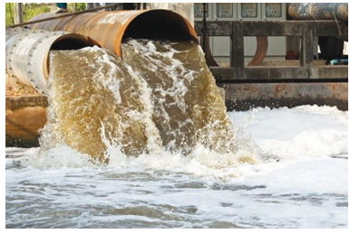

Water is essential for life. Without water life would have been impossible. The slogan, ‘Save Water, Water will save you’ tell us the importance of water. Such slogans tell us to save water. Apart from saving water, maintaining its quality is also equally important.

**Fig 15.6 water pollution**

Now a days water is getting polluted due to human activities and the availability of potable water in nature is becoming rare day by day.Water pollution is defined as“The addition of foreign substances or factors like heat which degrades the

  

quality of water, so that it becomes health haz

The water pollutants originate from both na water pollution is classified as Point and Non

Easily identified source of place of po municipal and industrial discharge pipes.

Non-point source cannot be identified wastes, acid rain, and storm-water drainage a

**Table 15.2: List of major water pollutants an**

| No | pollutant      | sources                             |
|----|----------------|-------------------------------------|
                 |
| 1  | Microorganisms | 	Domestic sewage, domestic waste water, dung heap    |
| 2  |  Organic wastes| 	Domestic sewage, animal excreta, food processing factory waste, detergents and decayed animals and plants,
|
| 3 |  Plant nutrients|Chemical fertilisers |
| 4  | Heavy metals| Heavy metal producing factories  |
| 5   |Sediments   | Soil erosion by agriculture and strip-mining|
| 6  |  Pesticides  | Chemicals used for killing insects, fungi and weeds         |
| 7 |Radioactive substances| Mining of uranium containing minerals         |
| 8  | Heat |      Water used for cooling in industries           |

