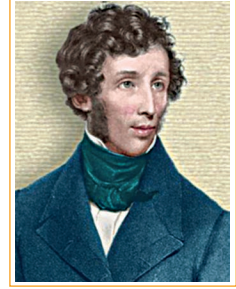

# Fundamentals of Organic Chemistry
  

**Learning Objectives**

After studying this unit students will be able to
• understand the reason for the tetra valency of
carbon and shapes of organic molecules
• classify the organic compounds
• name the organic compounds according to
IUPAC nomenclature and derive the structure
from the IUPAC name
• describe various types of isomerism
• explain the principles of detection and estimation
of elements in organic compounds
• describe various techniques used in the
purification of organic compounds

**Friedrich Wöhler,** was a German pioneer in organic chemistry. He is best known for his synthesis of urea an the organic compound from the inorganic compound, ammonium cyanate. This finding went against the mainstream theory of that time called _vitalism_ which stated that organic matter possessed a special force or vital force inherent to all living things. He is also the first to isolate several chemical elements. He is the discoverer of the element aluminum and also the co-discoverer of yttrium, beryllium, and titanium.  

# Introduction

Organic chemistry is the study of compounds n. Carbon has a tendency to form more ds with itself and other atoms (H, O, N, S gens) than any other elements. The tendency m to form a chain of bonds with the atoms me element is called catenation. The high of C-C bond is responsible for its catenation .e word 'organic' means 'derived from living s'. Organic compounds were thought to be ly in living things. Cell the basic unit of living onsumes, creates and consists of mainly ompounds. DNA, the genetic material, the lipids, that forms our cell membrane and the glycogen the energy reserve stored in our liver are all organic compounds. Except few inorganic compounds like salt, water etc... all others such as food, medicine, clothing, cosmetics, fuel etc... are compounds of carbon. All the essential biochemical reactions are also organic in nature leading to the fomation of various essential bioorganic molecules such as lipoproteins, phospholipids, glycolipids etc...

Synthesis of acetic acid by kolbe and methane by Berthlot, confirmed that organic compounds can be synthesized in laboratory. Since then, millions of organic compounds were synthesised and characterised. The field of organic chemistry is very vast and its principles find applications in many industries including food, textile, petrochemical, pharmaceutical, dye, polymers, fertilizer, cosmetics etc... Discussing the importance of organic chemistry is just like describing a drop of water in a mighty ocean.

The knowledge of chemical bonding and molecular structure will help in understanding the properties of organic compounds. We know that, the carbon has four valance electrons and its ground state electronic configuration is 1s2 2s2 2p2. An atom can attain noble gas electronic configuration either by transferring or sharing of electrons. It is not possible for the carbon to form either C4+ or C4- ions to attain the nearest noble gas configuration, as it requires large amount of energy. This implies that carbon cannot form ionic bond. Almost in all compounds of carbon, it forms four covalent bonds.  

The formation of four covalent bonds can be explained as below. During bond formation, one of the electrons from 2s orbital is promoted to 2pz orbital. The formation of four sigma bonds by carbon can be explained on the basis of sp3 hybridisation of carbon. Carbon forms multiple (double and triple) bonds in certain compounds. These can be explained by sp2 and sp hybridisation of carbon. The carbon forms relatively short bonds which enable the lateral overlap of unhybridised 2p orbitals of sp2 and sp hybridised carbon to form one and two pi bonds respectively.

Molecular stucture can be derived from the type of hybridisation. An sp3 hybridised carbon will have a tetrahedral geometry, a sp2 hybridised carbon will have trigonal planar geometry. and sp hybridised carbon will have a linear geometry.

# Characteristics of organic compounds:

All organic compounds have the following characteristic properties.

1\. They are covalent compounds of carbon and generally insoluble in water and readily soluble in organic solvent such as benzene, toluene, ether, chloroform etc...

2\. Many of the organic compounds are inflammable (except CCl4).They possess low boiling and melting points due to their covalent nature

3\. Organic compounds are characterised by functional groups. A functional group is an atom or a specific combination of bonded atoms that react in a characteristic way, irrespecti present. In almost all the cases, the react the functional group. They exhibit isome

4\. **Homologous series:** A series of organic functional group and the successive me formula by a CH2 group is called homolog

**Alkanes:** Methane (CH4), Ethane (C2H6),

**Alcohols:** Methanol (CH3OH), Ethanol (

Compounds of the homologous series ar CnH2n+2, Alkenes CnH2n, Alkynes CnH2n-2 an show regular gradation in physical properties but have almost similar chemical property.

