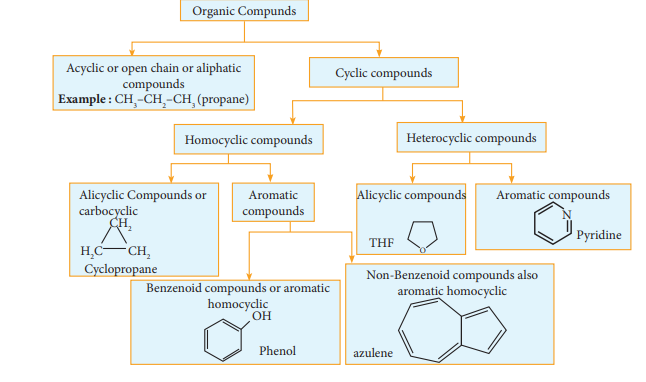
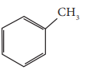
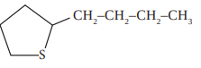
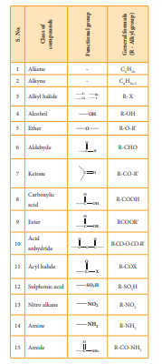
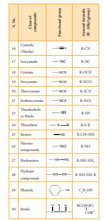

# Classification of organic compounds

The existing large number of organic co made it necessary to classify them. They may functional group.

# Classification based on the structure

Based on the above classification let us classify the following compounds.

1\. Classify the following compounds based on the structure

i) CH ≡ C– CH2–C ≡ CH

ii) CH3 – CH2 – CH2 - CH2– CH3

iii)

iv) 

S

**Solutions:**

(i) Unsaturated open chain compound

(ii) saturated open chain compound

(iii) aromatic benzenoid compound

(iv) alicyclic compound

**Evaluate Yourself** 

1)Give two examples for each of the following type of organic compounds.

(i) non-benzonoid aromatic,

(ii) aromatic heterocyclic,

(iii) alicyclic and

(iv) aliphatic open chain.

 

# Classification based on functional groups:

**Table 11.1 Class of compounds and their functional group**

