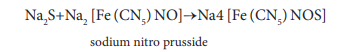
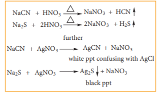

**Introduction**

The first step in the analysis of an organic compound is the detection of elements present in it. The principal elements are carbon, hydrogen and oxygen In addition to these they may contain nitrogen, sulphur and halogens. Phosphorous. Metals like Li, Mg, Zn are present in certain organometalic compounds.

**Detection of carbon and hydrogen**

If the compound under investigation is or- ganic, there is no need to test for carbon. This test is performed only to establish whether a

  

given compound is organic or not. With the exception of few compounds like CCl4, CS2 all organic compounds also contain hydro- gen. The presence of both these elements is confirmed by the following common test.

**Copper(II)oxide test: The organic** substance is mixed with about three times its weight of dry copper oxide by grinding. The mixture is then placed in a hard glass test tube fitted with a bent delivery tube. The other end of which is dipping into lime water in an another test tube. The mixture is heated strongly and the following reaction take place.

C + 2CuO \rightarrow CO + 2Cu



2H + \text{CuO} \rightarrow \text{H}_2\text{O} + \text{Cu}


Thus if carbon is present, it is oxidized to CO2 which turns lime water milky. If hydrogen is also present, it will be oxidized to water which condenses in small droplets on the cooler wall of the test tube and inside the bulb. Water is collected on anhydrous CuSO4 which turns anhydrous CuSO4 blue. This confirms the presence of C and H in the compound.

Detection of nitrogen by lassaigne sodium fusion test: This is a good test for the detection of nitrogen in all classes of nitrogenous compound and it involves the preparation of sodium fusion extract

This method involves the conversion of covalently bonded N, S or halogen present in the organic compounds to corresponding water soluble ions in the form of sodium salts For this purpose a small piece of Na dried by pressing between the folds of a filter paper is taken in a fusion tube and it is gently heated.  

When it melts to a shining globule, put a pinch of the organic compound on it. Heat the tube till reaction ceases and becomes red hot. Plunge it in about 50 mL of distilled water taken in a china dish and break the bottom of the tube by striking against the dish. Boil the contents of the dish for about 10 mts and filter. This filtrate is known as lassaignes extract or sodium fusion extract and it used for detection of nitrogen, sulfur and halogens present in organic compounds.

**ii) Test for Nitrogen:** If nitrogen is present it gets converted to sodium cyanide which reacts with freshly prepared ferrous sulphate and ferric ion followed by conc. HCl and gives a Prussian blue color or green colour or precipitate. It confirms the presence of nitrogen. HCl is added to dissolve the greenish precipitate of ferrous hydroxide produced by the excess of NaOH on FeSO4 which would otherwise mark the Prussian blue precipitate. The following reaction takes part in the formation of Prussian blue.


\mathrm{Na + C + N \rightarrow NaCN}


from organic compounds


\mathrm{FeSO_4 + 2NaOH \rightarrow Fe(OH)_2 + Na_2SO_4}


(from excess of sodium)


6\text{NaCN} + \text{Fe(OH)}_2 \rightarrow \text{Na}_4[\text{Fe(CN)}_6] + 2\text{NaOH}
                                       


3\text{Na}_4[\text{Fe(CN)}_6] + 4\text{FeCl}_3 \rightarrow \text{Fe}_4[\text{Fe(CN)}_6]_3 + 12\text{NaCl}


Incase if both N & S are present, a blood red colour is obtained due to the following reactions.


\text{Na} + \text{C} + \text{N} + \text{S} \xrightarrow{\text{heat}} \text{NaCNS}



3\text{NaCNS} + \text{FeCl}_3 \rightarrow \text{Fe(CNS)}_3 + 3\text{NaCl}


  

**iii) Test for sulphur:**

a) To a portion of the lassaigne's extract, add freshly prepared sodium nitro prusside solution. A deep violet or purple colouration is obtained. This test is also used to detect S2- in inorganic salt analysis

b) Acidify another portion of lassaigne's extract with acetic acid and add lead acetate solution. A black precipitate is obtained.


(CH_3COO)_2Pb + \text{Na}_2S \rightarrow \text{PbS} (\text{black ppt}) \downarrow + 2\text{CH}_3\text{COONa}


c) Oxidation test: The organic substances are fused with a mixture of KNO3 and Na2CO3. The sulphur, if present is oxidized to sulphate.


\text{Na}_2\text{CO}_3 + \text{S} + 3\text{O} \rightarrow \text{Na}_2\text{SO}_4 + \text{CO}_2


The fused mass is extracted with water, acidified with HCl and then BaCl2 solution is added to it. A white precipitate indicates the presence of sulphur.


\text{BaCl}_2 + \text{Na}_2\text{SO}_4 \rightarrow \text{BaSO}_4 + 2\text{NaCl}


iv) Test for halogens: To another portion of the lassaigne’s filtrate add dil HNO3 warm gently and add AgNO3 solution.  

a) Appearance of curdy white precipitate soluble in ammonia solution indicates the presence of chlorine.

b) Appearance of pale yellow precipitate sparingly soluble in ammonia solution indicates the presence of bromine.

c) Appearance of a yellow precipitate insoluble in ammonia solution indicates the presence of iodine.


\text{Na} + \text{X} \rightarrow \text{NaX} \quad (\text{Where } X = \text{Cl, Br, I})



\text{NaX} + \text{AgNO}_3 \rightarrow \text{AgX} + \text{NaNO}_3


If N or S is present in the compound along with the halogen, we might obtain NaCN and Na2S in the solution, which interfere with the detection of the halogen in the AgNO3 test Therefore we boil the lassaignes extract with HNO3 which decomposes NaCN and Na2S as

**V) Test for phosphorous:** A solid compound is strongly heated with a mixture of Na2CO3 & KNO3. phosphorous present in the compound is oxidized to sodium phosphate. The residue is extracted with water and boiled with Conc. HNO3. A solution of ammonium molybdate is added to the above solution. A canary yellow coloration or precipitate shows the presence of phosphorous.

  
