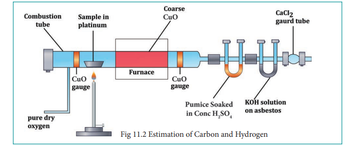
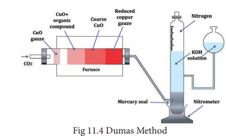
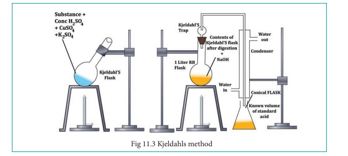

# Estimation of elements

After detecting the various elements present in a given organic compound by qualitative analysis it is necessary to determine their composition by weight. The estimation of carbon, hydrogen, nitrogen, sulphur halogens are discussed here. No dependable method is however available for determination oxygen and hence its amount is always determined by difference.

**Estimation of carbon and hydrogen:** Both carbon and hydrogen are estimated by the same method. A known weight of the organic substance is burnt in excess of ox- ygen and the carbon and hydrogen present in it are oxidized to carbon dioxide and wa- ter, respectively.


\text{CxHy + O}_2 \rightarrow x\text{CO}_2 + \frac{y}{2}\text{H}_2\text{O}


The weight of carbon dioxide and water thus formed are determined and the amount of carbon and hydrogen in the organic substance is calculated.

The apparatus employed for the purpose consists of three units (i) oxygen supply (2) combustion tube (3) absorption apparatus. (see Fig. 11.2)

**(1) Oxygen supply:** To remove the moisture from oxygen it is allowed to bubble through sulphuric acid and then passed through a U-tube containing sodalime to remove CO2. The oxygen gas free from moisture and carbondioxide enters the combustion tube.

**(2) Combustion tube:** A hard glass tube open at both ends is used for the combustion of the organic substance. It contains (i) an oxidized copper gauze to prevent the backward diffusion of the products of combustion (ii) a porcelain boat containing a known weight of the organic substance (iii) coarse copper oxide on either side and (iv) an oxidized copper gauze placed towards the end of the combustion tube. The combustion tube is heated by a gas burner.

**(3) Absorption Apparatus: The** combustion products containing moisture and carbon-dioxide are then passed through the absorption apparatus which consists of (1) a weighed U-tube packed with pumice soaked in Conc. H2SO4to absorb water (ii) a set of bulbs containing a strong solution of KOH to absorb CO2and finally (iii) a guard tube filled with anhydrous CaCl2 to prevent the entry of moisture from atmosphere.

**Procedure: The combustion tube is heated** strongly to dry its content. It is then cooled slightly and connected to the absorption apparatus. The other end of the combustion tube is open for a while and the boat containing weighed organic substance is introduced. The tube is again heated strongly till the substance in the boat is burnt away. This takes about 2 hours. Finally, a strong current of oxygen is passed through the combustion tube to sweap away any traces of carbon dioxide or moisture which may be left in it. The U-tube and the potash bulbs are then detached and the increase in weight of each of them is determined.

**Calculation:**

Weight of the organic substance taken = w g

Increase in weight of H2O = x g

Increase in weight of CO2 = y g

18 g of H2O contains 2g of hydrogen

∴ _x_ g of H2O contains ( 2 18

_x_)g of hydrogen

Percentage of hydrogen=( 2 18

× _x_ w

×100)%

44g of CO2 contains 12g of carbon

∴ _y_ g of CO2 contains (12 44

_y_) g of carbon

Percentage of Carbon=(12 44

× _y_ w

×100)%  

**Note:**

1\. If the organic substance under investigation also contain N, it will produce oxides of nitrogen on combustion. A spiral of copper is introduced at the combustion tube, to reduce the oxides of nitrogen to nitrogen which escapes unabsorbed.

2\. If the compound contains halogen as well, a spiral of silver is also introduced in the combustion tube. It converts halogen into silver halide.

3\. In case if the substance also contains sulphur, the copper oxide in the combustion tube is replaced by lead chromate. The SO2 formed during combustion is thus converted to lead sulphate and prevented from passing into the absorption unit.

**Worked out example: 1**

0.26g of an organic compound gave 0.039 g of water and 0.245 g of carbon dioxide on combustion. Calculate the percentage of C & H

Weight of organic compound = 0.26g

Weight of water = 0.039g

Weight of CO2 = 0.245g

**Percentage of hydrogen**

18 g of water contain 2 g of hydrogen

0.039 g of water contain 2 18

× 0.039 0.26

% of hydrogen = 0.039 0.26

× 2 18

× 100 =1.66%

  

**Percentage of carbon**

44 g of CO2 contain 12 g of C

0.245 g of CO2 contains 12 44

× 0.245 0.26

g of C

% of Carbon = 12 44

× 0.245 0.26

× 100 = 25.69 %

5) 0.2346g of an organic compound containing C, H & O, on combustion gives 0.2754g of H2O and 0.4488g CO2. Calculate the % composition of C, H & O in the organic compound \[C=52.17, H = 13.04, O = 34.79\]

?**Evaluate Yourself**

**Estimation of sulphur:**

**Carius method:** A known mass of the organic substance is heated strongly with fuming HNO3. C & H get oxidized to CO2& H2O while sulphur is oxidized to sulphuric acid as per the following reaction.

C fum. HNO 3 CO2

fum. HNO 3 H2O

S SO2 O + H2O

H2SO4

2H

The resulting solution is treated with excess of BaCl2 solution H2SO4 present in the solution in quantitatively converted into BaSO4, from the mass of BaSO4, the mass of sulphur and hence the percentage of sulphur in the compound can be calculated.

**Procedure:**

A known mass of the organic compound is taken in clean carius tube and  

added a few mL of fuming HNO3. The tube is the sealed. It is then placed in an iron tube and heated for about 5 hours. The tube is allowed to cool to room temperature and a small hole is made to allow gases produced inside to escape. The carius tube is broken and the content collected in a beaker. Excess of BaCl2 is added to the beaker contains H2SO4 acid as a result of the reaction is converted to BaSO4. The precipitate of BaSO4 is filtered, washed, dried and weighed. From the mass of BaSO4, percentage of S is found.

Mass of the organic compound = w g

Mass of the BaSO4 formed = _x_ g

233g of BaSO4 contains 32 g of Sulphur

∴ _x_ g of BaSO4 contains (32 233

_x_)g of S

Percentage of Sulphur = (32 233

× _x_ w × 100)%

**Example -2**

In an estimation of sulphur by carius method, 0.2175 g of the substance gave 0.5825 g of BaSO4 calculate the percentage composition of S in the compound.

Weight of organic compound 0.2175 g

Weight of BaSO4 0.5825 g

233 g of BaSO4 contains 32 g of S

0.5825 g of BaSO4 contains 32 233

× 0.5825 0.2175

Percentage of S= 32 233

× 0.5825 0.2175

× 100

\= 36.78 %

  

6) 0.16 g of an organic compound was heated in a carius tube and H2SO4 acid formed was precipitated with BaCl2. The mass of BaSO4 was 0.35g. Find the percentage of sulphur

?**Evaluate Yourself**

**Estimation of halogens: carius method:** A known mass of the organic compound is heated with fuming HNO3 and AgNO3. C,H &S get oxidized to CO2, H2O & SO2 and halogen combines with AgNO3 to form a precipitate of silver halide.

X fum.HNO3

AgNO3 AgX↓.

The ppt of AgX is filtered,

washed, dried and weighed. From the mass of AgX and the mass of the organic compound taken, percentage of halogens are calculated.

A known mass of the substance is taken along with fuming HNO3 and AgNO3 is taken in a clean carius tube. The open end of the Carius tube is sealed and placed in a iron tube for 5 hours in the range at 530- 540 K Then the tube is allowed to cool and a small hole is made in the tube to allow gases produced to escape. The tube is broken and the ppt is filtered, washed, dried and weighed. From the mass of AgX obtained, percentage of halogen in the organic compound is calculated.

Weight of the organic compound: w g

Weight of AgCl precipitate = a g

143.5 g of AgCl contains 35.5 g of Cl  

∴ a g of AgCl contains 35.5 143.5

× a

w g Organic compound gives a g AgCl

Percentage of Cl in w g =(35.5 143.5

× a w

× 100)% organic compound

Let Weight of silver Bromide be 'b'g

188g of AgBr contains 80 g of Br

∴ b g of AgBr contains ( 80 188

b) g of Br

w g Organic compound gives b g AgBr

Percentage of Br in w g =( 80 188

× b w

× 100)% organic compound

Let Weight of silver Iodide be 'c'g

235g of AgI contains 127 g of I

∴ C g of AgI contains (127 235

c) g of I

w g Organic compound gives c g AgI

Percentage of I in w g =( 127 235

× c w

× 100)% organic compound

**EXAMPLE :** 0.284 g of an organic substance gave 0.287 g AgCl in a carius method for the estimation of halogen. Find the Percentage of Cl in the compound.

Weight of the organic substance = 0.284 g

Weight of AgCl is = 0.287 g

143.5 g of AgCl contains 35.5 g of chlorine

0.287 g of AgCl contains 35.5 143.5

× 0.287 0.284

% of chlorine is 35.5 143.5

× 0.287 0.284

× 100 = 24.98%

  

7) 0.185 g of an organic compound when treated with Conc. HNO3 and silver nitrate gave 0.320 g of silver bromide. Calculate the % of bromine in the compound. (Ag =108, Br = 80) Ans: 73.6

8) 0.40 g of an iodo-substituted organic compound gave 0.235 g of AgI by carius method. Calculate the percentage of iodine in the compound. (Ag = 108, I = 127) (Ans = 31.75)

?**Evaluate Yourself**

**Estimation of phosphorus:**

**Carius method:** A known mass of the organic compound (w) containing phosphorous is heated with fuming HNO3 in a sealed tube where C is converted into CO2 and H to H2O. phosphorous present in organic compound is oxidized to phosphoric acid which is precipitated, as ammonium phosphomolybdate by heating with Conc. HNO3 and then adding ammonium molybdate.

H3PO4 + 12 (NH4)2 MoO4 + 21 HNO3

(NH4)3 PO4.12MoO3 + 21NH4 NO3 + 12 H2O heat

The precipitate of ammonium phosphomolybdate thus formed is filtered washed, dried and weighed.

In an alternative method, the phosphoric acid is precipitated as magnesium-ammonium phosphate by adding magnesia mixture (a mixture containing MgCl2, NH4Cl and ammonia) This ppt is washed, dried and ignited to get magnesium pyrophosphate which is washed, dried a weighed. The following are the reaction that takes place.  

By knowing the mass of the organic compound and the mass of ammonium phosphomolybdate or magnesium pyrophosphate formed, the percentage of P is calculated.

Mass of organic compound is wg

Weight of ammonium

phosphomolybdate = x g

Weight of magnesium pyrophosphate = y g

Mole mass of (NH4)3PO4.12MoO3is =1877g

\[3 x(14 + 4) + 31 +4(16)\] + 12 (96+3x16)

Molar mass of Mg2P2O7 is 222 g

(2x24) + (31x2) + (7x16)

1877g of (NH4)3PO4.12MoO3contains 31g of P

xg of(NH4)3PO4.12 MoO3 in w g of organic compound contains 31

1877 × x

w of

phosphorous

Percentage of Phosphorous= 31 1877

× x w

× 100%

(or) 227 of Mg2P2O7 contains 62 g of P Y g of of Mg2P2O7 in w g of Organic compound contains 62

222 ×

y w

of P.

Percentage Phosphorous = 62 222

× y

w × 100%

**Example 4:** 0.24 g of organic compound containing phosphorous gave 0.66 g of Mg2P2O7 by the usual analysis. Calculate the percentage of phosphorous in the compound

Weight of an organic compound = 0.24 g

Weight of Mg2P2O7 = 0.66 g

  

Fig 11.4 Dumas Method

222 g of Mg2P2O7 contains 62 g of P

0.66 g contains ( 62 222

× 0.66) g of P

Percentage of P 62 222

×0.66 0.24

× 100 =76.80 %

9) 0.33 g of an organic compound containing phosphorous gave 0.397 g of Mg2P2O7 by the analysis. Calculate the percentage of P in the compound (Ans: 23.21) (MFW of Mg2P2O7 is 222 P = 31)

?**Evaluate Yourself**

**Estimation of nitrogen: There are two** methods for the estimation of nitrogen in an organic compound. They are 1. Dumas method 2. Kjeldahls method

**1\. Dumas method:**

This method is based upon the fact that nitrogenous compound when heated with cupric oxide in an atmosphere of CO2 yields free nitrogen. Thus

CX HY NZ + (2X + Y/2) CuO x CO2 + Y/2 H2O + Z/2 N2 + (2X + Y/2) Cu

Traces of oxide of nitrogen, which may be formed in some cases, are reduced to elemental nitrogen by passing over heated copper spiral.  

The apparatus used in Dumas method consists of CO2 generator, combustion tube, Schiffs nitrometer. (See Fig. 11.4)

**CO2 generator:**

CO2 needed in this process is prepared by heating magnetite or sodium bicarbonate contained in a hard glass tube or by the action of dil. HCl on marble in a kipps apparatus. The gas is passed through the combustion tube after being dried by bubbling through Conc. H2SO4.

**Combustion Tube: The combustion tube is** heated in a furnace is charged with a) A roll of oxidized copper gauze to prevent the back diffusion of the products of combustion and to heat the organic substance mixed with CuO by radiation b) a weighed amount of the organic substance mixed with excess of CuO, C) a layer of course CuO packed in about 2/3 of the entire length of the tube and kept in position by loose asbestos plug on either side; this oxidizes the organic vapors passing through it, and d) a reduced copper spiral which reduces any oxides of nitrogen formed during combustion to nitrogen.

**Schiff ’s nitro meter: The nitrogen gas** obtained by the decomposition of the substance in the combustion tube is mixed with considerable excess of CO2 It is estimated by passing nitrometer when CO2 is absorbed by KOH and the nitrogen gets collected in the upper part of graduated tube.

**Procedure:** To start with the tap of nitro meter is left open. CO2 is passed through the combustion tube to expel the air in it. When the gas bubbles rising through, the
potash solution fails to reach the top of it and is completely absorbed it shows that only CO2 is coming and that all air has been expelled from the combustion tube. The nitrometer is then filled with KOH solution by lowering the reservoir and the tap is closed. The combustion tube is now heated in the furnace and the temperature rises gradually. The nitrogen set free form the compound collects in the nitro meter. When the combustion is complete a strong current of CO2 is sent through, the apparatus in order to sweep the last trace of nitrogen from it. The volume of the gas gets collected is noted after adjusting the reservoir so that the solution in it and the graduated tube is the same. The atmospheric pressure and the temperature are also recorded.

**Calculations:**

Weight of the substance taken = wg

Volume of nitrogen = V1 L

Room Temperature = T1 K

Atmospheric Pressure = P mm of Hg

Aqueous tension at

room temperature = P1 mm of Hg

Pressure of dry nitrogen = (P-P1) = P1 mm of Hg.

Let p0 V0 and T0 be the pressure, Volume and temperature respectively of dry nitrogen at STP,

Then, P0 V0

T0 =

P1V1

T1  

∴ V0 = P1V1

T1 ×

T0

P0

V0 = P1V1

T1

× 273K 760

mmHg)( Calculation of percentage of nitrogen. 22.4 L of N2 at STP weigh 28gof N2

∴ V0 L of N2 at S.T.P weigh 28

22.4 × V0

Wg of Organic compound contain 28 22.4

× V0

W( )g of nitrogen

∴Percentage of nitrogen =

28 22.4 ×

V0

W( )× 100

**Problem:** 0.1688 g when analyzed by the Dumas method yield 31.7 mL of moist nitrogen measured at 140 C and 758 mm mercury pressure. Determine the % of N in the substance (Aqueous tension at 140 C =12 mm)

Weight of Organic compound = 0.168g Volume of moist nitrogen (V1) = 31.7mL = 31.7 × 10-3 L Temperature (T1) = 140C = 14 +273 = 287K Pressure of Moist nitrogen (P) = 758 mm Hg Aqueous tension at 140C = 140C = 12 mm of Hg ∴Pressure of dry nitrogen = (P-P1) = 758- 12 = 746 mm of Hg

P1V1

T1 =

P0V0

T0

∴ V0 = 746 × 31.7 × 10–3

287 × 273 760

V0 = 29.58 × 10-3 L

  

Percentage of

nitrogen= 28

22.4 ×

V0

W × 100)( =

28 22.4

× ×29.58 × 10-3

0.1688 100

\= 21.90%

Dumas method is a high precision method and is generally preferred over Kjeldahl's method.

**Kjeldahls method:**

This method is carried much more easily than the Dumas method. It is used largely in the analysis of foods and fertilizers. Kjeldahls method is based on the fact that when an organic compound containing nitrogen is heated with Conc. H2SO4, the nitrogen in it is quantitatively converted to ammonium sulphate. The resultant liquid is then treated with excess of alkali and then liberated ammonia gas absorbed in excess of standard acid. The amount of ammonia (and hence nitrogen) is determined by finding the amount of acid neutralized by back titration with same standard alkali.

**Procedure:**

A weighed quantity of the substance (0.3 to 0.5 g) is placed in a special long – necked Kjeldahl flask made of pyrex glass. About 25 mL of Conc. H2SO4 together with a little K2SO4 and CuSO4 (catalyst) are added to it the flask is loosely stoppered by a glass bulb and heated gently in an inclined position. The heating is continued till the brown color of the liquid first produced, disappears leaving the contents clear as before. At this point all the nitrogen in the substance is converted to (NH4)2SO4. The Kjeldahl flask is then cooled and its contents are diluted with distilled water and then carefully transferred into a 1 lit round bottom flask. An excess NaOH solution is poured down the side of the flask and it is fitted with a Kjeldahl trap and a water condenser. The lower end of the

condenser dips in a measured volume of

excess the N 20

H2SO4 solution. The liquid in

the round bottom flask is then heated and the liberated ammonia is distilled into sulphuric acid. The Kjeldahl trap serves to retain any alkali splashed up on vigorous boiling. (See Fig. 11.3)

ahls method

  

When no more ammonia passes over (test the distillate with red litmus) the receiver is removed. The excess of acid is then determined by titration with alkali, using phenolphthalein as the indicator.

**Calculation:**

Weight of the substance = Wg.

Volume of H2SO4 required for the complete neutralisation of evolved NH3 = V mL.

Strength of H2SO4 used to neutralise NH3 = N

Let the Volume and the strength of NH3 formed are V1 and N1 respectively

we know that V1N1 = VN

The amount of nitrogen present in the w g of

Organic Compound = 14 ×NV 1×1000 × w

Percentage of Nitrogen =( 14 ×NV 1000 × w

) × 100%

**Example :** 0.6 g of an organic compound was Kjeldalised and NH3 evolved was absorbed into 50 mL of semi-normal solution of H2SO4. The residual acid solution was diluted with distilled water and the volume made up to 150 mL. 20 mL of this diluted solution required 35 mL of

N 20

NaOH solution for complete neutralization. Calculate the % of N in the compound.

Weight of Organic compound = 0.6g Volume of sulphuric acid taken = 50mL Strength of sulphuric acid taken= 0.5 N 20 ml of diluted solution of unreacted sul- phuric acid was neutralised by 35 mL of  

0.05 N Sodium hydroxide

Strength of the diluted sulphuric acid = 35 × 0.05

20 = 0.0875 N

Volume of the sulphuric acid

remaining after reaction with = V1 mL Organic compound

Strength of H2SO4 = 0.5N

Volume of the diluted H2SO4 = 150 mL Strength of the diluted

sulphuric acid = 0.0875 N

V1 = 150 ×0.087

0.5 = 26.25 mL

Volume of H2SO4 consumed by ammonia = 50 - 26.25

\= 23.75 mL

23.75 mL of 0.5 N H2SO4 ≡ 23.75mL of 0.5N NH3

The amount of Nitrogen present in the 0.6 = 14g

1000 mL × 1 N × 23.75 × 0.5N

\= 0.166g

Percentage of Nitrogen = 0.166

0.6 × 100

\= 27.66 %

?**Evaluate Yourself**

10) 0.3 g of an organic compound on kjeldahl’s analysis gave enough ammonia to just neutralize 30 mL of 0.1N H2SO4. Calculate the percentage of nitrogen in the compound.

  
