**11.5. Isomerism in organic compounds:**

The term ‘isomerism’ was given by Berzelius, and its represents of existence of two or more compounds with the same molecular formula but different structure and properties (physical, chemical, or both). Compounds exhibiting this isomerism are called isomers. The difference in properties of two isomers is due to difference in (bond connectivity or spatial arrangement) the arrangement of atoms within their molecules. Isomerism is broadly divided into two types. i. Constitutional isomerism, ii. stereoisomerism.

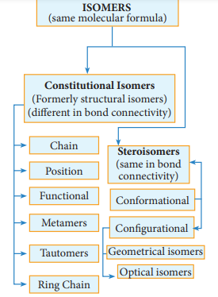

**11.5.1 Constitutional isomers (Formerly structural isomers):**

This type of isomers have same molecular formula but differ in their bonding sequence. Structural or constitutional isomerism is further classified into following types.  

**(a) Chain or nuclear or skeletal isomerism:**

These isomers differ in the way in which the carbon atoms are bonded to each other in a carbon chain or in other words isomers have similar molecular formula but differ in the nature of the carbon skeleton (ie. Straight or branched)

**(b) Position isomerism:**

If different compounds belonging to same homologous series with the same molecular formula and carbon skeleton, but differ in the position of substituent or functional group or an unsaturated linkage are said to exhibit position isomerism.

**Example:**
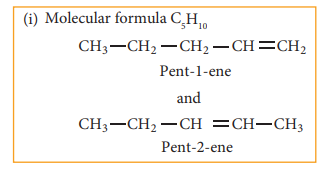

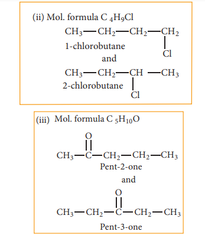

**(c) Functional isomerism:**

Different compounds having same molecular formula but different functional groups are said to exhibit functional isomerism.

**Example:**

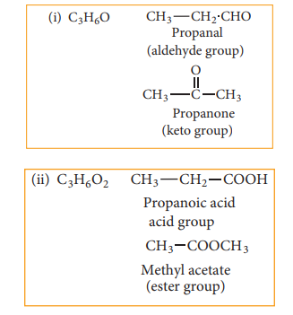

**(d) Metamerism:** 

This type of isomerism is a special kind of structural isomerism arises due to the unequal distribution of carbon atoms on either side of the functional group or different alkyl groups attached to the either side of the same functional group and having same molecular formula. This isomerism is shown by compounds having functional group such as ethers, ketones, esters and secondary amines between two alkyl groups.
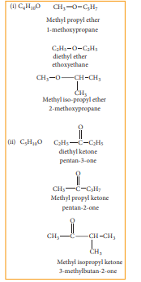

**(e) Tautomerism:** It is a special type of functional isomerism in which a single compound exists in two readily inter con- vertible structures that differ markedly in the relative position of atleast one atomic nucleus, generally hydrogen. The two dif- ferent structures are known as tautomers. There are several types of tautomerism and the two important types are dyad and triad systems.

**(i) Dyad system:** In this system hydrogen atom oscillates between two directly linked polyvalent atoms. Eg:
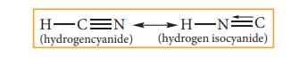

In this example hydrogen atom oscillates between carbon & nitrogen atom

**Evaluate Yourself**

4) Write all the possible isomers of molecular formula C4H10O and identify the isomerisms found in them.

**(ii) Triad system:** In this system hydrogen atom oscillates between three polyvalent atoms. It involves 1,3 migration of hydrogen atom from one polyvalent atom to other within the mole- cule. The most important type of triad system is keto–enol tautomerism and the two groups of tautomers are ketoform and enol-form. The polyvalent atoms involved are one oxygen and two carbon atoms. Enolisation is a process in which keto-form is converted to enol form. Both tautomeric forms are not equally stable. The less stable form is known as labile form  

**Example:**
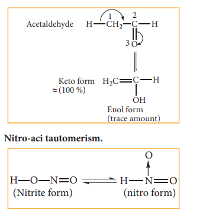

**(f) Ring chain isomerism:** In this type of isomerism, compounds having same molecular formula but differ in terms of bonding of carbon atom to form open chain and cyclic structures for eg:
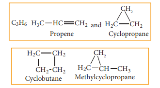

**11.5.2 Stereoisomerism:**

The isomers which have same bond connectivity but different arrangement of groups or atoms in space are known as stereoisomers. This branch of chemistry dealing with the study of three-dimensional nature (spactial arrangement) of molecules is known as stereo chemistry. The metabolic activities in living organisms, natural synthesis and drug synthesis involve various stereoisomers.

  

**Steroisomerism:**

**11.5.3 Geometrical isomerism:**

Geometrical isomers are the stereoisome or atoms around a rigid frame work of double restricted rotation of double bonds, or about sin

In alkenes, the carbon-carbon double bon bond consists of a σ bond and a π bond. The σ hybrid orbitals. The π bond is formed by the s of the π bond lock the molecule in one positio possible. This restriction of rotation about C-C isomerism in alkenes.

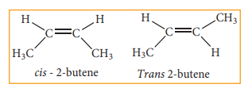

These two compounds are termed as geometrical isomers and are distinguished from
each other by the terms cis and trans. The cis isomer is one in which two similar groups are on
the same side of the double bond. The trans isomers is that in which the two similar groups are
on the opposite side of the double bond, hence this type of isomerism is often called cis-trans
isomerism.
The cis-isomer can be converted to trans isomer or vice versa is only if either isomer
is heated to a high temperature or absorbs light. The heat supplies the energy (about 62kcal/
mole) to break the π bond so that rotation about σ bond becomes possible. Upon cooling, the
reformation of the π bond can take place in two ways giving a mixture both cis and trans forms
of trans-2-butene and cis-2-butene.

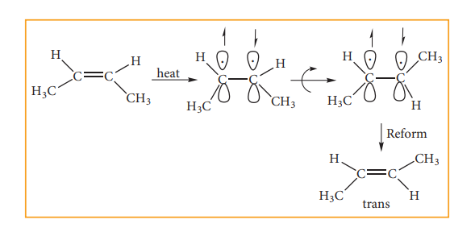

Generally the trans isomer is more stab because in the cis isomer, the bulky groups are o repulsion of the groups makes the cis isomers le groups are on the opposite side. These cis and t is. They can be separated by fractional distillati identical substrate do not show geometrical is only when each double bonded C atom is atta propene no geometrical isomers are possible b two identical H atoms.

Cis-trans isomerism is also seen arou two double bonds in conjugation. CH2=CH-C conformations, but the following two extreme c

**ii) Oximes and azo compounds:**

Restricted rotation around C=N (oxim oximes. Here ‘syn’ and ‘anti’ are used instead of c H atom of a doubly bonded carbon and –OH gro side of the double bond, while in the anti isom bond. For eg:

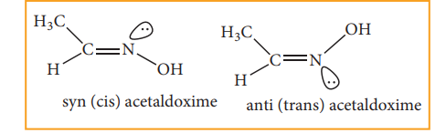

  

**11.5.4 Optical Isomerism**

Compounds having same physical and chemical property but differ only in the rotation of plane of the polarized light are known as optical isomers and the phenomenon is known as optical isomerism.

Some organic compounds such as glucose have the ability to rotate the plane of the plane polarized light and they are said to be optically active compounds and this property of a compound is called optical activity. The optical isomer, which rotates the plane of the plane polarised light to the right or in clockwise direction is said to be dextro rotatary (dexter means right) denoted by the sign (+), whereas the compound which rotates to the left or anticlockwise is said to be leavo rotatary (leavues means left) denoted by sign(-). Dextrorotatory compounds are represented as ‘d’ or by sign (+) and lavorotatory compounds are represented as ‘l’ or by sign (-).

**Enantiomerism and optical activity**

An optically active substance may exist in two or more isomeric forms which have same physical and chemical properties but differ in terms of direction of rotation of plane polarized light, such optical isomers which rotate the plane of polarized light with equal angle but in opposite direction are known as enantiomers and the phenom- enon is known as enantiomerism. Isomers which are non-super imposable mirror images of each other are called enantiomers.

**Conditions for enantiomerism or optical isomerism**

A carbon atom whose tetra valency  

is satisfied by four different substituents (atoms or groups) is called asymmetric carbon or chiral carbon. It is indicated by an asterisk as C\*. A molecule possessing chiral carbon atom and non-super imposable to its own mirror image is said to be a chiral molecule or asymmetric, and the property is called chirality or dissymmetry.

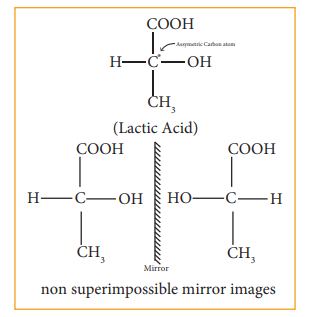

