# Nomenclature of organic compounds:

The International Union of Pure and Applied Chemistry (IUPAC) is the world authority on chemical nomenclature and terminology, naming of new elements in the periodic table standardized methods  

for measurement; atomic weights, and many other critically-evaluated data. According to IUPAC recommendations to name any organic compound, it is considered as a derivative of its parent saturated hydrocarbon. The IUPAC name of an organic compound consists of three parts.

**prefix + root word + suffix**

Root word denotes the number of carbon atoms in the longest continiuous chain in molecules. Prefix denotes the group(s) attached to the main chain which is placed before the root. Suffix denotes the funtional group and is placed after the root word.

**Table 11.2 Number of carbons in parent chain and the corresponding root words**
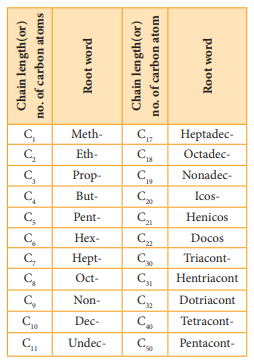

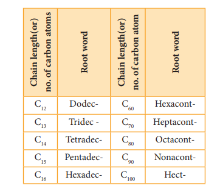

**Suffix: There are two types of suffix. They** are primary suffix and secondary suffix

**Primary suffix:** It denotes the saturation/ unsaturation of organic compounds. It is added immediately after the root word. Primary suffix for various saturated and unsaturated carbon chains are as follows:

**Table 11.3 Primary suffix for various saturated and unsaturated carbon chains**
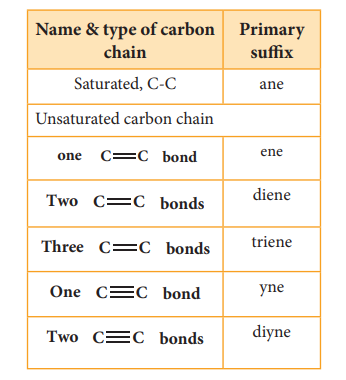

**Secondary suffix:** It is used to denote the nature of functional group present in the organic compound. It is added to the primary suffix by removig its terminal ‘e’. Secondary suffix names for some functional groups is listed below in table 11.4

**Table 11.4 Secondary suffix and prefixes for some functional groups:**
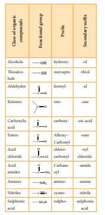

**Prefix:** Substituents that are attached to the parent carbon chain are denoted by adding prefix names before the root word. The prefix names for some common substituents are listed below. If the functional groups are not part of the parent chain, they are considered as substituents. In such cases its prefix name is added before the root word. Prefix names for some functional groups mentioned along with their secondary prefix are listed in table 11.4

**Table 11.5 List of substitutents and their Prefix names**
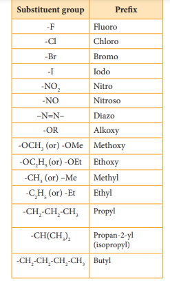

# IUPAC rules for nomenclature of organic compounds

The following steps should be followed for naming an organic compound as per IUPAC nomenclature.

1\. Choose the longest carbon chain. (Root word). Consider all the other groups attached to this chain as substitutents.

2\. Numbering of the longest carbon chain

3\. Naming of the substituents (prefixes or suffixes)

4\. Arrange the substitutents in the alphabetical order

5\. Write the name of the compound as below

"prefix + root word + primary suffix + secondary suffix"

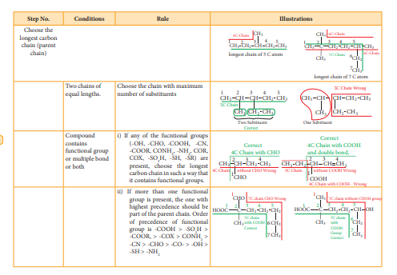

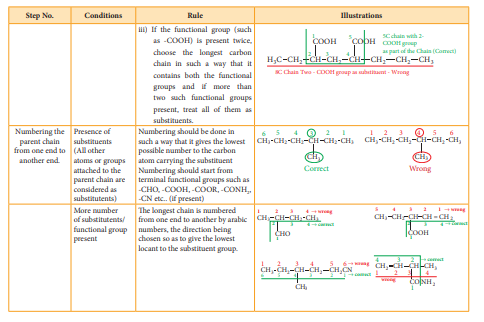

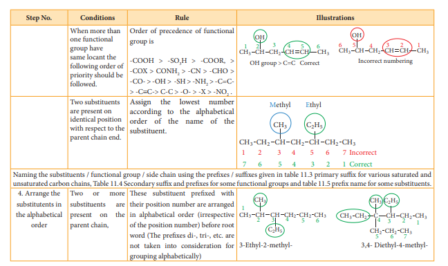

**The following are guide lines for writing** 

1\. The IUPAC names are always written as single word, with notable exception of organic
salts, acids and acid derivatives.

2\. Commas are used between two adjacent number or letter symbols, and hypens are
used to separate numbers and letter symbol in names Eg: 2,2-Dimethyl-3-hexene
N,N-Dimethyl methanamide

3\. Structural prefix such as, meso-, cis-, trans-, are italicised and joined to the name by a
hypen. These prefixes are omitted in alphabetising compound names or in capitalising
names at the beginning of a sentence.Eg:trans-2-Butene

4 .Structural prefixes such as di, tri, tetra are treated as a part of the basic name and
therefore are neither italicised nor separated by a hypen. These prefixes are not taken
into account in alphabetising compound names eg: 4- Ethyl -2,2-dimethyl hexane.

5 To name alicyclic compounds , the additional rules should be followed as illustrated
in the table 11.6

**Table 11.6 Rules for naming of alicyclic c**
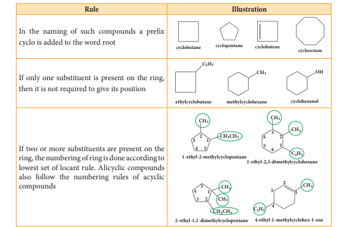

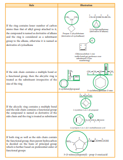

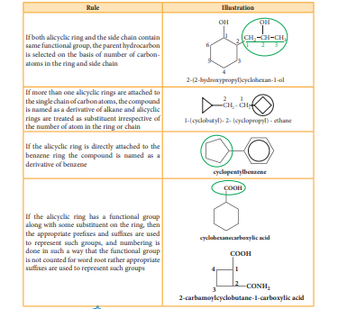

**Evaluate Yourself**

**NOMENCLATURE OF AROMATIC COM** 

An aromatic compound consists of two parts nucleus and side chain

**(A) Nucleus**: The benzene ring present in aromatic compound is called nucleus. It is
represented as follows  

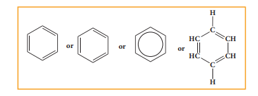

**(B) Side chain:** Alkyl or any other aliphatic group attached to the benzene nucleus by replacing one or more hydrogen atom is called the side chain

If one hydrogen atom, (or) two hydrogen atoms or three hydrogen atoms are replaced in the benzene ring by some other groups, they are termed as mono substituted, di substituted or tri substituted derivative respectively.

**Example**

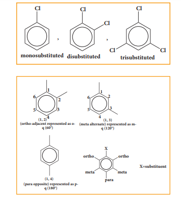

If more than one hydrogen atom of benzene ring is replaced by some other atom or group, then their position is mentioned by Arabic numerals 1,2,3 ….. In case of disubstitution, respective position of two groups can also be mentioned as follows.

ortho - adjacent; represented as - o 

meta - alternate; represented as - m 

Para - opposite; represented as - p 

**Aromatic compounds are basically of two types:** 

1\.Nuclear substituted aromatic
compounds: These are the compounds
in which the functional group is directly
attached to the benzene ring. They are
named as derivatives of benzene.

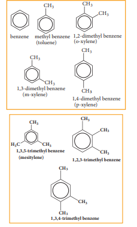

**Nuclear substituaed aramatic Halogen derivatives compounds.**
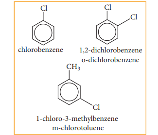

2\. Side chain substituted aromatic compounds: These are the compounds in which the functional group is present in the side chain of the benzene ring. These are named as phenyl derivatives of the corresponding aliphatic compounds.

**Side chain substituted**
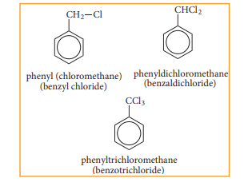

**Aryl groups**
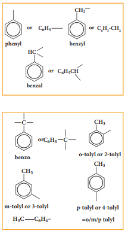

Selection of parent hydrocarbon
out of side chain and benzene ring
is based on (more or less) some
rule as for the alicyclic compounds.

**Evaluate Yourself**

3)Write structural formula for the following

(i) m - dinitrobenzene (ii) p-dichloro benzene (iii)1, 3, 5- Trimethyl benzene

  

**Table 11.3.1. 2**
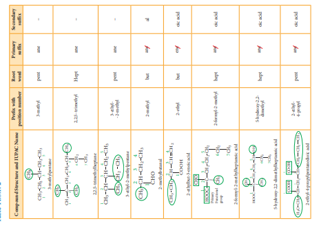

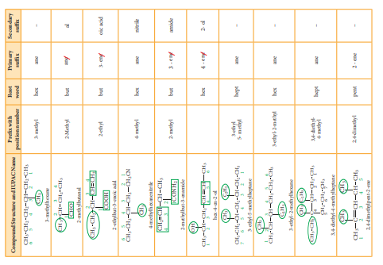

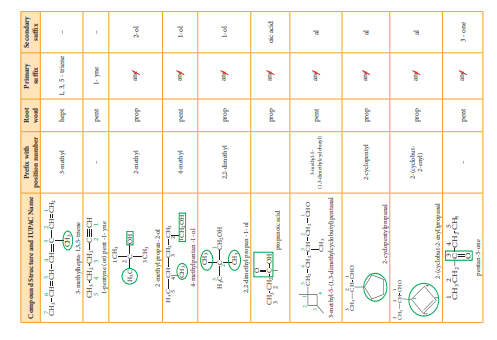

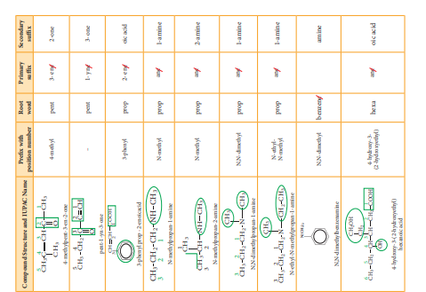

