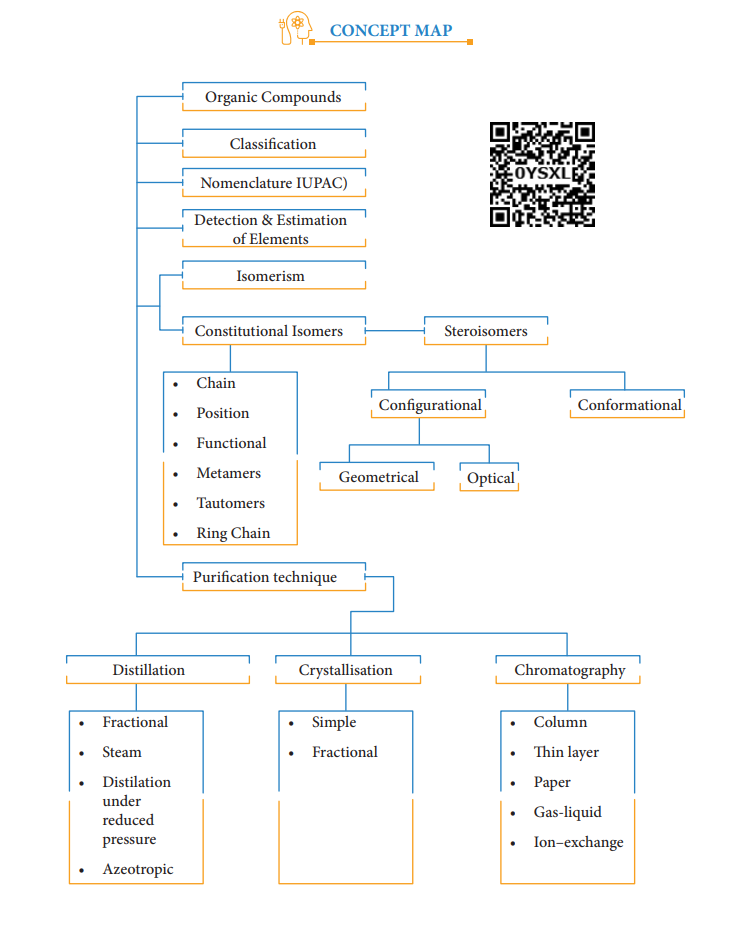

**Need for purification:**

In order to study the structure, physical properties, chemical properties and biological properties of organic compounds they must be in the pure state. There are several methods by which organic compounds can be purified. The methods employed for purification depend upon the nature of impurity and the nature of organic compound. The most widely used technique for the separation and purification of organic compounds are: (a) Crystallisation, (b) Sublimation (c) Distillation (d) Fractional distillation (e) Steam distillation (f) Azeotropic distillation (g) Differential extraction and (h) Chromatography.

Liquids are purified by

Solids are purified by Sublimation Crystallisation

Fractional Crystallisation distillation

Fractional distillation

Steam distillation Distillation under reduced pressure

Azeotropic distillation Differential extraction

Chromatography

# Sublimation:

Few substances like benzoic acid, naphthalene and camphor when heated pass directly from solid to vapor without melting (ie liquid). On cooling the vapours will give back solids. Such phenomenon is called sublimation. It is a useful technique to separate volatile and non-volatile solid. It has limited application because only a few substance will sublime.  

Substances to be purified is taken in a beaker. It is covered with a watch glass. The beaker is heated for a while and the resulting vapours condense on the bottom of the watch glass. Then the watch glass is removed and the crystals are collected. This method is applicable for organic substance which has high vapour pressure at temperature below their melting point. Substances like naphthalene, benzoic acid can be sublimed quickly. Substance which has very small vapour pressure will decompose upon heating are purified by sublimation under reduced pressure. This apparatus consists of large heating and large cooling surface with small distance in between because the amount of the substance in the vapour phase is much too small in case of a substance with low vapour pressure.

# Crystallization:

It is the most widely used method for the purification of solid organic compound. This process is carried out in by the follow- ing step

**(i) Selection of solvent:** Most of the organic substances being covalent do not dissolve in polar solvents like water, hence selection of solvent (suitable) becomes necessary. Hence the powdered organic substance is taken in a test tube and the solvent is added little by little with constant stirring and heating, till the amount added is just sufficient to dissolve the solute(ie) organic compound. If the solid dissolves upon heating and throws out maximum crystals on cooling, then the solvent is suitable. This process is repeated with other solvents like benzene, ether, acetone and alcohol till the most suitably one is sorted out.

|------|

|------|

  

**(ii) Preparation of solution: The** organic substance is dissolved in a minimum quantity of suitable solvent. Small amount of animal charcoal can be added to decolorize any colored substance. The heating may be done over a wire gauze or water bath depending upon the nature of liquid (ie) whether the solvent is low boiling or high boiling.

**(iii) Filtration of hot solution: The hot** solution so obtained is filtered through a fluted filter paper placed in a funnel.

**(iv) Crystallization: The hot filtrate is** then allowed to cool. Most of the impurities are removed on the filter paper, the pure solid substance separate as crystal. When copious amount of crystal has been obtained, then the crystallization is complete. If the rate of crystallization is slow, it is induced either by scratching the walls of the beaker with a glass rod or by adding a few crystals of the pure compounds to the solution.

**(v) Isolation and drying of crystals:** The crystals are separated from the mother liquor by filtration. Filtration is done under reduced pressure using a Bucher funnel. When the whole of the mother liquor has been drained into the filtration flask, the crystals are washed with small quantities of the pure cold solvent and then dried.

# Distillation:

**This method is to purify liquids** from non-volatile impurities, and used for separating the constituents of a liquid mixture which differ in their boiling points. There are various methods of distillation depending upon the difference in the boiling points of the constituents. The methods  

are (i) simple distillation (ii) fractional distillation and (iii) steam distillation. The process of distillation involves the impure liquid when boiled gives out vapour and the vapour so formed is collected and condensed to give back the pure liquid in the receiver. This method is called simple distillation. Liquids with large difference in boiling point (about 40k) and do not decompose under ordinary pressure can be purified by simply distillation eg. The mixture of C6H5NO2 (b.p 484k) & C6H6(354k) and mixture of diethyl ether (b.p 308k) and ethyl alcohol (b.p 351k)

**Fractional distillation: This is one** method to purify and separate liquids present in the mixture having their boiling point close to each other. In the fractional distillation, a fractionating column is fitted with distillation flask and a condenser. A thermometer is fitted in the fractionating column near the mouth of the condenser. This will enable to record the temperature of vapour passing over the condenser. The process of separation of the components in a liquid mixture at their respective boiling points in the form of vapours and the subsequent condensation of those vapours is called fractional distillation. The process of fractional distillation is repeated, if necessary. This method finds a remarkable application in distillation of petroleum, coal-tar and crude oil.

# Steam distillation:

**This method is applicable for solids** and liquids. If the compound to be steam distilled the it should not decompose at the steam temperature, should have a fairly high vapour pressure at 373k, it should be insoluble in water and the impurities present should be non-volatile.

  

Fig 11.4 Steam distillation

The impure liquid along with little water is taken in a round-bottom flask which is connected to a boiler on one side and water condenser on the other side, the flask is kept in a slanting position so that no droplets of the mixture will enter into the condenser on the brisk boiling and bubbling of steam. The mixture in the flask is heated and then a current of steam passed in to it. The vapours of the compound mix up with steam and escape into the condenser. The condensate obtained is a mixture of water and organic compound which can be separated. This method is used to recover essential oils from plants and flowers, also in the manufacture of aniline and turpentine oil. (see Fig. 11.4)

# Azeotropic Distillation

These are the mixture of liquids that cannot be separated by fractional distillation. The mixtures that can be purified only by azeotropic distillation are called as azeotropes. These azeotropes are constant boiling mixtures, which distil as a single component at a fixed temperature. For example ethanol and water in the ratio of 95.87:4.13.

In this method the presence of a third component like C6H6, CCl4, ether, glycerol, glycol which act as a dehydrating agent depress the partial pressure of one component of azeotropic mixture and raises  

the boiling point of that component and thus other component will distil over.

Subtances like C6H6, CCl4 have low boiling points and reduce the partial vapour pressure of alcohol more than that of water while subtances like glycerol & glycol etc. have high boiling point and reduce the partial vapour pressure of water more than that of alcohol.

# Differential extraction:

**The process of removing a substance** from its aqueous solution by shaking with a suitable organic solvent is termed extraction. When an organic substance present as solution in water can be recovered from the solution by means of a separating funnel. The aqueous solution is taken in a separating funnel with little quantity of ether or chloroform (CHCl3). The organic solvent immiscible with water will form a separate layer and the contents are shaken gently. The solute being more soluble in the organic solvent is transfered to it. The solvent layer is then separated by opening the tap of the separating funnel, and the substance is recovered.

# Chromatography:

**The most valuable method for the** separation and purification of small quantity of mixtures. As name implies chroma-colour and graphed writing it was first applied to separation of different colored constituents of chlorophyll in 1906 by M.S Tswett, a Russian botanist. He achieved it by passing a petroleum ether solution of chlorophyll present in leaves through a column of CaCO3 firmly packed into a narrow glass tube. Different components of the pigments got separated into land or zones of different

  

colors and now this technique is equally well applied to separation of colorless substances.

The principle behind chromatography is selective distribution of the mixture of organic substances between two phases – a stationary phase and a moving phase. The stationary phase can be a solid or liquid, while the moving phase is a liquid or a gas. When the stationary phase is a solid, the moving phase is a liquid or a gas. If the stationary phase is solid, the basis is adsorption, and when it is a liquid, the basis is partition. So the Chromatography is defined as a technique for the separation of a mixture brought about by differential movement of the individual compound through porous medium under the influence of moving solvent. The various methods of chromatography are

1\. Column chromatography (CC)

2\. Thin layer chromatography (TLC)

3\. Paper chromatography (PC)

4\. Gas-liquid chromatography (GLC)

5\. Ion–exchange chromatography

**Adsorption chromatography: The** principle involved is different compounds are adsorbed on an adsorbent to different degree. Silica gel and alumina are the commonly used adsorbent. The components of the mixture move by varying distances over the stationary phase. Column chromatography and thin layer chromatography are the techniques based on the principle of differential adsorption.

**Column chromatography: This is the** simplest chromatographic method carried out in long glass column having a stop cock  

near the lower end. This method involves separation of a mixture over a column of adsorbent (Stationery phase) packed in a column. In the column a plug of cotton or glass wool is placed at the lower end of the column to support the adsorbent powder. The tube is uniformLy packed with suitable absorbent constitute the stationary phase. (Activated aluminum oxides (alumina), Magnesium oxide, starch are also used as absorbents).

Fig 11.5 Column Chromatography

The mixture to be separated is placed on the top of the adsorbent column. Eluent which is a liquid or a mixture of liquids is allowed to flow down the column slowly. Different components are eluted depending upon the degree to which the components are adsorbed and complete separation takes place. The most readily adsorbed substances

  

are retained near the top and others come down to various distances in the column.

**Thin layer chromatography: This** method is an another type of adsorption chromatography with this method it is possible to separate even minute quantities of mixtures. A sheet of a glass is coated with a thin layer of adsorbent (cellulose, silica gel or alumina). This sheet of glass is called chromoplate or thin layer chromatography plate. After drying the plate, a drop of the mixture is placed just above one edge and the plate is then placed in a closed jar containing eluent (solvent). The eluent is drawn up the adsorbent layer by capillary action. The components of the mixture move up along with the eluent to different distances depending upon their degree of adsorption of each component of the mixture. It is expressed in terms of its retention factor (ie) Rf value

Rf =

Distance moved by the substance from base line (x)

Distance moved by the solvent from base line (y)

The spots of colored compounds are visible on TLC plate due to their original color. The colorless compounds are viewed under uv light or in another method using iodine crystals or by using appropriate reagent.

**Partition chromatography:** Paper chro- matography (PC) is an example of parti- tion chromatography. The same procedure is followed as in thin layer chromatog- raphy except that a strip of paper acts as an adsorbent. This method involves con- tinues differential portioning of compo- nents of a mixture between stationary and  

mobile phase. In paper chromatography, a special quality paper known as chroma- tography paper is used. This paper act as a stationary phase. A strip of chromatographic paper spotted at the base with the solution of the mixture is suspended in a suitable solvent which act as the mobile phase. The solvent rises up and flows over the spot. The paper selectively retains different components according to their different partition in the two phases where a chromatogram is developed. The spots of the separated colored compounds are visible at different heights from the position of initial spots on the chromatogram. The spots of the separated colorless compounds may be observed either under ultraviolent light or by the use of an appropriate spray reagent.

Evaluation

 I. Choose the best answer

1. Select the molecule which has only one π bond.
   - a) CH₃ – CH = CH – CH₃
   - b) CH₃ – CH = CH – CHO
   - c) CH₃ – CH = CH – COOH
   - d) All of these

2. In the hydrocarbon CH₃ – CH₂ – CH = CH– CH₂ – C≡CH (7 6 5 4 3 2 1), the state of hybridization of carbon 1, 2, 3, 4, and 7 are in the following sequence.
   - a) sp, sp, sp³, sp², sp³
   - b) sp², sp, sp³, sp², sp³
   - c) sp, sp, sp², sp, sp³
   - d) none of these

3. The general formula for alkadiene is
   - a) CnH2n
   - b) CnH2n-1
   - c) CnH2n-2
   - d) CnHn-2

4. Structure of the compound whose IUPAC name is 5,6 - dimethylhept - 2 - ene is
   - a)
   - b)
   - c)
   - d) None of these

5. The IUPAC name of the Compound is
   - a) 2,3 - Diemethylheptane
   - b) 3- Methyl -4- ethyloctane
   - c) 5-ethyl -6-methyloctane
   - d) 4-Ethyl -3 - methyloctane.

6. Which one of the following names does not fit a real name?
   - a) 3 – Methyl –3–hexanone
   - b) 4–Methyl –3– hexanone
   - c) 3– Methyl –3– hexanol 
   - d) 2– Methyl cyclo hexanone.

7. The IUPAC name of the compound CH₃ –CH= CH – C ≡ CH is
   - a) Pent - 4 - yn-2-ene 
   - b) Pent -3-en-l-yne
   - c) pent – 2– en – 4 – yne
   - d) Pent – 1 – yn –3 –ene

8. IUPAC name of CH₃ – C––– C – CH₃ H C₄ H₉ C₂ H₅ CH₃ is
   - a) 3,4,4 – Trimethylheptane
   - b) 2 – Ethyl –3, 3– dimethyl heptane
   - c) 3, 4,4 – Trimethyloctane
   - d) 2 – Butyl -2 –methyl – 3 – ethyl-butane.

9. The IUPAC name of H₃ C– C – CH= C(CH₃ )₂ CH₃ CH₃ is
   - a) 2,4,4 – Trimethylpent -2-ene
   - b) 2,4,4 – Trimethylpent -3-ene
   - c) 2,2,4 – Trimethylpent -3-ene
   - d) 2,2,4 – Trimethylpent -2-ene

10. The IUPAC name of the compound CH₃ –CH = C– CH₂ –CH₃ CH₂ – CH₂ – CH₃ is
    - a) 3 – Ethyl -2– hexene
    - b) 3 – Propyl -3– hexene
    - c) 4 – Ethyl – 4 – hexene
    - d) 3 – Propyl -2-hexene

11. The IUPAC name of the compound CH₃ –CH – COOH OH is 
    - a) 2 – Hydroxypropionic acid
    - b) 2 – Hydroxy Propanoic acid
    - c) Propan – 2– ol –1 – oic acid
    - d) 1 – Carboxyethanol.

12. The IUPAC name of CH – CH – COOH CH₃ Br CH₃ is
    - a) 2 – Bromo -3 – methyl butanoic acid 
    - b) 2 - methyl - 3- bromobutanoic acid
    - c) 3 - Bromo - 2 - methylbutanoic acid
    - d) 3 - Bromo - 2, 3 - dimethyl propanoic acid.

13. The structure of the isobutyl group in an organic compound is 
    - a) CH₃ – CH₂ – CH₂ – CH₂ –
    - b) CH₃ – C(CH₃)₃
    - c) CH₃ – CH – CH₂ –
    - d) CH₃ – CH – CH₂ – CH₃

14. The number of stereoisomers of 1,2 – dihydroxycyclopentane
    - a) 1
    - b) 2
    - c) 3
    - d) 4

15. Which of the following is optically active?
    - a) 3 – Chloropentane 
    - b) 2 Chloro propane
    - c) Meso – tartaric acid
    - d) Glucose

16. The isomer of ethanol is 
    - a) acetaldehyde
    - b) dimethylether
    - c) acetone
    - d) methyl carbinol

17. How many cyclic and acyclic isomers are possible for the molecular formula C₃H₆O?
    - a) 4
    - b) 5
    - c) 9
    - d) 10

18. Which one of the following shows functional isomerism?
    - a) ethylene
    - b) Propane
    - c) ethanol
    - d) CH₂Cl₂

19. CH₂–C–CH₃ and CH₂=CH–CH₃O O are 
    - a) resonating structure
    - b) tautomers
    - c) Optical isomers
    - d) Conformers.

20. Nitrogen detection in an organic compound is carried out by Lassaigne’s test. The blue colour formed is due to the formation of. 
    - a) Fe₃[Fe(CN)₆]₂
    - b) Fe₄[Fe(CN)₆]₃
    - c) Fe₄[Fe(CN)₆]₂
    - d) Fe
 21. Lassaigne’s test for the detection of nitrogen fails in
   - a) H₂N – CO– NH.NH₂.HCl 
   - b) NH₂ – NH₂. HCl
   - c) C₆H₅ – NH – NH₂. HCl 
   - d) C₆H₅ CONH₂

 22. Connect pair of compounds which give blue colouration / precipitate and white precipitate respectively, when their Lassaigne’s test is separately done.
   - a) NH₂ NH₂ HCl and ClCH₂–CHO
   - b) NH₂ CS NH₂ and CH₃ – CH₂Cl
   - c) NH₂ CH₂ COOH and NH₂ CONH₂
   - d) C₆H₅NH₂ and ClCH₂ – CHO.

 23. Sodium nitropruside reacts with sulphide ion to give a purple colour due to the formation of
   - a) [Fe(CN)₅ NO]³⁻
   - b) [Fe(NO)₅ CN]⁺
   - c) [Fe(CN)₅ NOS]⁴⁻
   - d) [Fe (CN)₅ NOS]³⁻

 24. An organic Compound weighing 0.15g gave on carius estimation, 0.12g of silver bromide. The percentage of bromine in the Compound will be close to
   - a) 46%
   - b) 34%
   - c) 3.4%
   - d) 4.6%

 25. A sample of 0.5g of an organic compound was treated according to Kjeldahl’s method. The ammonia evolved was absorbed in 50mL of 0.5M H₂SO₄. The remaining acid after neutralization by ammonia consumed 80mL of 0.5 M NaOH. The percentage of nitrogen in the organic compound is.
   - a) 14%
   - b) 28%
   - c) 42%
   - d) 56%

 26. In an organic compound, phosphorus is estimated as
   - a) Mg₂P₂O₇
   - b) Mg₃(PO₄)₂
   - c) H₃PO₄
   - d) P₂O₅

 27. Ortho and para-nitro phenol can be separated by
   - a) azeotropic distillation 
   - b) destructive distillation
   - c) steam distillation
   - d) cannot be separated

 28. The purity of an organic compound is determined by 
   - a) Chromatography 
   - b) Crystallization
   - c) melting or boiling point
   - d) both (a) and (c)

 29. A liquid which decomposes at its boiling point can be purified by 
   - a) distillation at atmospheric pressure
   - b) distillation under reduced pressure
   - c) fractional distillation
   - d) steam distillation.

 30. Assertion: CH₃ – C = CH – COOH is COOC₂H₅ 3– carbethoxy -2- butenoicacid. 
   Reason: The principal functional group gets lowest number followed by double bond (or) triple bond.
   - a) both the assertion and reason are true and the reason is the correct explanation of assertion. 
   - b) both assertion and reason are true and the reason is not the correct explanation of assertion.
   - c) assertion is true but reason is false
   - d) both the assertion and reason are false. 

 II. Write brief answer to the following questions.
31. Give the general characteristics of organic compounds?**
32. Describe the classification of organic compounds based on their structure.**
33. Write a note on homologous series.**
34. What is meant by a functional group? Identify the functional group in the following compounds.**
   - (a) acetaldehyde 
   - (b) oxalic acid
   - (c) di methyl ether 
   - (d) methylamine 
35. Give the general formula for the following classes of organic compounds**
   - (a) Aliphatic monohydric alcohol 
   - (b) Aliphatic ketones. 
   - (c) Aliphatic amines. 
36. Write the molecular formula of the first six members of the homologous series of nitro alkanes.**
37. Write the molecular and possible structural formula of the first four members of the homologous series of carboxylic acids.**
38. Give the IUPAC names of the following compounds.**
   - (i) (CH₃)₂CH–CH₂–CH(CH₃)–CH(CH₃)₂ 
   - (ii) CH₃-CH-CH-CH₃ CH₃ Br 
   - (iii) CH₃-O-CH₃ 
   - (iv) CH₃-CH₂-CH-CHO 
   - (v) CH₂ = CH-CH=CH₂ 
   - (vi) CH₃-CC-CH-CH₃ Cl 
   - (vii) H₃C H H H H Br 
   - (viii) HO O O 
   - (ix) 
   - (x) 
   - (xi) C₆H₅NH₂ 
   - (xii) O CN 
   - (xiii) O 
   - (xiv) O₂N CH₃ 
   - (xv) OHC Br 
39) Give the structure for the following compound.**
   - (i) 3-ethyl - 2-methyl -1-pentene 
   - (ii) 1,3,5-Trimethyl cyclohex-1-ene 
   - (iii) tertiary butyl iodide 
   - (iv) 3-Chlorobutanal 
   - (v) 3-Chlorobutanol 
   - (vi) 2-Chloro - 2-methyl propane 
   - (vii) 2,2-dimethyl-1-chloropropane 
   - (viii) 3-methylbut-1-ene 
   - (ix) Butan-2,2-diol 
   - (x) Octane-1,3-diene 
   - (xi) 1,3-Dimethylcyclohexane 
   - (xii) 3-Chlorobut-1-ene 
   - (xiii) 3-methylbutan-2-ol 
   - (xiv) acetaldehyde 
40) Describe the reactions involved in the detection of nitrogen in an organic compound by Lassaigne method.**
41) Give the principle involved in the estimation of halogen in an organic compound by carius

42) Principles of Fractional Distillation and Column Chromatography:**
   - *Fractional Distillation:*
     - It is based on the differences in boiling points of the components of a mixture.
     - The mixture is heated, and the vapor is condensed and collected at different temperatures.
     - This method is suitable for separating components with close boiling points.

   - Column Chromatography:
     - It involves the separation of components based on their affinity for a stationary phase within a column.
     - The mixture is passed through a column filled with a solid or liquid stationary phase.
     - Different components move at different rates and get separated.

43) Paper Chromatography:
   - It is a technique for separating and identifying mixtures.
   - A spot of the sample is placed on paper, and it is allowed to move up the paper through capillary action.
   - Components with different affinities for the paper and solvent move at different rates, leading to separation.

44) Types of Constitutional Isomerism (Structural Isomerism) in Organic Compounds:
   - Chain Isomerism: Different arrangements of carbon atoms in the main chain.
   - Position Isomerism: Different positions of a functional group or substituent on the main chain.
   - Functional Group Isomerism: Different functional groups in the same molecular formula.

45)  Optical Isomerism:
   - It occurs in molecules with chiral centers, resulting in non-superimposable mirror images (enantiomers).
   - Example: D-glucose and L-glucose.

46)  Geometrical Isomerism in Alkene (2-Butene):
   - Geometrical isomers have the same molecular formula but differ in the arrangement of atoms in space.
   - In 2-butene, the cis and trans isomers exhibit different spatial arrangements around the double bond.

47)  Percentage of Carbon and Hydrogen Calculation:
   - Given: 0.30 g substance, 0.88 g CO₂, 0.54 g H₂O.
   - Moles of CO₂ = 0.88/44; Moles of H₂O = 0.54/18.
   - Moles of C = Moles of CO₂; Moles of H = 2 * Moles of H₂O.
   - Calculate percentages of C and H.

48)  Percentage of Nitrogen Calculation:
   - Given: 0.20 g organic compound, 15 mL N/20 sulfuric acid.
   - Moles of NH₃ = (15/1000) * (20/1000); Moles of N = 2 * Moles of NH₃.
   - Calculate percentage of N.

49)  Percentage of Sulphur Calculation:
   - Given: 0.32 g organic compound, 0.466 g BaSO₄.
   - Moles of BaSO₄ = 0.466/(137.33 + 32.07 + 4 * 16); Moles of S = Moles of BaSO₄.
   - Calculate percentage of S.

50)  Percentage of Chlorine Calculation:
   - Given: 0.24 g organic compound, 0.287 g AgCl.
   - Moles of AgCl = 0.287/(107.87 + 35.45); Moles of Cl = Moles of AgCl.
   - Calculate percentage of Cl.

51)  Percentage of Nitrogen Calculation by Dumas Method:
   - Given: 0.35 g compound, 20.7 mL N₂ at 150°C and 760 mm pressure.
   - Moles of N₂ = (20.7/1000) * (1/22.4) * (760/760) * (273/423).
   - Calculate percentage of N.

  

