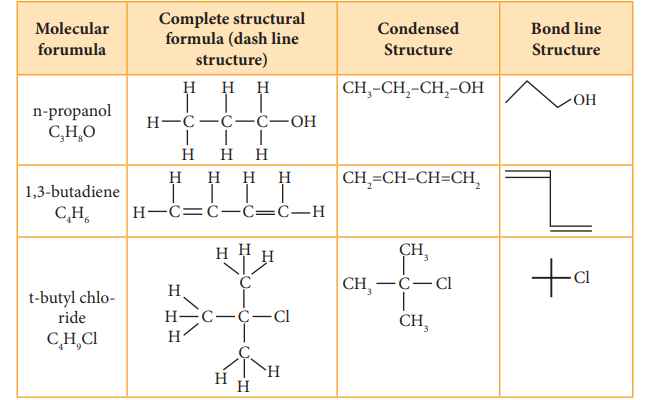
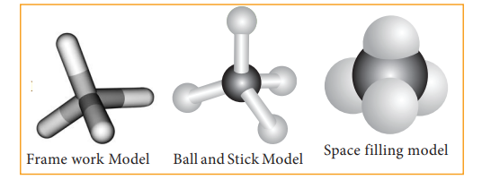
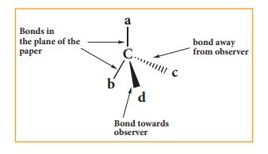
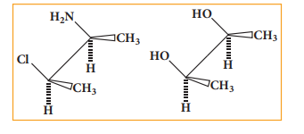
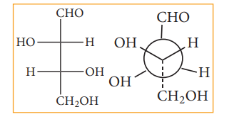

Molecular formula of a compound is the simplest, least informative representation, showing the ratio of atoms present. The structure of an organic compound can be represented using any one of the below mentioned methods.

1\. Lewis structure or dot structure,

2\. Dash structure or line bond structure,

3\. Condensed structure

4\. Bond line structure

We know how to draw the Lewis
structure for a molecule. The line bond
structure is obtained by representing the
two electron covalent bond by a dash or
line (-) in a Lewis structure. A single line
or dash represents single σ covalent bond,
double line represents double bond (1σ
bond, 1π bond) and a triple line represents triple bond (1σ bond, 2π bond). Lone pair
of electrons on heteroatoms may or may
not be shown. This represents the complete
structural formula. 

This structural formula can be
further abbreviated by omitting some or all
of the dashes representing covalent bonds
and by indicating the number of identical
groups attached to an atom by a subscript.
The resulting expression of the compound is
called a condensed structural formula.

For further simplification, organic
chemists use another way of representing
the structures in which only lines are used.
In this type of representation of organic
compounds, carbon and hydrogen atoms
are not shown and the lines representing
carbon-carbon bonds are shown in a zigzag
fashion. The only atoms specifically written
are oxygen, chlorine, nitrogen etc. These
representations can be easily understood by
the following illustration.

**Molecular models**

Molecular models are physical devices that are used for a better visualisation and
perception of three dimensional shapes of organic molecules. These are made of wood,
plastic or metal and are commercially available. (i) Frame work model (ii) Ball and stick
model & (iii) space filling model. In the frame work model only the bonds connecting the
atoms themselves are shown. This model emphasizes the pattern of bonds of a molecule
while ignoring the size of the atom. In the ball and stick model, both the atoms and the
bonds are shown. Ball represent atoms and the stick a bond. Compounds containing C=C
can be best represented by using springs in place of sticks and this model is termed as ball
and spring model. The space filling model emphasizes the relative size of each atom based
on its vander-waals radius

**Three dimensional representation of organi**

The simplest convention is solid and dashed wedge formula in which 3-D image of a
molecule can be perceived from two dimensional picture. In this representation a tetrahedral
molecule with four atoms or group a,b,c and d bonded to it can be represented by a wedge
formula as follows. A solid wedge ( ) (or a heavy line) is used to indicate a bond projecting 
above the plane of the paper and the dashed
wedge ( ) (or a dashed line) is used to
depict the bond below the plane. The bonds
lying in the plane of the paper are shown by
normal lines.

**Fisher projection formula:**

This is a method of representing three
dimensional structures in two dimension.
In this method, the chiral atom(s) lies in the
plane of paper. The horizontal substituents
are pointing towards the observer and the
vertical substituents are away from the
observer. Fisher projection formula for
tartaric acid is given below.

**Sawhorse projection formula:**

Here the bond between two carbon atoms is drawn diagonally and slightly elongated. The lower left hand carbon is considered lying towards the front and  

the upper right hand carbon towards the back. The Fischer projection inadequately portrays the spatial relationship between ligands attached to adjacent atoms. The sawhorse projection attempts to clarify the relative location of the groups.

**Newman projection formula:**

In this method the molecules are viewed from the front along the carbon- carbon bond axis. The two carbon atom forming the σ bond is represented by two circles. One behind the other so that only the front carbon is seen. The front carbon atom is shown by a point where as the carbon lying further from the eye is represented by the origin of the circle. Therefore, the C-H bonds of the front carbon are depicted from the circle while C-H bonds of the back carbon are drawn from the circumference of the circle with an angle of 1200 to each other.

