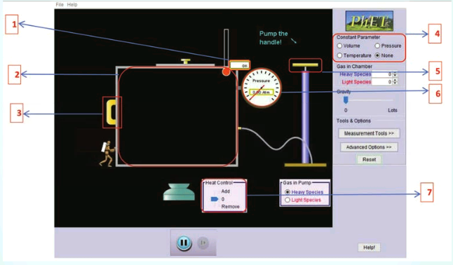

<pre>
By using this tool you will
be able to understand the
relationship between T, P of V
gases and verify the gas laws.
</pre>

<pre>
Please go to the URL
https://phet.colorado.edu/en/
simulation/gas-properties
(or)
Scan the QR code on the right side
</pre>

**Properties**

**Step – 1** Open the Browser and type the URL given (or) Scan tapplet, then you will see a Java applet named ‘gas prope

**Set up instructions:** 
• In the chamber (2) you can pump some gas molecules by using the pump handle (5).  
• The temperature (1) and pressure (6) of the gas molecules in the chamber can be monitored by using the corresponding gauges.  
• The volume of the chamber can be altered by moving the left side wall (3). 
• The temperature of the chamber can be altered by heating or cooling using the slider (7)  
• Any of the three properties can be kept as constant by making appropriate selections in the box (4) 

**Verifying the gas laws:** By using the above instructions you can understand t temperature constant (4) and pump few molecules of ga by pushing the left side wall (3) then you can see that th gas laws can also be verified.

By using this tool you will be able to understand the relationship between T, P of V gases and verify the gas laws.

