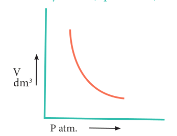




# 6.2. The Gas Laws

The gas laws have played a major role in the development of chemistry. The physical properties of all gases are governed by the gas laws that were formulated based on the studies of the properties like pressure, volume, etc., as a function of temperature. Before studying the gas laws in detail, let us understand an important parameter, namely, the pressure.

Pressure is defined as force divided by the area to which the force is applied. The SI unit of pressure is pascal which is defined as 1 Newton per square meter (Nm-2). There are other units that are commonly used and their relation with the SI unit is as follows.


Pressure=\frac{Force(N or kg m^-2)}{Area(m^2)}


**Table 6.1 Units of pressure**

| Unit |Symbol |Value (Nm   or  kgm s )-2 -1 -2 |
|------|------|------|
| pascal |Pa |1 Pa = 1 Nm-2 |
| atmosphere |atm |1 atm = 101325 Pa |
| millimeter of mercur y |mmHg |1 mmHg = 133.322 Pa |
| bar |bar |1 bar = 10  Pa5 |
| torr |Torr |1 Torr = 133.322 Pa |
| pound per square inch |psi |1 psi = 6894.76 pa |
  

## 6.2.1 Boyle’s Law: Pressure-Volume Relationship

Robert Boyle performed a series of experiments to study the relation between the pressure and volume of gases. The schematic of the apparatus used by him is shown in figure 6.1.

.png>)

Mercury was added through the open end of the apparatus such that the mercury level on both ends are equal as shown in the figure 6.1(a). Add more amount of mercury until the volume of the trapped air is reduced to half of its original volume as shown in figure 6.1(b). The pressure exerted on the gas by the addition of excess mercury is given by the difference in mercury levels of the tube. Initially the pressure exerted by the gas is equal to 1 atm as the difference in height of the mercury levels is zero. When the volume is reduced to half, the difference in mercury levels increases to 760 mm. Now the pressure exerted by the gas is equal to 2 atm. It led him to conclude that at a given temperature the volume occupied by a fixed mass of a gas is inversely proportional to its pressure.

(a) (b) (c)  

Mathematically, the Boyle’s law can be written as

$$
V α \frac{1}{P} ------- (6.1)
$$

(T and n are fixed, T-temperature, n- number of moles) 
$$
V = K × \frac{1}{P} ------- (6.2)
$$

k – proportionality constant When we rearrange equation 6.2. PV = k ------ (6.2a)(at constant temperature and mass) 

Boyle’s law is applicable to all gases regardless of their chemical identity (provided the pressure is low). Therefore, for a given mass of a gas under two different sets of conditions at constant temperature we can write 

$$
 P1V1 = P2V2 = k ------ (6.3)
$$

.png>)

  

The PV relationship can be understood as follows. The pressure is due to the force of the gas particles on the walls of the container. If a given amount of gas is compressed to half of its volume, the density is doubled and the number of particles hitting the unit area of the container will be doubled. Hence, the pressure would increase twofold.

**Consequence of Boyle’s law**

The pressure-density relationship can be derived from the Boyle’s law as shown below.

$$
K=\frac{[H_3O^+][OH^-]}{[H_2O]^2}
$$

$$
Pressure=\frac{{Force}(N\quad or\quad kg\quad m^-2)}{Area(m^2)}
$$

$$
P1V1 = P2V2 (Boyle’s law)
$$

$$
P1\frac{m}{d_1}=P2\frac{m}{d_2}
$$

where “m” is the mass, d1 and d2 are the densities of gases at pressure P1 and P2.

$$
\frac{P_1}{d_1}=\frac{P_2}{d_2}  ------ (6.4)
$$

In other words, the density of a gas is directly proportional to pressure.

|**All the passenger aeroplane cabins have to be artificially pressurised. do you know why?**|
|------|
|All the passenger aeroplane cabins have to be artificially pressurised. do you know why? Most commercial aeroplanes fly at about 30,000 feet altitude. The pressure decreases with the increase in altitude as there are fewer molecules per unit volume of air. Hence, while at air, the pressure around the aeroplane will be so low that one could pass out for lack of oxygen. For this reason aeroplanes cabins are artificially pressurized.

.png>)

Similarly, the effect of drop in pressure is felt as a little pain in the ears by a person while ascending a mountain in a plain. Though the external pressure drops, the internal pressure within the ear cavities remains the same. This creates an imbalance. The greater internal pressure forces the eardrum to bulge outward causing pain. The excess air within the ear cavities escapes after some time and with the help of yawning and thereby equalizing the internal and external pressure to relieve the pain.
Underwater divers are advised not to hold the breath unnecessarily while diving. Do you know why?|

In figure (6.3) let us find the missing parameters (volume in 6.3 (b) and pressure in 6.3(c))

.png>)

  

**Solution:**

According to Boyle’s law, at constant temperature for a given mass of gas at constant temperature,


P1V1 = P2V2 = P3V3



1 atm × 1 dm3 = 2 atm × V2 = P3 × 0.25 dm3



∴ 2 atm × V2 = 1 atm × 1 dm3



V2=\frac{1 atm × 1 atm^3}{2 atm}


>**Evaluate Yourself**
1\. Freon-12, the compound widely used in the refrigerator system as coolant causes depletion of ozone layer. Now it has been replaced by eco-friendly compounds. Consider 1.5 dm3 sample of gaseous Freon at a pressure of 0.3 _atm_. If the pressure is changed to 1.2 _atm_. at a constant temperature, what will be the volume of the gas increased or decreased?

>2\. Inside a certain automobile engine, the volume of air in a cylinder is 0.375 dm3, when the pressure is 1.05 _atm_. When the gas is compressed to a volume of 0.125 dm3 at the same temperature, what is the pressure of the compressed air?  

**6.2.2 Charles Law (Volume-temperature relationship)**

The relationship between volume of a gas and its temperature was examined by J. A. C. Charles. He observed that for a fixed mass of a gas at constant pressure, the volume is directly proportional to its temperature (K). Mathematically it can be represented as (at constant P and n)


V = kT ------- (6.5)



 Or\quad \frac{V}{T}=Constant


If the temperature of the gas increases, the volume also increases in direct proportion, so that \frac{V}{T} is a constant.For the same system at constant pressure, one can write

$$
\frac{V_1}{T_1}=\frac{V_2}{T_2}= Constant ----- (6.6)
$$

For example, if a balloon is moved from an ice cold water bath to a boiling water bath, the temperature of the gas increases. As a result, the gas molecules inside the balloon move faster and gas expands. Hence, the volume increases.

.png>)
**Variation of volume with temperature at constant pressure**

The plot of the volume of the gas against its temperature at a given pressure is shown in the figure 6.5. From the graph it is clear that the volume of the gas linearly increases with temperature at a given pressure. Such lines are called isobars. It can be expressed by the following straight line equation.

V = mT + C where T is the temperature in degree Celsius and m & C are constants.

When T= 0 ºC the volume becomes V0. Hence, V0 = C and slope of the straight line m is equal to ΔV / ΔT. Therefore the above equation can be written in the following form.

$$
V={ΔV \choose ΔT}T + V_0 ------- (6.7)
$$

(n, P are constant)

Divide the equation 6.7 by V0

$$
 \frac{V}{V_0}=\frac{1}{V_0}{ΔV \choose ΔT}T+1\-------- (6.8)
$$

**Figure. 6.5 Plot of volume vs t**  

Charles and Gay Lussac found that under constant pressure, the relative increase in volume per degree increase in temperature is same for all gases. The relative increase in volume per º C (α)is

equal to

$$
 \frac{1}{V_0}{ΔV \choose ΔT}T
 $$ 

Therefore

$$
 \frac{V}{V_0}=αT + 1------ (6.9)
 $$ 

Charles found that the coefficient of expansion is approximately equal to 1/273. It means that at constant pressure for a given mass, for each degree rise in temperature, all gases expand by 1/273 of their volume at 00C

o 100 Co 200 Co 300 Co 400 Co

373 K 473 K 573 K 673 K

V0

**emperature for an ideal gas**

T

V

  

If we extrapolate the straight line in the figure 6.5 beyond the experimental measurements, the straight line intersects the temperature axis (x-axis) at -2730 C. This shows that the volume of the gas becomes zero at -2730 C, more precisely this temperature is -273.150 C. Beyond this temperature the gas would have a negative volume which is physically impossible. For this reason, this temperature was defined as absolute zero by Kelvin and he proposed a new temperature scale with absolute zero as starting point which is now called Kelvin scale. The only difference between the Kelvin scale of temperature and Celsius scale of temperature is that the zero position is shifted. The boiling and freezing point of water in both scales are given below.

| Kelvin Scale |Celsiusscale |
|------|------|------|
| Absolute Zero |0 K |-273.15 °C |
| Freezing point of water |273.15 K |0 °C |
| B oiling point of water |373.15 K |100 °C |

**Example:** In figure 6.6 let us find the missing parameters (volume in 6.6 (b) and temperature in 6.6(c))

$$
P = 1 atm 
$$


V3 = 0.15 dm^3


$$
T3 = ? K
$$

$$
P = 1 atm 
$$


V1 = 0.3 dm^3


$$
T3 = 200 K
$$

$$
P = 1 atm 
$$


V2 = ? dm^3


$$
T2 = 300 K
$$

**Fig. 6.6. Effect of temperature on volume of the gas to verify Charles law**  

Solution:

According to Charles law,

$$
\frac{V_1}{T_1}=\frac{V_2}{T_2}=  \frac{V_3}{T_3}
$$

$$
\frac{0.3 dm^3}{200 K}=\frac{V_2}{300K}=  \frac{0.15 dm^3}{T_3}
$$

$$
\frac{V_2}{300K}=  \frac{0.3 dm^3}{200 K}
$$

$$
V_2=  \frac{300×0.3 dm^3}{200 K}
$$

$$
V_2=  0.45 dm^3\quad and 
$$

$$
\frac{0.15 dm^3}{T^3}=  \frac{0.3 dm^3}{200 K}
$$

$$
T_3=  \frac{0.15 dm^3 × 200K}{0.3 dm^3}
$$

$$
T_3=  200K
$$

|**Evaluate yourself**|
|------|
|3A sample of gas has a volume of 3.8 dm3 at an unknown temperature. When the sample is submerged in ice water at 0 °C, its volume gets reduced to 2.27 dm3. What is its initial temperature?|

**6.2.3 Gay-Lussac’s Law (Pressure- temperature relationship)**

Joseph Gay-Lussac stated that, at constant volume the pressure of a fixed mass of a gas is directly proportional to temperature.

$$
P α T
$$

  
$$
or\quad P T= Constant k
$$

If P1 and P2 are the pressures at temperatures T1 and T2, respectively, then from Gay Lussac’s law

$$
\frac{P_1}{T_1}=  \frac{P_2}{T_2}
$$

**Activity -1**

The table below contains the values of pressure measured at different temperatures for 1 mole of an ideal gas. Plot the values in a graph and verify the Gay Lussac’s law. \[Lines in the pressure vs temperature graph are known as iso chores (constant volume) of a gas.\]

| Temperature (in deg celcius)|32|69|94|130|154|191|
|------|------|------|------|------|------|------|
| Pressure in 50 L container (atm)|0.51|0.56|0.6|0.66|0.7|0.76|
| Pressure in 75 L container (atm)|0.34|0.37|0.40|0.44|0.47|0.51|

**6.2.4 Avogadro’s Hypothesis**

Avogadro hypothesised that equal volumes of all gases under the same conditions of temperature and pressure contain equal number of molecules. The mathematical form of Avogadro’s hypothesis may be expressed as

$$
Vα n
$$

$$
\frac{V_1}{n_1}=  \frac{V_2}{n_2} = constant -------- (6.10)
$$

where V1 & n1 are the volume and number  
of moles of a gas and V2 & n2 are a different set of values of volume and number of moles of the same gas at same temperature and pressure.

|**Evaluate yourself**|
|------|
|An athlete in a kinesiology research study has his lung volume of 7.05 dm3 during a deep inhalation. At this volume the lungs contain 0.312 mole of air. During exhalation the volume of his lung decreases to 2.35 dm3. How many moles of air does the athlete exhale during exhalation? (assume pressure and temperature remain constant)|