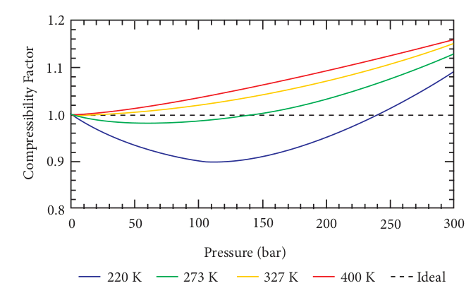




**6.5 Deviation from ideal gas behaviour**

The kinetic theory of gases (postulates of kinetic theory of gases are described in physics text book) which is the basis for the gas equation (PV=nRT),  

assumes that the individual gas molecules occupy negligible volume when compared to the total volume of the gas and there is no attractive force between the gas molecules. Gases whose behaviour is consistent with these assumptions under all conditions are called ideal gases. But in practice both these assumptions are not valid under all conditions. For example, the fact that gases can be liquefied shows that the attractive force exists among molecules. Hence, there is no gas which behaves ideally under all conditions. The non-ideal gases are called real gases. The real gases tend to approach the ideal behaviour under certain conditions.

**6.5.1 Compressibility factor Z**

The deviation of real gases from ideal behaviour is measured in terms of a ratio of PV to nRT. This is termed as compressibility factor. Mathematically,

$$
Z=\frac{PV}{nRT}
$$

For ideal gases PV = nRT, hence the compressibility factor, Z = 1 at all temperatures and pressures. For these gases the plot of Z vs P should be a straight line parallel to the pressure axis. When a gas deviates from ideal behaviour, its Z value deviates from unity. For all gases, at very low pressures and very high temperature the compressibility factor approaches unity and they tend to behave ideally. The plot of the compressibility factor vs pressure for some common gases are shown in Figure 6.8.

.png>)

  

When the pressure is low, the volume of the container is very large compared to the volume of the gas molecules so that individual volume of the gas molecules can be neglected. In addition, the molecule in a gas are far apart and attractive forces are negligible. As the pressure increases, the density of gas also increases and the molecules are much closer to one another. Hence, the intermolecular force becomes significant enough to affect the motion of the molecules and the gas will not behave ideally.

At high temperatures the average kinetic energy of the molecules is very high and hence inter moleclular attractions will become insignificant. As the temperature
decreases, the average kinetic energy of molecules also decreases, hence the molecular attraction is enhanced. The temperature at which a real gas obeys ideal gas law over an appreciable range of pressure is called Boyle temperature or Boyle point. The Boyle point varies with the nature of the gas. Above the Boyle point, for real gases, Z > 1, ie., the real gases show positive deviation. Below the Boyle point, the real gases first show a decrease for Z, reaches a minimum and then increases with the increase in pressure. So, it is clear that at low pressure and at high temperature, the real gases behave as ideal gases.

**6.5.2 Compressibility factor for real gases**

The compressibility factor Z for real gases can be rewritten

$$
Z= \frac{PV_{real}}{nRT}− − − − − (6.17)
$$

$$
V_{ideal}= \frac{nRT}{P}− − − − − (6.18)
$$

Substituting 6.18 in 6.17

$$
Z=\frac{V_{real}}{V_{ideal}}----------- (6.19)
$$

Where Vreal is the molar volume of the real gas and Videal is the molar volume of it when it behaves ideally.

**6.5.3 Van der Waals Equation**

J. D. Van der Waals made the first mathematical analysis of real gases. His  

treatment provides us an interpretation of real gas behaviour at the molecular level. He modified the ideal gas equation PV = nRT by introducing two correction factors, namely, pressure correction and volume correction.

**Pressure Correction:**

The pressure of a gas is directly proportional to the force created by the bombardment of molecules on the walls of the container. The speed of a molecule moving towards the wall of the container is reduced by the attractive forces exerted by its neighbours. Hence, the measured gas pressure is lower than the ideal pressure of the gas. Hence, van der Waals introduced a correction term to this effect.

.png>)

Van der Waals found out the forces of attraction experienced by a molecule near the wall are directly proportional to the square of the density of the gas.

$$
P α ρ^2
$$

$$
ρ=\frac{n}{V}
$$
  

where n is the number of moles of gas and V is the volume of the container

$$
\Rightarrow P α \frac{n^2}{V^2}
$$

$$
\Rightarrow P = a\frac{n^2}{V^2}
$$

where a is proportionality constant and depends on the nature of gas

Therefore,

$$
P_{ideal}=P+\frac{aN^2}{V^2}------ (6.20)
$$

**Volume Correction**

As every individual molecule of a gas occupies a certain volume, the actual volume is less than the volume of the container, V. Van der Waals introduced a correction factor V' to this effect. Let us calculate the correction term by considering gas molecules as spheres.

.png>)

$$
V=excluded\quad volume\quad Excluded\quad volume\quad for\quad two\quad molecules\quad = \frac {4}{3}\Pi{(2r)^3}
$$

$$
=8\left (\frac{4}{3}\pi r^3\right )=8 V_3
$$

where vm is a volume of a single
molecule 

Excluded volume for single molecule

$$
=\frac{8V_m}{2}=4V_m
$$

Excluded volume for n molecule

$$
=n(4 V_m)=nb
$$

Where b is van der waals constant
whch is equal to 4Vm

$$
\Rightarrow V^'=nb
$$

$$
V_{ideal}=V-nb----(6.21)
$$

Replacing the corrected pressure and volume in the ideal gas equation PV=nRT we get the van der Waals equation of state for real gases as below,

$$
\left (P+ \frac{an^2}{V^2} \right )(V-nb) = nRT----(6.22)
$$

The constants _a_ and _b_ are van der Waals constants and their values vary with the nature of the gas. It is an approximate formula for the non-ideal gas.

