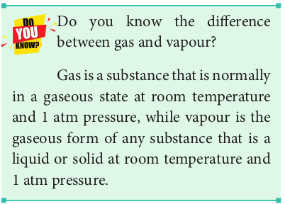

**6.1. Introduction**

We can survive for weeks without food, days without water, but only minutes without air. Thus, we inhale a lungful of air every few seconds, keep some of the molecules for our own end, and some of the molecules that our body no longer needs, and exhale the mixture back into the surrounding air. The air around us is in the gaseous state, which is the simplest of the states of matter. Although the chemical behaviour of gases depends on their composition, all the gases have remarkably similar physical behaviour.

Earth is surrounded by an atmosphere of air whose composition in volume percentage is roughly 78 % nitrogen, 21 % oxygen and 1 % other gases. Of the known elements, only eleven are gases under normal atmospheric conditions. The elements hydrogen 
(H2), nitrogen (N2), oxygen (O2), fluorine (F2) and chlorine (Cl2) exist as gaseous diatomic molecules. Another form of oxygen, namely, ozone(O3) is also a gas at room temperature. The noble gases, namely, helium (He), neon (Ne), argon (Ar), krypton (Kr), xenon (Xe) and radon (Rn) of 18th group are monatomic gases. Compounds such as carbon monoxide (CO), carbon dioxide (CO2), nitrogen dioxide (NO2) and nitric oxide (NO) also exist in gaseous state under normal atmospheric conditions. In this unit you will learn the properties of gases and other related phenomena.