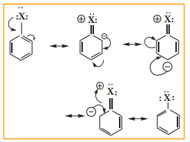




**14.5 Haloarenes**

Haloarenes are the compounds in which the halogen is directly attached to the benzene ring.

**X**

**14.5.1. Nomenclature of haloarenes**

In the IUPAC nomenclature, the halo arenes are named by adding prefix halo before the name of the aromatic hydrocarbon. For naming disubstituted arenes, the relative position of the substituent 1,2; 1,3 and 1,4 are indicated by the prefixes ortho, meta and para, respectively.

For poly haloarenes the numbering should be done in such a way that the lowest possible number should be given to the substituents and the name of the halogens are arranged in alphabetic order.

Nomenclature can be well understood from the following examples.  

| C ompound |IUPAC NAME |
|------|------|
| 1 |1, 2 - DichlorobenzeneClCl |
| 2 |1, 3- DibromobenzeneBrBr |
| 3 |1,3,5-tri bromobenzeneBrBr Br |
| 4 |1- Bromo - 4- uoro -2-  iodobenzene FIBr |
| 5 |1- Bromo -2- chloro-4- iodobenzeneBrClI |
  

**14.5.2 Nature of C- X bond in haloarenes**

In halo arenes the carbon atom is sp2 hybridised. The sp2 hybridised orbitals are shorter and holds the electron pair of bond more tightly.

Halogen atom contains P-orbital with lone pair of electrons which interacts with π-orbitals of benzene ring to form extended conjugated system of π- orbitals. The delocalisation of these electrons give double bond character to C – X bond. The resonance structure of halobenzene is given as

Due to this double bond character of C- X bond in haloarenes ,the C-X bond is
shorter in length and stronger than in halo alkanes.

**Example**

.png>) 
.png>)

**14.5.3 Methods of preparation**

**1) Direct halogenation**

Chlorobenzene is prepared by the direct chlorination of benzene in the presence of lewis acid catalyst like FeCl3

.png>)

**2) From benzene diazonium chloride**

Chloro benzene is prepared by Sandmeyer reaction or Gattermann reaction using benzene diazonium chloride.

**(i) Sandmeyer reaction**

When aqueous solution of benzene diazonium chloride is warmed with Cu2Cl2 in HCl gives chloro benzene  

.png>)

**3) Preparation of iodobenzene**

Iodobenzene is prepared by warming benzene diazonium chloride with aqueous KI solution.

$$
C_6H_5N_2Cl+KI \xrightarrow[{}]{warm}C_6H_5I+N_2+KCl
$$

**4) Preparation of fluorobenzene**

Fluoro benzene is prepared by treating benzenediazonium chloride with fluoro boric acid. This reaction produces diazonium fluoroborate which on heating produces fluorobenzene. This reaction is called Balz – schiemann reaction.

.png>)

**5) Commercial preparation of chloro**

**benzene (Raschig process)**

Chloro benzene is commercially prepared by passing a mixture of benzene vapour, air and HCl over heated cupric chloride .This reaction is called Raschig process.

.png>)

**14.5.4 Physical properties**

**1\. Melting and boiling points**

The boiling points of monohalo benzene which are all liquids follow the order

Iodo > Bromo > Chloro

The boiling points of isomeric dihalobenzene are nearly the same

The melting point of para isomer is generally higher than the melting points of ortho and meta isomers. The higher melting point of p-isomer is due to its symmetry which leads to more close packing of its molecules in the crystal lattice and consequently strong intermolecular attractive force which requires more energy for melting

p –Dihalo benzene > o- Dichloro benzene > m-Dichloro benzene

**2\. Solubility**

Haloarenes are insoluble in water because they cannot form hydrogen bonds with water ,but are soluble in organic solvents  

**3\. Density**

Halo arenes are all heavier than water and their densities follow the order.

Iodo benzene > Bromo benzene > Chloro benzene

**14.5.5 Chemical properties**

**A. Reactions invoving halogen atom**

**1\. Aromatic nucleophilic substitution reaction**

Halo arenes do not undergo nucleophilic substitution reaction readily. This is due to C–X bond in aryl halide is short and strong and also the aromatic ring is a centre of high electron density.

The halogen of haloarenes can be substituted by OH– , NH2, or CN– with appropriate nucleophilic reagents at high temperature and pressure.

**For Example**

$$
C_6H_5Cl + NaOH \xrightarrow[{300 atm}]{350^0}C_6H_5OH +NaCl
$$

This reaction is known as Dow’s Process

$$
C_6H_5Cl + 2NH_3  \xrightarrow[{50  atm}]{250^0}C_6H_5NH_2 +NH_4Cl
$$

$$
C_6H_5Cl + CuCN  \xrightarrow[{Pyridine}]{250^0}C_6H_5CN +CuCl
$$

**2\. Reaction with metals**

**a) Wurtz Fittig reaction**

Halo arenes reacts with halo alkanes when heated with sodium in ether solution to form alkyl benzene. This reaction is called Wurtz Fittig reaction.

$$
C_6H_5Cl +2Na + ClC_2H_5  \xrightarrow[{\Delta }]{Ether }C_6H_5 C_2H_5 +2NaCl
$$
 
**b) Fittig reaction**

Haloarenes react with sodium metal in dry ether, two aryl groups combine to give biaryl products. This reaction is called Fittig reaction

$$
C_6H_5Cl+2Na+Cl-C_6H_5 \xrightarrow[{\Delta }]{Ether } C_6H_5 C_6H_5 +2NaCl
$$

**B) Reaction involving aromatic ring**

**3\. Electrophilic substitution reaction**

Haloarenes undergo aromatic electrophilic substitution reactions. The rate of eleclophilic substitution of halobenzene is lower than that of benzene. halogen is deactivating due to - I effect of halogen. The lone pair of electrons on the chlorine involves in resonance with the ring. It increases the electron density at ortho and para position (refer figure no 14.1). The halogen attached to the benzine ring with draw electron and thereby and hence the halogen which is attached to the benzene directs the incoming, electrophile either to ortho or to para position in electrophilie substitution reaction  

.png>)

**Toluene**

**4) Reduction**

Haloarenes on reduction with Ni- Al alloy in the presence of NaOH gives corresponding arenes.

$$
C_6H_5Cl+2(H)\xrightarrow[{ NaOH }]{Ni-Al} C_6H_6 +HCl
$$

**5) Formation of Grignard reagent**

Haloarenes reacts with magnesium to form Grignard reagent in tetra hydrofuran (THF).

$$
C_6H_5Cl + Mg\xrightarrow[{}]{THF} C_6H_5MgCl
$$

**14.5.6 Uses of Chloro benzene**

i) Chloro benzene is used in the manufacture of pesticides like DDT

ii) It is used as high boiling solvent in organic synthesis.

iii) It is used as fibre - swelling agent in textile processing.

<pre>
Evaluate Yourself

Haloalkanes undergo nucleophilic substitution reaction whereas haloarenes  undergo electrophilic substitution  reaction. comment.
</pre>

| (Nitration)H(Sulphonation) (Friedel - Cras alklation) |
|------|------|

