


**14.6 Poly halogen compounds**

Carbon compounds containing more than one halogen atoms are called poly halogen compounds. Some of the important poly halogen compounds are described below.

They are classified as

**a) gem – dihalides**
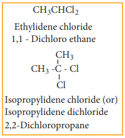

**b) vic - dihalides**

**For Example**

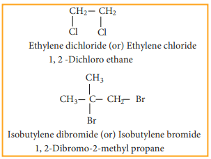

**14.6.1 Preparation**

**a) gem- dihalides**

**(i) Treating acetaldehyde with PCl5**

$$
CH_3CHO + PCl_5 \xrightarrow[{}]{}H_3CHCl_2 + POCl_3
$$

**(ii) Adding hydrogen chloride to acetylene**
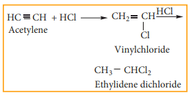

**b) vic- dihalides**

Ethylene dichloride (1, 2 - Dichloro ethane) is prepared by the following methods.

**i) Addition of chlorine to ethylene**

**ii) Action of PCl5 (or HCl) on ethylene glycol**

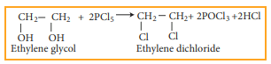

**Properties**

**Physical Properties**

i) They are sweet smelling, colourless liquids having relatively high boiling points.

ii) The boiling point of ethylidene chloride is less than that of ethylene dichloride.

**Chemical properties**

**1) Hydrolysis with aqueous NaOH or KOH**

Gem-Dihalides, on hydrolysis with aqueous KOH give an aldehyde or a ketone vic-Dihalides, on hydrolysis with aqueous KOH gives glycols.

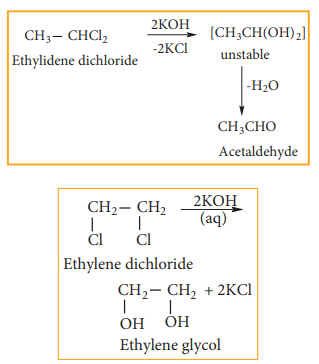

This reaction can be used to distinguish the
gem- Dihalides and vic- Dihalides.

**2) Reaction with Zinc (Dehalogenation)**

Gem- Dihalides and vic- Dihalides on treatment with zinc dust in methanol give alkenes.  

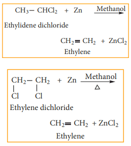

**3) Reaction with Alcoholic KOH (Dehydrohalogenation)**

gem- Dihalides and vic- Dihalides on treatment with alcoholic KOH give alkynes.

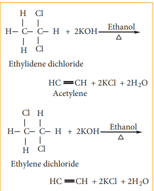

**Methylene chloride (Di chloromethane)**

**Preparation** Methylene chloride is prepared by the following methods

  

**1) Reduction of chloroform**

a) Reduction of chloroform in the presence of Zn + HCl gives methylene chloride.

$$
CHCl_3 Zn+HCl\xrightarrow[{2(H)}]{Zn+HCl} CH2Cl2 + HCl
$$

**b) Reduction of chloroform using H2/Ni**

$$
CHCl_3 Zn+HCl\xrightarrow[Ni]{H_2} CH2Cl2 + HCl
$$

methylene chloridechloro form Ni

**2) Chlorination of methane**

Chlorination of methane gives methylene chloride

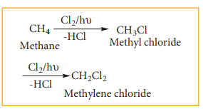

**Uses of methylene chloride**

Methylene chloride is used as

1) aerosol spray propellant

2) solvent in paint remover

3) process solvent in the manufacture of drugs

4) a metal cleaning solvent

**14.6.2 Trihaloalkane**

Trihaloalkanes are compounds obtained by replacing three hydrogen atoms of a hydrocarbon by three halogen atoms.  

**Example**

$$
CHCl_3\quad
Chloroform 
$$

$$
CHI3\quad
Iodoform
$$

**1) Chloroform**

Chloroform is an important trihaloalkane. Dumas named CHCl3 as chloroform as it gives formic acid on hydrolysis.

**Preparation:**

Chloroform is prepared in the laboratory by the reaction between ethyl alcohol with bleaching powderfollowed by the distillation of the product chloroform. Bleaching powder act as a source of chlorine and calcium hydroxide. This reaction is called haloform reaction. The reaction proceeds in three steps as shown below.

**Step – 1: Oxidation**

$$
CH_3CH_2OH + Cl_2 → CH_3CHO + 2HCl
$$

**Step – 2: Chlorination**

$$
CH_3CHO + 3Cl_2 → CCl_3CHO + 3HCl
$$

**Step – 3: Hydrolysis**

$$
2CCl_3CHO + Ca{(OH)}_2 → 2CHCl_3 + {(HCOO)}_2 Ca
$$

**Properties**

**Physical properties**

(i) Chloroform is a colourless liquid with peculiar sickly smell and a burning taste

(ii) The vapours of chloroform when inhaled it causes unconsciousness (depress the central nervous system) and hence it is used as an anaesthetic.

**Chemical properties**

**1) Oxidation**

Chloroform undergoes oxidation in the presence of light and air to form phosgene (carbonyl chloride)

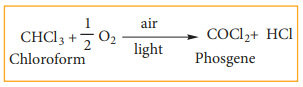

Since phosgene is very poisonous, its presence makes chloroform unfit for use as anaesthetic.

**2) Reduction**

Chloroform undergoes reduction with zinc and HCl in the presence of ethyl alcohol to form methylene chloride.

CH2Cl2 Methylene chloride

$$
CHCl_3 +2[H]\xrightarrow[{HCl}]{Zn} + HCl 
$$

**3) Nitration**

Chloroform reacts with nitric acid to form chloropicrin.(Trichloro nitro methane)  

$$
CHCl_3 +HNO_3\xrightarrow[{}]{}  Chloroform
$$

It used as an insecticide and soil sterilising agent.

**4) Carbylamine reaction**

Chloroform reacts with aliphatic or aromatic primary amine and alcoholic caustic potash, to give foul smelling alkyl isocyanide (carbylamines)

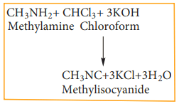

This reaction is used to test primary amine.

<pre>
Evaluate Yourself

7) Chloroform is kept with a little ethyl  
alcohol in a dark coloured bottle why?
</pre>

**14.6.3 Tetra haloalkane**

Carbon tetrachloride is a good example for tetra haloalkane

Carbon tetrachloride

**Preparation**

**1\. Chlorination of methane** The reaction of methane with excess of chlorine in the presence of sunlight will give carbon tetrachloride as the major product.

$$
CH_4 + 4Cl_2 \xrightarrow[{}]{hγ}CCl_4+4HCl
$$

  

**2\. Action of carbondisulphide with chlorine gas**

Carbon disulphide reacts with chlorine gas in the presence of anhydrous AlCl3 as catalyst giving carbon tetrachloride

$$
CS_2 + 3Cl_2 \xrightarrow[{AlCl_3}]{anhydrous}CCl_4+ S_2Cl_2 
$$

**Physical properties** 

(i) Carbon tetrachloride is a colourless
liquid with its specific smell

(ii) It is insoluble in water and soluble in organic solvents

**Chemical properties**

**(i) Hydrolysis** Carbon tetrachloride reacts with hot water or with hot water vapour producing the poisonous gas, phosgene.

$$
CCl_4 + H_2O(g)\xrightarrow[{}]{} COCl_2 + 2HCl 
$$

**(ii) Reduction**

Carbon tetrachloride is reduced by iron powder in dilute HCl medium to form chloroform

$$
CCl_4 + 2(H) \xrightarrow[{}]{Fe/HCl}CHCl_3 + HCl
$$ 
**14.6.4 Freons (CFC)** The chloro fluoro derivatives of methane and ethane are called freons.  

**Nomenclature** Freon is represented as Freon-cba

Where c = number of carbon atoms – 1

b = number of hydrogen atoms + 1

a = total number of fluorine atoms

**Example**
| Formula |C–1 |H+1 |F |Name |
|------|------|------|------|------|
| CFCl3 |1–1=0 |0+1=1 |1 |Freon–11 |
| CF Cl2 2 |1–1=0 |0+1=1 |2 |Freon–12 |
| C F Cl2 2 4 |2–1=1 |0+1=1 |2 |Freon– 112 |
| C F Cl2 3 3 |2–1=1 |0+1=1 |3 |Freon- 113 |

Freon – 12 is prepared by the action of hydrogen fluoride on carbon tetrachloride in the presence of catalylic amount of antimony pentachloride. This is called swartz reaction.

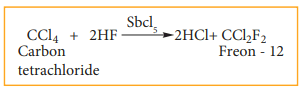

**Physical properties**

Freons are highly stable, unreactive, non corrosive, non toxic, easily liquefiable gases.

**Uses:** 

(i) Freons are a used as refrigerants in
refrigerators and air conditioners. 

(ii) It is used as a propellant for aerosols and foams

(iii) It is used as propellant for foams to spray out deodorants, shaving creams, and insecticides.

  

**14.6.5 DDT (p,p’-dichloro diphenyl tri- chloro ethane)** DDT, the first chlorinated organic pesticide was prepared in 1873, and in 1939 Paul Muller discovered the effectiveness of DDT as an insecticide. He was awarded Noble prize in medicine and physiology in 1948 for this discovery. DDT can be prepared by heating a mixture of chlorobenzene with chloral (Trichloro acetaldehyde) in the presence of Conc.H2SO4.

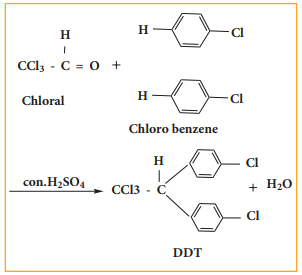

<pre>
Evaluate Yourself

8) What is the IUPAC name of the insecticide  
DDT? Why is their use banned in most of the countries?
</pre>

**Uses:** 

i) DDT is used to control certain insects
which carries diseases like malaria and yellow fever

ii) It is used in farms to control some agricultural pests

iii) It is used in building construction as pest control

iv) It is used to kill various insects like housefly and mosquitoes due to its high and specific toxicity.  
