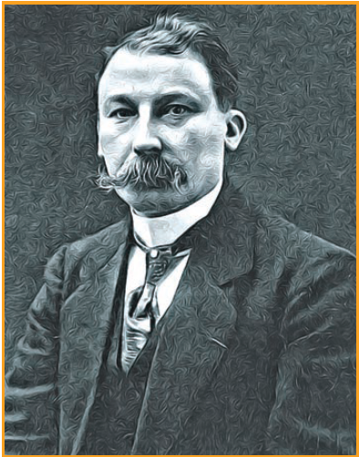

  

Unit **14** **Haloalkan Haloarene**

He a French chemist was awarded the noble prize for chemistry in 1912. He prepared and realised the usefulness of organo magnesium compounds. He took maths degree and eventually switched over organic chemistry while attempting to find the catalyst for the process of Methylation.

**Francois Auguste Victor Grignard** 

**Learning Objectives**

After learning this unit, students will be able to
• classify the various organic halo compounds.
• name the organic halo compounds according to
IUPAC system.
• recognise the nature of C-X bond.
• describe the general methods of preparation of
haloalkanes and haloarenes
• explain the physical and chemical properties of
haloalkanes and haloarenes.
• describe the mechanism of nucleophilic
substitution and elimination reactions of halo
organics
• explain the preparation and synthetic uses of
grignard reagent.
• highlight the uses of poly halogen compounds.
• comprehend the environmental effect of poly
halogen compounds.

