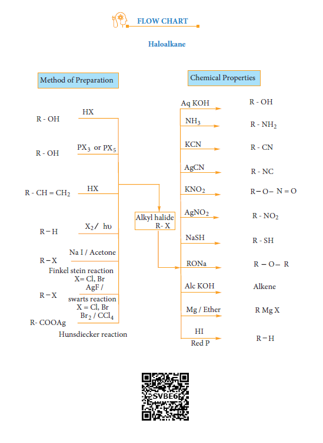
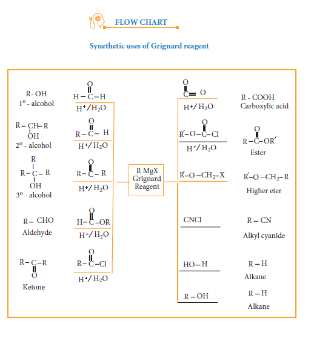

**Evaluation**

**I. Choose the best answer.**

1\. The IUPAC name of **H3C**

**H H3C**

**H H**

**Br** is

a) 2-Bromo pent – 3 – ene

b) 4-Bromo pent – 2 – ene c) 2-Bromo pent – 4 – ene d) 4-Bromo pent – 1 – ene

2\. Of the following compounds, which has the highest boiling point?

a) n-Butyl chloride

b) Isobutyl chloride

c) t-Butyl chloride

d) n-propyl chloride

3\. Arrange the following compounds in increasing order of their density

A) CCl4 B) CHCl3

C) CH2Cl2 D) CH3Cl a) D < C < B < A b) C > B > A > D c) A < B < C < D d) C > A > B > D

4\. With respect to the position of – Cl in the compound CH3 – CH = CH – CH2 – Cl, it is classified as

a) Vinyl b) Allyl

c) Secondary d) Aralkyl

5\. What should be the correct IUPAC name of diethyl chloromethane?

a) 3 – Chloro pentane

b) 1-Chloropentane

c) 1-Chloro-1, 1, diethyl methane

d) 1 –Chloro-1-ethyl propane

  

6\. C -X bond is strongest in

a) Chloromethane

b) Iodomethane

c) Bromomethane

d) Fluoromethane

7\. In the reaction

X is \_\_\_\_\_\_\_\_\_

a) b)

**Cl**

c)

**Cl Cl**

d) **Cl**

**ClCl**

8\. Which of the following compounds will give racemic mixture on nucleophilic substitution by OH- ion?

i) - CH - CH

C2H5

CH3 2Br

ii) **H3C C**

**CH3**

**Br**

**C2H5**

iii) **CH3 - C - C2H5**

**Cl**

**H**

a) (i) b) (ii) and (iii) c) (iii) d) (i) and (ii)

9\. The treatment of ethyl formate with excess of RMgX gives

a) R- C - R O

b) R- CH - R OH

**N= N-Cl**

**Cu HCl X+N2.**  

c) R- CHO d) R- O – R

10\. Benzene reacts with Cl2 in the presence of FeCl3 and in absence of sunlight to form

a) Chlorobenzene

b) Benzyl chloride

c) Benzal chloride

d) Benzene hexachloride

11\. The name of C2F4Cl2 is \_\_\_\_\_\_\_\_\_\_\_

a) Freon – 112

b) Freon – 113

c) Freon – 114

d) Freon – 115

12\. Which of the following reagent is helpful to differentiate ethylene dichloride and ethylidene chloride?

a) Zn / methanol

b) KOH / ethanol

c) aqueous KOH

d) ZnCl2 / Con HCl

13\. Match the compounds given in Column I with suitable items given in Column II

**Column I (Com- pound)**

**Column II (Uses)**

A Iodoform 1 Fire extinguisher

B Carbon tetra chloride

2 Insecticide

C CFC 3 Antiseptic

D DDT 4 Refrigerants

| C olumn I (C om-pound) |C olumn II (Uses) |
|------|------|------|------|
| A |Iodoform |1 |Fire extinguisher |
| B |Carbon tetra chloride |2 |Insecticide |
| C |CFC |3 |Antiseptic |
| D |DDT |4 |Refrigerants |
  

**Code**

a) A → 2 B → 4 C →1 D →3

b) A → 3 B → 2 C →4 D →1

c) A → 1 B → 2 C →3 D →4

d) A → 3 B → 1 C →4 D →2

14\. **Assertion:** In mono haloarenes, electrophilic substitution occurs at ortho and para positions.

**Reason:** Halogen atom is a ring deactivator

(i) If both assertion and reason are true and reason is the correct explanation of assertion.

(ii) If both assertion and reason are true but reason is not the correct explanation of assertion.

(iii) If assertion is true but reason is false.

(iv) If both assertion and reason are false.

15\. Consider the reaction,

CH3CH2CH2Br + NaCN → CH3CH2CH2CN + NaBr

This reaction will be the fastest in

a) ethanol b) methanol

c) DMF (N, N' – dimethyl formamide)

d) water

16\. Freon-12 is manufactured from tetrachloro methane by

a) Wurtz reaction

b) Swarts reaction

c) Haloform reaction

d) Gattermann reaction

17\. The most easily hydrolysed molecule under SN1 condition is  

a) allyl chloride

b) ethyl chloride

c) ispropylchloride

d) benzyl chloride

18\. The carbo cation formed in SN1 reaction of alkyl halide in the slow step is

a) sp3 hybridised b) sp2 hybridised

c) sp hybridised d) none of these

19\. The major products obtained when chlorobenzene is nitrated with HNO3

and con H2SO4

a) 1-chloro-4-nitrobenzene

b) 1-chloro-2-nitrobenzene

c) 1-chloro-3-nitrobenzene

d) 1-chloro-1-nitrobenzene

20\. Which one of the following is most reactive towards nucleophilic substitution reaction ?

a) O C_l_

b) C_l_

c) C_l_

d) C_l_ 21\. Ethylidene chloride on treatment with

aqueous KOH gives

a) acetaldehyde

b) ehtyleneglycol

c) formaldehyde

d) glycoxal

22\. The raw material for Rasching process

a) chloro benzene b) phenol

c) benzene d) anisole

|------|------|

|------|------|

  

23\. Chloroform reacts with nitric acid to produce

a) nitro toluene

b) nitro glycerine

c) chloropicrin

d) chloropicric acid

24\. acetone i) CH3MgI

ii) H2O / H–1 X, X is

a) 2-propanol

b) 2-methyl-2-propanol

c) 1-propanol

d) acetonol

25\. Silverpropionate when refluxed with Bromine in carbontetrachloride gives

a) propionic acid

b) chloro ethane

c) bromo ethane

d) chloro propane

26\. Classify the following compounds in the form of alkyl, allylic, vinyl, benzylic halides

a) CH3 – CH = CH – Cl (ii) C6H5CH2I

(iii) **CH3 - CH - CH3**

**Br**

(iv) CH2 = CH – Cl

**II. Write brief answer to the following questions.**

27\. Why chlorination of methane is not possible in dark?

28\. How will you prepare n propyl iodide from n-propyl bromide?  

29\. Which alkyl halide from the following pair is i) chiral ii) undergoes faster SN2 reaction?

**Br** **Cl**

30\. How does chlorobenzene react with sodium in the presence of ether? What is the name of the reaction?

31\. Give reasons for polarity of C-X bond in halo alkane.

32\. Why is it necessary to avoid even traces of moisture during the use of Grignard reagent?

33\. What happens when acetyl chloride is treated with excess of CH3MgI?

34\. Arrange the following alkyl halide in increasing order of bond enthalpy of RX

CH3Br, CH3F, CH3Cl, CH3I

35\. What happens when chloroform reacts with oxygen in the presence of sunlight?

36\. Write down the possible isomers of C5H11Br and give their IUPAC and common names.

37\. Mention any three methods of preparation of haloalkanes from alcohols.

38\. Compare SN1 and SN2 reaction mechanisms.

39\. Reagents and the conditions used in the reactions are given below. Complete the table by writing down the product and the name of the reaction.

  

**Reaction Product Name of the reac-**

**tion** CH3CH2OH +

SOCl2

pyridine ?

\-------- --------

CH3CH2Br + AgF ?

\-------- --------

C6H5Cl + Na ether

? -------- --------

40\. Discuss the aromatic nucleophilic substitutions reaction of chlorobenzene.

41\. Account for the following

(i) t-butyl chloride reacts with aqueous KOH by SN1 mechanism while n-butyl chloride reacts with SN2 mechanism.

(ii) p-dichloro benzene has higher melting point than those of o-and m-dichloro benzene.

42\. In an experiment ethyliodide in ether is allowed to stand over magnesium pieces. Magnesium dissolves and product is formed

a) Name the product and write the equation for the reaction.

b) Why all the reagents used in the reaction should be dry? Explain

c) How is acetone prepared from the product obtained in the experiment.

43\. Write a chemical reaction useful to prepare the following:

i) Freon-12 from Carbon tetrachloride

ii) Carbon tetrachloride from carbon disulphide

44\. What are Freons? Discuss their uses  

and environmental effects

45\. Predict the products when bromoethane is treated with the following

i) KNO2 ii) AgNO2

46\. Explain the mechanism of SN1 reaction by highlighting the stereochemistry behind it

47\. Write short notes on the the following

i) Raschig process

ii) Dows Process

iii) Darzens process

48\. Starting from CH3MgI, How will you prepare the following?

i) Acetic acid

ii) Acetone

iii) Ethyl acetate

iv) Iso propyl alcohol v) Methyl cyanide

49\. Complete the following reactions

i) CH3 - CH = CH2 + HBr Peroxide

ii) CH3 - CH2 - Br + NaSH alcohol H2O

iii) C6H5Cl + Mg THF

iv) CHCl3 + HNO3

v) CCl4 + H2O

50\. Explain the preparation of the following compounds

i) DDT ii) Chloroform

| Reaction |Product |Name of the reac-tion |
|------|------|------|
| CH CH OH  + pyridineSO Cl ?3 22 |-------- |-------- |
| CH CH Br  + AgF    ?3 2 |-------- |-------- |
| C H Cl + N a ether ?6 5 |-------- |-------- |
  

iii) Biphenyl

iv) Chloropicrin

v) Freon-12

51\. An organic compound (A) with molecular formula C2H5Cl reacts with KOH gives compounds (B) and with alcoholic KOH gives compound (C). Identify (A),(B), and (C)

52\. Simplest alkene (A) reacts with HCl to form compound (B).Compound (B) reacts with ammonia to form compound (C) of molecular formula C2H7N.Compound (C) undergoes carbylamine test. Identify (A), (B), and (C).  

53\. A hydrocarbon C3H6 (A) reacts with HBr to form compound (B). Compound (B) reacts with aqueous potassium hydroxide to give (C) of molecular formula C3H8O. What are (A) (B) and (C). Explain the reactions.

54\. Two isomers (A) and (B) have the same molecular formula C2H4Cl2. Compound (A) reacts with aqueous KOH gives compound (C) of molecular formula C2H4O. Compound (B) reacts with aqueous KOH gives compound (D) of molecular formula C2H6O2. Identify (A),(B),(C) and (D).

  

Alkyl hal R-

R - OH HX

R - OH PX3 or PX5

R - CH = CH2 HX

R H X2

R X Na I / Acetone

Finkel stein reaction X= Cl, Br

R X AgF /

swarts reaction X = Cl, Br

R- COOAg Br2 / CCl4

Hunsdiecker reaction

Method of Preparation

hυ

