**14.3 Haloalkanes**

Mono halogen derivatives of alkanes are called haloalkanes. Haloalkanes are
represented by general formula R – X, Where, R is an alkyl group (CnH2n+1) – and X is a
halogen atom (X=F, Cl, Br or I). Haloalkanes are further classified into primary, secondary,
tertiary haloalkane on the basis of type of carbon atom to which the halogen is attached.

**14.3.1 Nomenclature**

**Common System**

In the common system, haloalkanes are named as alkyl halides. It is derived by naming the alkyl group followed by the halide.

**IUPAC System**

Let us write the IUPAC name for the below mentioned haloalkanes by applying the general rules of nomenclature that are already discussed in Unit no: 11

| S.No | Structural formula           | Common name         | IUPAC name                           |
|------|-----------------------------|---------------------|--------------------------------------|
| 1    | CH3I                        | methyl iodide       | Iodomethane                          |
| 2    | CH3CH2Br                    | ethyl bromide       | Bromoethane                          |
| 3    | CH3CH2CH2F                  | n-propyl fluoride   | 1-Fluoropropane                     |
| 4    | CH3 - CH - CH3              | F                   | isopropyl fluoride                   |
| 5    | CH3 - CH2 - CH2 - CH2 - Cl  | n-butyl chloride    | 1-Chlorobutane                       |
| 6    | CH3 - CH - CH2 - Cl         | CH3                 | isobutyl chloride                    |
| 7    | CH3 - CH - CH2 - CH3        | Cl                  | sec-butyl chloride                   |
| 8    | CH3 - C- CH3                 | Cl                  | tert-butyl chloride                   |
| 9    | CH3 - C - CH2                | CH3                 | Br                                   |
| 10   | CH2 = CH - Cl               | vinyl chloride      | Chloroethene                         |
| 11   | CH2 = CH - CH2 - Br         | allyl bromide       | 3-Bromopropene                      |
| 12   | CH2Cl                       | Ethylene chloride   | 1,2-Dichloroethane                  |
| 13   | CHCl2CH3                    | Ethylidene chloride | 1,1-Dichloroethane                  |
| 14   | CH2 CH CH2CH3               | Br Cl Cl            | 1-Bromo-2,3-dichloro butane         |
| 15   | CH3 - C - CH - CH - CH3     | Br CH3Cl CH3       | 2-Bromo-3-Chloro-2,4-dimethyl pentane |

**Evaluate Yourself**

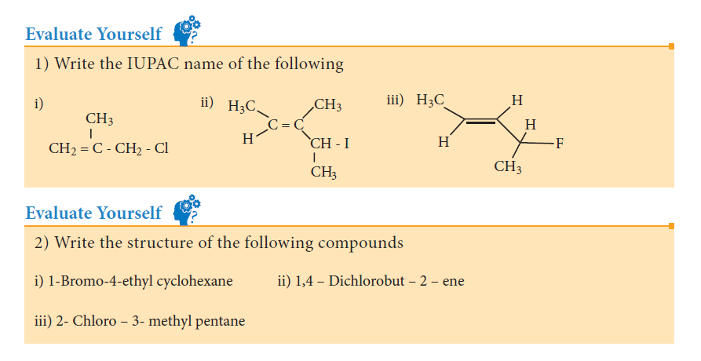

**14.3.2 Nature of C – X bond in haloalkane**

Carbon halogen bond is a polar bond as halogens are more electro negative than
carbon. The carbon atom exhibits a partial positive charge (б+) and halogen atom a partial
negative charge (б-)

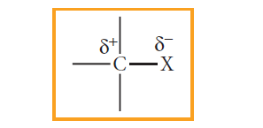

The C –X bond is formed by
overlap of sp3 orbital of carbon atom with
half filled p-orbital of the halogen atom.
The atomic size of halogen increases
from fluorine to iodine, which increases
the C – X bond length. Larger the size,
greater is the bond length, and weaker is
the bond formed. The bond strength of C
– X decreases from C – F to C – I in CH3X.
The changes in the value of bond length,
bond enthalpy and bond polarity, as we
move from C –F to C –I, is given in the
table.

**Table showing carbon – halogen bond length, bond enthalpy and polarity of bond.**

| Bond       | Bond length (pm) | Bond Enthalpy (kJ/mol) | Polarity of Bond (Debye) |
|------------|-------------------|-------------------------|---------------------------|
| CH3 – F    | 139               | 452                     | 1.847                     |
| CH3 – Cl   | 178               | 351                     | 1.860                     |
| CH3 – Br   | 193               | 293                     | 1.830                     |
| CH3 – I    | 214               | 234                     | 1.636                     |

**14.3.3 Methods of preparation**

Haloalkanes are prepared by the following
methods

1) From alcohols
Alcohols can be converted into halo
alkanes by reacting it with any one of the
following reagent 1. hydrogen halide 2.
Phosphorous halides 3. Thionyl chloride

a) Reaction with hydrogen halide


CH3CH2OH+HCl  \xrightarrow[]{Δ} CH3CH2Cl+H2O


Mixture of con.HCl and anhydrous ZnCl2
is called Lucas reagent.

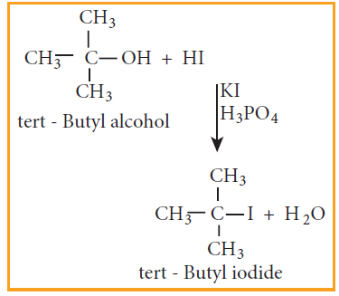

The order of reactivity of halo acids
with alcohol is in the order HI > HBr >
HCl. The order of reactivity of alcohols
with halo acid is tertiary > secondary >
primary.

b)Reaction with phosphorous halides
Alcohols react with PX5 or PX3 to
form haloalkane. PBr3 and PI3 are usually
generated in situ (produced in the reaction
mixture) by the reaction of red phosphorus
with bromine and iodine, respectively.

**Example**

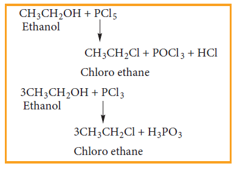

c) Reaction with thionyl chloride
(Sulphonyl chloride)

**Example**

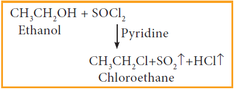

This reaction is known as Darzen's
halogenation

2) From alkenes
Alkenes react with halogen acids
(HCl, HBr, HI) to give haloalkane. The
mode of addition follows Markovnikov’s
rule.

3) From alkanes
Alkanes react with halogens (Cl2
or Br2) in the presence of ultra violet light
to form haloalkane. This reaction is a free
radical substitution reaction and gives a
mixture of mono, di or poly substituted
haloalkane.

**Example**

Chlorination of methane gives
different products which have differences
in the boiling points. Hence, these can be
separated by fractional distillation.

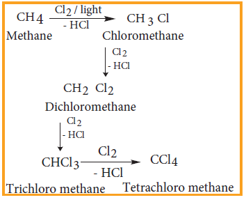

4) Halogen exchange reactions

a) Finkelstein reaction
Chloro or bromoalkane on heating
with a concentrated solution of sodium
iodide in dry acetone gives iodo alkanes.
This reaction is called Finkelstein reaction, (SN2 reaction).

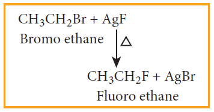

b) Swarts reaction
Chloro or bromo alkanes on heating
with metallic fluorides like AgF, SbF3 or
Hg2F2 gives fluoro alkanes. This reactions
is called Swarts reaction.

**Example**

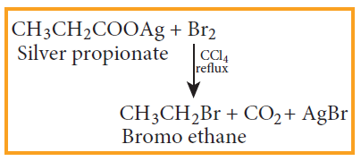

5) From silver salts of fatty acids
(Hunsdiccker reaction)
Silver salts of fatty acids when refluxed
with bromine in CCl4 gives bromo alkane

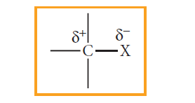

14.3.4 Physical Properties

1. Pure haloalkanes are colourless.
Bromo and iodo alkanes are coloured in
the presence of light.

2. Haloalkanes having one, two or
three carbon atoms are in the gaseous
state at normal temperature. Haloalkanes
having more than three carbon atoms are
liquids or solids.

3. Boiling point and Melting point

i) Haloalkanes have higher boiling
point and melting point than the
parent alkanes having the same
number of carbons because the
intermolecular forces of attraction
(dipole – dipole interaction and
vander Waals forces) are stronger
in haloalkane.

ii) The boiling point and melting
point of haloalkanes decreases
with respect to the helogen in the
following order.

**Example**


CH3I > CH3Br > CH3Cl > CH3F


iii) The boiling points of chloro,
bromo and iodo alkanes increase
with the increase in the number of
halogen atoms.

For Example:


CCl4 > CHCl3 > CH2Cl2 > CH3Cl


iv) The boiling point and melting
point of mono haloalkane increase
with the increase in the number of
carbon atoms.


CH3CH2CH2Cl > CH3CH2Cl > CH3Cl


v) Among isomeric alkyl halides the
boiling point decreases with the
increase in branching in the alkyl
group; with increase in branching,
the molecule attains spherical
shape with less surface area. As a
result the inter molecular forces
become weak, resulting in lower
boiling points.

**Example**

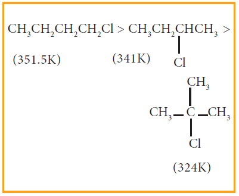

4. Solubility

Haloalkanes are polar covalent
compounds soluble in organic
solvents, but insoluble in water
because they cannot form hydrogen
bonds with water molecules

5. Density

The density of liquid alkyl halides are
higher than these of hydrocarbons of
comparable molecular weight.

3) Write all possible chain isomers with
molecular formula C5H11Cl

**Evaluate Yourself**

14.3.5 Chemical properties

Haloalkanes are one of the most
reactive classes of organic compounds.
Their reactivity is due to the presence
of polar carbon – halogen bond in their
molecules. The reactions of haloalkane
may be divided into the following types

i) Nucleophilic substitution reactions
ii) Elimination reactions
iii) Reaction with metals
iv) Reduction

**1) Nucleophilic substitution reactions**

We know that the Cδ+ - Xδ- present
in halo alkane is polar and hence the
nucleophilic reagents are attracted by
partially positively charged carbon atoms
resulting in substitution reactions.

**Reaction with aqueous alkali or moist silver oxide.(Hydrolysis)**

Haloalkane reacts with aqueous
solution of KOH or moist silver oxide
(Ag2O/H2O) to form alcohols.

**Example**

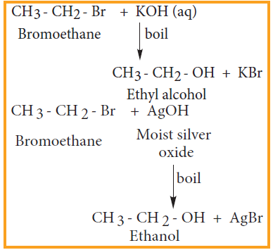

**i) Reaction with alcoholic ammonia (Ammonolysis)**

Haloalkanes react with alcoholic
ammonia solution to form alkyl amines.

**Example**

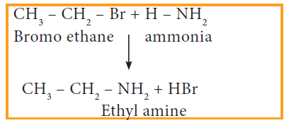

However, with excess of halo alkane,
secondary and tertiary amines along with
quartenary ammonium salts are obtained.

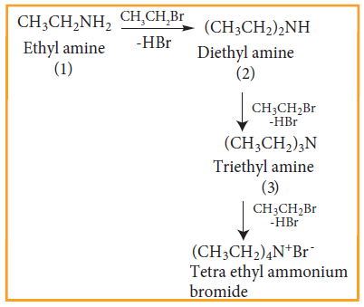

**Ambident Nucleophiles**

Nucleophiles such as cyanide and
nitrite ion which can attack nucleophilic
centre from two sides of the nucleophile
are called ambident nucleophiles. These
nucleophiles can attack with either of the
two sides depending upon the reaction
conditions and the reagent used.

**ii) Reaction with alcoholic KCN**

Haloalkanes react with alcoholic
KCN solution to form alkyl cyanides.

**Example**


CH3–CH2–Br+KCN→

CH3–CH2–CN+KBr


**iii) Reaction with alcoholic AgCN**

Haloalkanes react with alcoholic
AgCN solution to form alkyl isocyanide.

**Example**


CH3CH2Br + AgCN → CH3CH2NC+AgBr


**iv) Reaction with sodium or potassium nitrite**

Haloalkanes react with alcoholic
solution of NaNO2 or KNO2 to form alkyl
nitrites.

**Example**


CH3CH2Br + KNO2→CH3CH2–O–N=O+KBr


**v) Reaction with silver nitrite**

Haloalkanes react with alcoholic
solution of AgNO2 to form nitro alkanes.

**Example**


CH3CH2Br+AgNO2 → CH3CH2NO2+ AgBr


**vi) Reaction with sodium or potassium hydrogen sulphide**

Haloalkanes react with sodium or
potassium hydrogen sulphide to form thio
alcohols.

**Example**


CH3CH2Br+NaSH → CH3CH2SH+NaBr


**vii) Williamson ether synthesis**

Haloalkane, when boiled with
sodium alkoxide gives corresponding ethers.

**Example**

This method can be used to prepare mixed
(unsymmetrical) ethers also.


CH3CH2Br+NaOCH2CH3 → CH3CH2OCH2CH3+NaBr


**Mechanism of Nucleophilic substitution reaction**

The mechanism of nucleophilic
substitution reaction is classified as

a) Bimolecular Nucleophilic
substitution reaction (SN2)

b) Unimolecular Nucleophilic
substitution reaction (SN1)

**SN2 Mechanism**

The rate of SN2 reaction depends upon
the concentration of both alkyl halide
and the nucleophile.

Rate of reaction = k2 [alkylhalide][nucleophile]

It follows second order kinetics and
occurs in one step.

This reaction involves the formation
of a transition state in which both the
reactant molecules are partially bonded
to each other. The attack of nucleophile
occurs from the back side (i.e opposite to
the side in which the halogen is attacked).
The carbon at which substitution occurs has
inverted configuration during the course of
reaction just as an umbrella has tendency
to invert in a wind storm. This inversion of
configuration is called Walden inversion;
after paul walden who first discovered the
inversion of configuration of a compound in
SN2 reaction.

SN2 reaction of an optically active
haloalkane is always accompanied by
inversion of configuration at the asymmetric
centre. 

Let us consider the following example
When 2 - Bromooctane is heated
with sodium hydroxide, 2 – octanol is
formed with invesion of configuration. (-) – 2 – Bromo octane is heated with sodium
hydroxide (+) – 2 – Octanol is formed
in which – OH group occupies a position
opposite to what bromine had occupied,

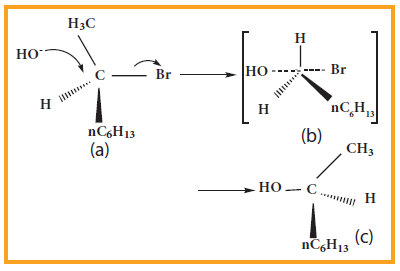

(a) (-) 2 – Bromo octane
(b) Transition State
(c) (+) 2 – Octanol (product)

**SN1 Mechanism**

SN1 stands for unimolecular
nucleophilic substitution
‘S’ stands for substitution
‘N’ stands for nucleophilic
‘1’ stands for unimolecular (one
molecule is involved in the rate determining
step)

The rate of the following SN1 reaction
depends upon the concentration of alkyl
halide (RX) and is independent of the
concentration of the nucleophile (OH−).

Hence Rate of the reaction = k[alkyl halide]

R−Cl + OH −--> R – OH + Cl−

This SN1 reaction follows first order
kinetics and occurs in two steps.

We understand SN1 reaction
mechanism by taking a reaction between
tertiary butyl bromide with aqueous KOH.

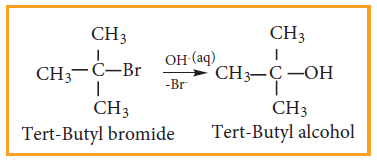

This reaction takes place in two steps
as shown below

**Step - 1 Formation of carbocation**

The polar C - Br bond breaks forming
a carbocation and bromide ion. This step is
slow and hence it is the rate determining
step.

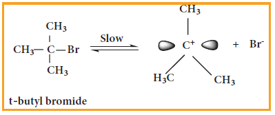

The carbocation has 2 equivalent lobes
of the vacant 2p orbital, so it can react
equally rapidly from either face

**Step - 2**

The nucleophile immediately reacts
with the carbocation. This step is fast and
hence does not affect the rate of the reactions.

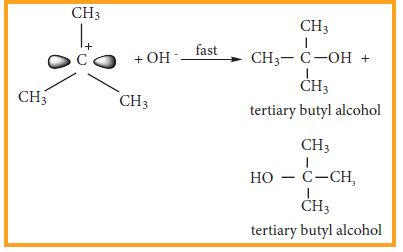

As shown above, the nucleophilic
reagent OH- can attack carbocation from
both the sides.

In the above example the substrate
tert-butyl bromide is not optically active,
hence the obtained product is optically
inactive. If halo alkane substrate is optically
active then, the product obtained will
be optically inactive racemic mixture.
As nucleophilic reagent OH- can attack
carbocation from both the sides, to form
equal proportion of dextro and levorotatory
optically active isomers which results in
optically inactive racemic mixture.

**Example**

Hydrolysis of optically active 2 -
bromo butane gives racemic mixture of ±
butan-2-ol

The order of reactivity of
haloalkanes towards SN1 and SN2 reaction
is given below.

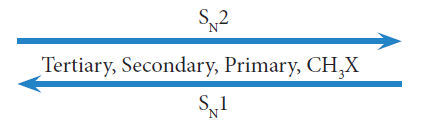

**Evaluate Yourself**

4) neo-pentyl bromide undergoes
nucleophilic substitution reactions very
slowly - justify.

**2) Elimination reactions**

When a haloalkane containing a
hydrogen on β carbon is treated with an
ethanolic solution of potassium hydroxide,
an alkene is formed. In this reaction a double
bond between α and β carbon is formed by releasing a halogen attached to a α carbon
and a hydrogen to a β carbon of halo
alkane. This reaction is called β elimination
reaction. (dehydrohalogenation).


CH3CH2Br + KOH -> CH2=CH2+KBr+H2O


Some haloalkanes yield a mixture of
olefins in different amounts. It is explained
by Saytzeff ’s Rule, which states that ‘In
a dehydrohalogenation reaction, the
preferred product is that alkene which has
more number of alkyl groups attached to the
doubly bonded carbon (more substituted
double bond is formed)

**Example**

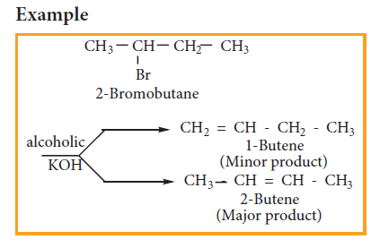

Elimination reactions may proceed through
two different mechanisms namely E1 and E2
E2 reaction mechanism

**E2 Elimination**

bimolecular
(Second order)
The rate of E2 reaction depends on the
concentration of alkyl halide and base
Rate = k [alkyl halide][base]
It is therefore, a second order
reaction. Generally primary alkyl halide
undergoes this reaction in the presence of
alcoholic KOH. It is a one step process in
which the abstraction of the proton from
the β carbon and expulsion of halide from
the ∝ carbon occur simultaneously. The
mechanism is shown below.

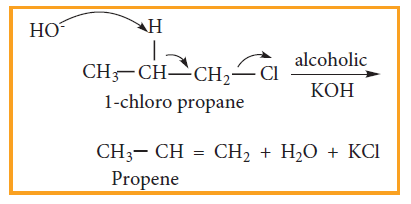

Generally, tertiary alkyl halide which
undergoes elimination reaction by this
mechanism in the presence of alcoholic
KOH. It follows first order kinetics. Let us
consider the following elimination reaction.

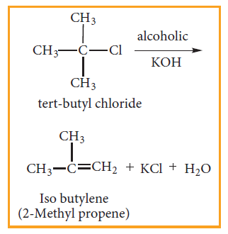

**Step - 1** Heterolytic fission to yield a carbocation

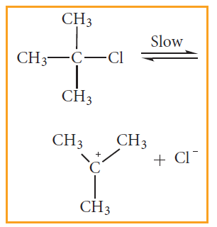

**Step - 2** Elimination of a proton from the
β - carbon to produce an alkene

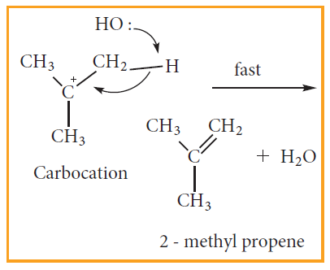

**3) Reaction with metals**

Haloalkane reacts with metals, to
form a compound containing carbon - metal
bond known as organometallic compounds.

**a) Grignard reaction**

When a solution of halo alkane in
ether is treated with magnesium, we get
alkyl magnesium halide known as Grignard
reagent.

**Example**

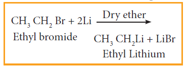

b) Reaction with active metals like sodium,
lead etc
Haloalkane reacts with active metals
like sodium, lead etc in the presence of dry
ether to form organo metallic compounds.

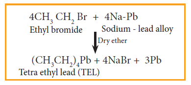

**4) Reduction reactions**

Haloalkanes are reduced to alkanes
by treating with H2 in the presence of
metal catalyst like nickel, palladium etc or
with hydroiodic acid in the presence of red
phosphorous.

**14.3.6 Uses of haloalkane**

**Chloroform:**

1. is used as a solvent in pharmaceutical
industry
2. is used for producing pesticides and
drugs
3. is used as an anaesthetic.
4. used as a preservative for anatomical
specimens.

**Iodoform:**

1. is used as an antiseptic for dressing
wounds.

**Carbon tetrachloride:**

1. is used as dry cleaning agent
2. is used as a solvent for oils, fats and waxes
3. As the vapour of CCl4 is non –
combustible, it is used under the name
pyrene for extinguishing the fire in oil or
petrol.

