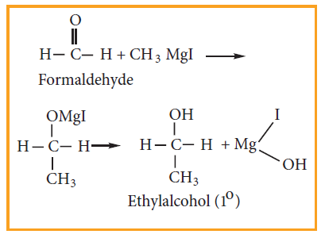
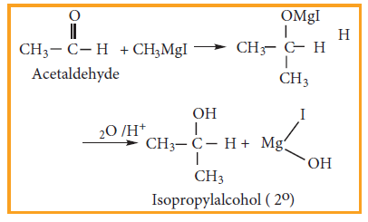
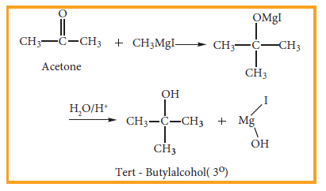
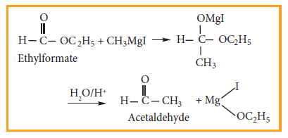
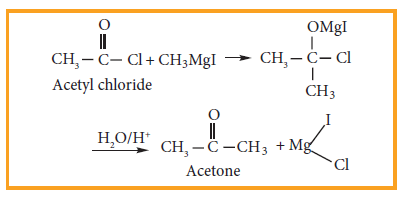
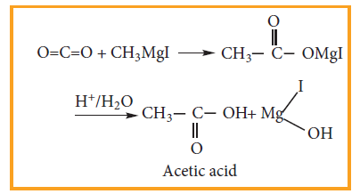
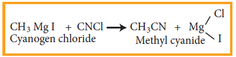
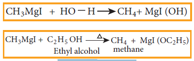

**14.4 Organo metallic Compounds**

Organo metallic compounds are organic compounds in which there is a direct carbon –metal bond. For Example **CH3Mg I - Methyl magnesium iodide CH3CH2MgBr - Ethyl magnesium bromide** The Carbon - Magnesium bond in Grignard reagent is covalent but highly polar. The carbon atom is more electro negative than magnesium. Hence, the carbon atom has partial negative charge and the magnesium atom has partial positive charge

R ----- MgX δ- δ+

**14.4.1. Preparation** When a solution of alkyl halide in ether is allowed to stand over pieces of magnesium metal, the metal gradually dissolves and alkyl magnesium halide (Grignard reagent) is formed. All the reagents used should be pure and dry

 **Example**


CH3 I Mg \xrightarrow CH3MgI


**Evaluate Yourself**

5) Why Grignard reagent should be prepared in anhydrous condition?

**14.4.2. Uses of Grignard reagent**

Grignard reagents are synthetically very useful compounds. These reagents are  

converted to various organic compounds like alcohols, carboxylic acids, aldehydes and ketones. The alkyl group being electron rich acts as a carbanion or a nucleophile. They would attack polarized molecules at a point of low electron density. The following reactions illustrate the synthetic uses of Grignard reagent.

**(1) Preparation of primary alcohol**

Formaldehyde reacts with Grignard reagent to give addition products which on hydrolysis yields primary alcohol.

**2) Preparation of secondary alcohol**

Aldehydes other than formaldehyde, react with Grignard reagent to give addition product which on hydrolysis yields secondary alcohol.

**3) Preparation of Tertiary alcohol**

Ketone reacts with Grignard reagent to give an addition product which on hydrolysis yields tertiary alcohols.

**Example**

**(4) Preparation of aldehyde**

Ethyl formate reacts with Grignard reagent to form aldehyde. However, with excess of Grignard reagent it forms secondary alcohol.

**Example**

**(5) Preparation of ketone**

Acid chloride reacts with Grignard reagent to form ketones. However, with excess of Grignard reagent it forms tertiary alcohol.

**Example**

**6) Preparation of carboxylic acids**

Solid carbon dioxide reacts with Grignard reagent to form addition product which on hydrolysis yields carboxylic acids.  

**For Example**

**7) Preparation of esters**

Ethylchloroformate reacts with Grignard reagent to form esters.

**Example**

**8) Preparation of higher ethers**

Lower halogenated ether reacts with Grignard reagent to form higher ethers.

**Example**

**9) Preparation of alkyl cyanide**

Grignard reagent reacts with cyanogen chloride to from alkyl cyanide

**Example**

**10) Preparation of Alkanes**

Compounds like water, alcohols and amines which contain active hydrogen atom react with Grignard reagents to form alkanes.

**Example**

