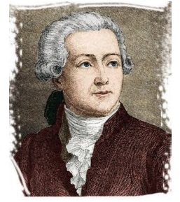
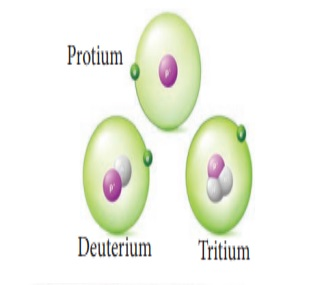
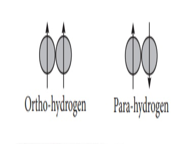

  

**Hydrogen**

**Unit 4**

Hydrogen, third most abundant on the surface of the Universe, is being visualised as the major feature source of energy

  

**Antoine - Laurent de Lavoisier (1743-1794)**

He recognised and named hydrogen and oxygen. He introduced a new system for chemical nomen- clature in 1787  

**Learning Objectives**

After studying this unit, the students will be able to

- Justify the position of hydrogen in the periodic 
table
- Recognise the different isotopes of hydrogen
- Explain the methods of preparation of hydrogen.
- Explain the properties of hydrogen
- Appraise the uses of hydrogen
- Differentiate various types of hydrides
- Translate the knowledge of structure of water 
  for explaining its physical and chemical 
  properties
- Differentiate hard and soft water and select the 
  suitable method for water softening.
- Recognise heavy water and explain its 
  properties.
- Explain the preparation and properties of 
  hydrogen peroxide 
- List the uses of hydrogen peroxide

**4.1 Introduction**

Hydrogen is the simplest atom, containing one electron and one proton. In contrast to other elements (except helium), its valence electron is directly in the sphere of action of the nucleus. It is invariably present in most of the compounds we come across in our daily life, such as water, carbohydrates, proteins, etc. As it has an unpaired electron, it is reactive and exists as a diatomic molecule (H2). However, the abundance of hydrogen gas in the Earth's atmosphere is very small.

**4.1.1 Position in Periodic Table**

Hydrogen has the electronic configuration of 1s1, which resembles the ns1 general valence shell configuration of alkali metals and shows similarity with them as follows:

It forms unipositive ions (H+) like alkali metals (Na+, K+, Cs+).
It forms halides (HX), oxides (H2O), peroxides (H2O2), and sulfides (H2S) like alkali metals (NaX, Na2O, Na2O2, Na2S).
It also acts as a reducing agent.
However, unlike alkali metals, which have ionization energy ranging from 377 to 520 kJ mol-1, hydrogen has 1,314 kJ mol-1, which is much higher than alkali metals. Like the formation of halides (X-) from halogens, hydrogen also has a tendency to gain one electron to form a hydride ion (H-) whose electronic configuration is similar to the noble gas, helium. However, the electron affinity of hydrogen is much less than that of halogen atoms. Hence, the tendency of hydrogen to form a hydride ion is low compared to that of halogens to form the halide ions, as evident from the following reactions:

½ H2 + e- → H- ΔH = + 36 kcal mol-1
½ Br2 + e- → Br- ΔH = - 55 kcal mol-1
Since hydrogen has similarities with alkali metals as well as the halogens, it is difficult to find the right position in the periodic table. However, in most of its compounds, hydrogen exists in +1 oxidation state. Therefore, it is reasonable to place hydrogen in group 1 along with alkali metals, as shown in the latest periodic table published by IUPAC.

**4.1.2 Isotopes of Hydrogen**

Hydrogen has three naturally occurring isotopes, namely, protium (1H1 or H), deuterium (1H2 or D), and tritium (1H3 or T). Protium (1H1) is the predominant form (99.985%) and is the only isotope that does not contain a neutron.

**[Figure 4.1 Isotopes of hydrogen]**

Deuterium, also known as heavy hydrogen, constitutes about 0.015%. The third isotope, tritium, is a radioactive isotope of hydrogen that occurs only in traces (~1 atom per 10^18 hydrogen atoms). Due to the existence of these isotopes, naturally occurring hydrogen exists as H2, HD, D2, HT, T2, and DT. The properties of these isotopes are shown in Table 4.1.

**Table 4.1 Properties of Hydrogen, Deuterium, and Tritium Molecules**

| Property                        | Protium     | Deuterium   | Tritium     |
| ------------------------------- | ----------- | ----------- | ----------- |
| Atomic Hydrogen                 | H           | D           | T           |
| Atomic mass (amu)               | 1.008       | 2.014       | 3.016       |
| No of electron / protons / neutrons | 1 / 1 / 0   | 1 / 1 / 1   | 1 / 1 / 2   |
| Nuclear stability               | Stable      | Stable      | Radioactive (t1/2=12.3 yrs) |
| Molecular Hydrogen              | H2          | D2          | T2          |
| Abundance (%)                   | 99.985      | 0.0156      | ~10^-15     |
| Molecular mass (amu)            | 2.016       | 4.028       | 6.032       |
| Melting point (K)               | 13.96       | 18.73       | 20.62       |
| Boiling point (K)               | 20.39       | 23.67       | 25.04       |
| Internuclear distance (pm)      | 74.14       | 74.14       | 74.14       |
| Critical Temperature (K)        | 33.19       | 38.35       | 40.60       |
| Enthalpy of dissociation (kJ/mol)† | 435.9    | 443.4      | 446.9      |

† Bond dissociation energy

**4.1.3 Ortho and Para-Hydrogen:**

In the hydrogen atom, the nucleus has a spin. When molecular hydrogen is formed, the spins of two hydrogen nuclei can be in the same direction or in the opposite direction, as shown in the figure. These two forms of hydrogen molecules are called ortho and para-hydrogens, respectively.

At room temperature, normal hydrogen consists of about 75% ortho-form and 25% para-form. As the ortho-form is more stable than the para-form, the conversion of one isomer into the other is a slow process. However, the equilibrium shifts in favor of para-hydrogen when the temperature is lowered. The para-form can be catalytically transformed into ortho-form using platinum or iron. Alternatively, it can also be converted by passing an electric discharge, heating above 800°C, and mixing with paramagnetic molecules such as O2, NO, NO2, or with nascent/atomic hydrogen.
Ortho and para-hydrogen are similar in chemical properties but differ in some of the physical properties. For example, the melting point of para-hydrogen is 13.83 K, while that of ortho-hydrogen is 13.95 K; the boiling point of para-hydrogen is 20.26 K, while that of ortho-hydrogen is 20.39 K. Since the nuclear spins are in opposite directions, the magnetic moment of para-hydrogen is zero, and ortho-hydrogen has a magnetic moment twice that of a proton.

