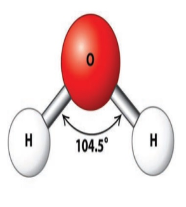
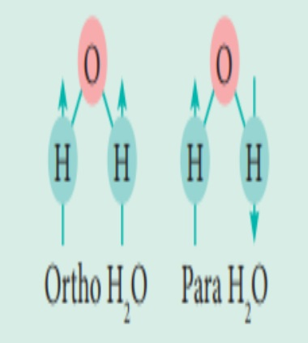
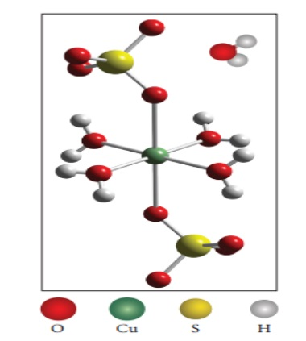
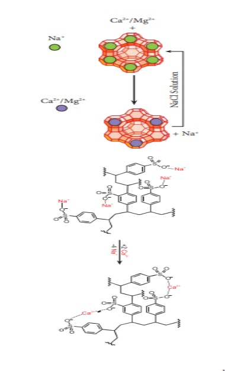

Water is one of the most abundant compounds of hydrogen, and our Earth’s surface contains approximately 70% of the ocean, which is the major source of water. However, seawater contains many dissolved salts; hence, it cannot be used directly. Water is essential for all living things, and our body contains about 65% water.

**Ortho-H₂O and Para-H₂O**

Water exists in the interstellar clouds and icy satellites of the solar system. In particular, the ortho-to-para ratio (OPR) of water in space has recently received attention. Like hydrogen, water can also be classified into ortho-H₂O, in which the spin directions of the nuclei of the hydrogen atoms are parallel, and para-H₂O, in which the directions are antiparallel. OPR of H₂(300K) on earth should be 3:1. OPR of H₂O(50K) in interstellar clouds and comets should be 2:5:1.

# Physical Properties:

Water is a colorless and volatile liquid. The peculiar properties of water in the condensed phases are due to the presence of intermolecular hydrogen bonding between water molecules. Hydrogen bonding is responsible for the high melting and boiling points of water. Some of the physical parameters of water are listed in Table 4.2.

**Table 4.2 Properties of water, heavy water, and super heavy water†**

| Property                             | H₂O        | D₂O        | T₂O        |
|--------------------------------------|------------|------------|------------|
| Molecular weight                     | 18.015     | 20.0276    | 22.031     |
| Melting point (K)                    | 273.0      | 276.8      | 277.5      |
| Boiling point (K)                    | 373.0      | 374.4      | 374.5      |
| Temperature of maximum density (K)  | 277.0      | 284.2      | 286.4      |
| Maximum density (g/cm³)              | 1.000      | 1.106      | 1.215      |
| Density (g/cm³)                      | 0.997      | 1.104      | 1.214      |
| Vapour pressure (mm Hg)              | 23.75      | 20.51      | 19.80      |
| Viscosity (cP)                       | 0.890      | 1.107      | ---        |
| Dielectric constant                  | 78.39      | 78.06      | ---        |
| Enthalpy of formation (kJ/mol)       | −285.9     | −294.6     | ---        |
| Enthalpy of vaporization (kJ/mol)    | 40.66      | 41.61      | ---        |

†Unless otherwise stated, all data are at 298 K.

# Chemical Properties:

Water reacts with metals, non-metals, and other compounds differently. The most reactive metals are the alkali metals. They decompose water even in cold, with the evolution of hydrogen, leaving an alkali solution.


2 \text{Na} + 2 \text{H}_2\text{O} \rightarrow 2 \text{NaOH} + \text{H}_2


The group 2 metals (except beryllium) react in a similar way but less violently. The hydroxides are less soluble than those of Group 1.


\text{Ba} + 2\text{H}_2\text{O} \rightarrow \text{Ba(OH)}_2 + \text{H}_2


Some transition metals react with hot water or steam to form the corresponding oxides. For example, steam passed over red hot iron results in the formation of iron oxide with the release of hydrogen.


3\text{Fe} + 4\text{H}_2\text{O} \rightarrow \text{Fe}_3\text{O}_4 + 4\text{H}_2


Lead and copper decompose water only at a white heat. Silver, gold, mercury, and platinum do not have any effect on water. In the elemental form, the non-metals such as carbon, sulfur, and phosphorus normally do not react with water. However, as we have seen earlier, carbon will react with steam when it is red (or white) hot to give water gas.

On the other hand, the halogens react with water to give an acidic solution. For example, chlorine forms hydrochloric acid and hypochlorous acid. It is responsible for the antibacterial action of chlorine water and for its use as bleach.

\text{Cl}_2 + \text{H}_2O \rightarrow \text{HCl} + \text{HOCl}


Fluorine reacts differently to liberate oxygen from water.


2\text{F}_2 + 2\text{H}_2O \rightarrow 4\text{HF} + \text{O}_2


In a similar way, compounds of non-metals react with water to give acidic or alkaline solutions. For example, solutions of carbonates are slightly alkaline.

\text{CO}_3^{2-} + \text{H}_2O \rightarrow \text{HCO}_3^- + \text{OH}^-


Water is an amphoteric oxide. It has the ability to accept as well as donate protons, and hence it can act as an acid or a base. For example, in the reaction with HCl, it accepts a proton, whereas in the reaction with the weak base ammonia, it donates a proton.

\text{NH}_3 + \text{H}_2O \rightarrow \text{NH}_4^+ + \text{OH}^-


\text{HCl} + \text{H}_2O \rightarrow \text{H}_3\text{O}^+ + \text{Cl}^-


Water dissolves ionic compounds. In addition, it also hydrolyzes some covalent compounds.

\text{SiCl}_4 + 2 \text{H}_2O \rightarrow \text{SiO}_2 + 4 \text{HCl}



\text{P}_4\text{O}_{10} + 6 \text{H}_2O \rightarrow 4 \text{H}_3\text{PO}_4


Many salts crystallized from aqueous solutions form hydrated crystals. The water in the hydrated salts may form a coordinate bond or just present in interstitial positions of crystals.

Examples:


[Cr(H_2O)_6]Cl_3

 → All six water molecules form a coordinate bond.


BaCl_2 \cdot 2H_2O

 → Both the water molecules are present in interstitial positions.


CuSO_4 \cdot 5H_2O

 → In this compound, four water molecules form a coordinate bond while the fifth water molecule, present outside the coordination, can form an intermolecular hydrogen bond with another molecule. 
 
 
[Cu(H_2O)_4]SO_4 \cdot H_2O


**Figure 4.4 structure of copper sulphate pentahydrate**

# Hard and Soft Water:

Hard water contains high amounts of mineral ions. The most common ions found in hard water are the soluble metal cations such as magnesium and calcium, though iron, aluminum, and manganese may also be found in certain areas. The presence of these metal salts in the form of bicarbonate, chloride, and sulfate in water makes water ‘hard’. When hard water is boiled, carbonates of magnesium and calcium present in it get precipitated. On the other hand, water free from soluble salts of calcium and magnesium is called soft water. The hardness of water is of two types, viz., temporary hardness and permanent hardness.

**Temporary Hardness and its removal:**

Temporary hardness is primarily due to the presence of soluble bicarbonates of magnesium and calcium. This can be removed by boiling the hard water followed by filtration. Upon boiling,these salts decompose into insoluble carbonate which leads to their precipitation. The magnesium carbonate thus formed further hydrolysed to give insoluble magnesium hydroxide. 

\text{Ca(HCO}_3)_2 \rightarrow \text{CaCO}_3 + \text{H}_2\text{O} + \text{CO}_2



\text{Mg(HCO}_3)_2 \rightarrow \text{MgCO}_3 + \text{H}_2\text{O} + \text{CO}_2



\text{MgCO}_3 + \text{H}_2\text{O} \rightarrow \text{Mg(OH)}_2 + \text{CO}_2


The resulting precipitates can be removed by filtration. Alternatively, we can use Clark’s method in which, a calculated amount of lime is added to hard water containing magnesium and calcium, and the resulting carbonates and hydroxides can be filtered-off. 

\text{Ca(HCO}_3)_2 + \text{Ca(OH)}_2 \rightarrow 2\text{CaCO}_3 + 2\text{H}_2\text{O}



\text{Mg(HCO}_3)_2 + 2\text{Ca(OH)}_2 \rightarrow 2\text{CaCO}_3 + \text{Mg(OH)}_2 + 2\text{H}_2\text{O}


**Permanent Hardness:** 
Permanent hardness of water is due to the presence of soluble salts of magnesium and calcium in the form of chlorides and sulphates in it. It can be removed by adding washing soda, which reacts with these metal (M = Ca or Mg) chlorides and sulphates in hard water to form insoluble carbonates.

\text{MCl}_2 + \text{Na}_2\text{CO}_3 \rightarrow \text{MCO}_3 + 2\text{NaCl}



\text{MSO}_4 + \text{Na}_2\text{CO}_3 \rightarrow \text{MCO}_3 + \text{Na}_2\text{SO}_4


In another way to soften the hard water is by using a process called ion-exchange. That is, hardness can be removed by passing through an ion-exchange bed like zeolites or a column containing ion-exchange resin. Zeolites are hydrated sodium alumino-silicates with a general formula, \(Na_2O∙Al_2O_3∙xSiO_2∙yH_2O\) (x = 2 to 10, y = 2 to 6). Zeolites have a porous structure in which the monovalent sodium ions are loosely held and can be exchanged with hardness-producing metal ions (M = Ca2+ or Mg2+) in water. The complex structure can conveniently be represented as \(Na_2-Z\) with sodium as exchangeable cations. 

\text{Na}_2\text{-Z} + \text{M}^{2+} \rightarrow \text{M-Z} + 2\text{Na}^{+}


When exhausted, the materials can be regenerated by treating with aqueous sodium chloride. The metal ions (Ca2+ and Mg2+) caught in the zeolite (or resin) are released, and they get replenished with sodium ions. 

\text{M-Z} + 2\text{NaCl} \rightarrow \text{Na}_2\text{-Z} + \text{MCl}_2


