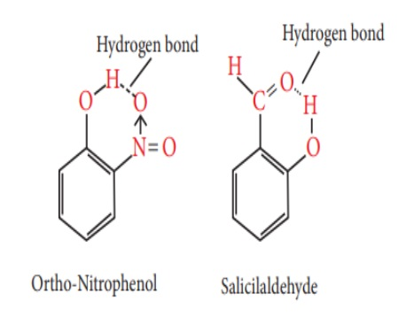
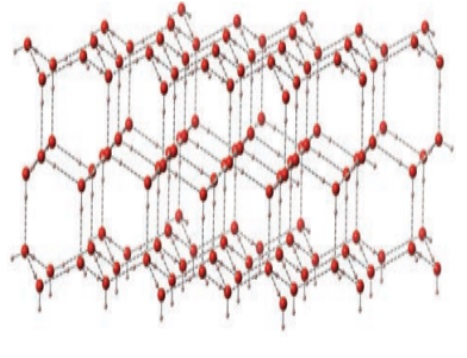
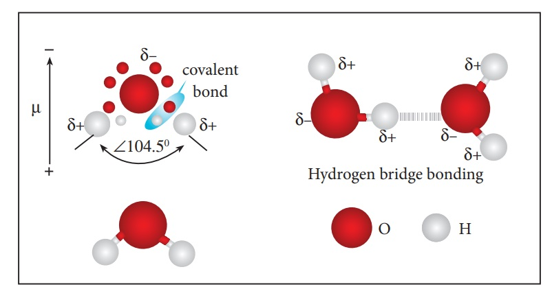
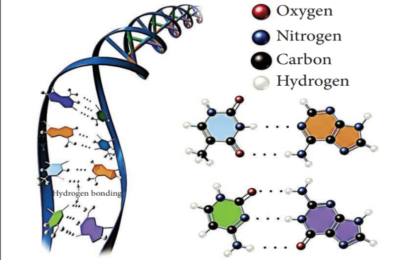
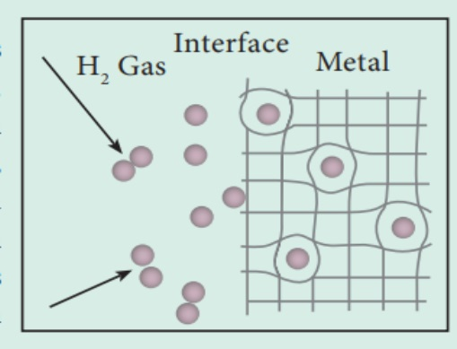
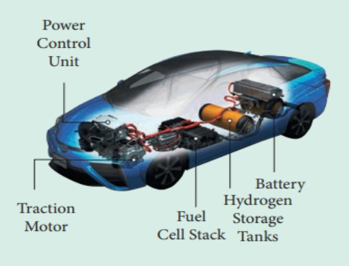
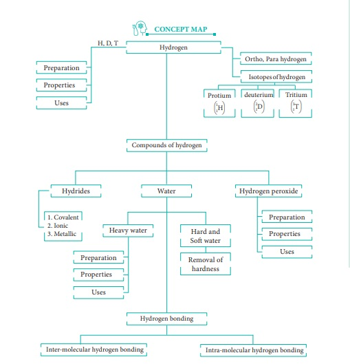

**4.9 Hydrogen Bonding**

Hydrogen bonding is one of the most important natural phenomena occurring in chemical and biological sciences. These interactions play a major role in the structure of proteins and DNA. When a hydrogen atom (H) is covalently bonded to a highly electronegative atom such as fluorine (F) or oxygen (O) or nitrogen (N), the bond is polarized. Due to this effect, the polarized hydrogen atom is able to form a weak electrostatic interaction with another electronegative atom present in the vicinity. This interaction is called as a hydrogen bond (20-50 _kJ mol_−_1_) and is denoted by dotted lines (…).

It is weaker than covalent bond (> 100 _kJ mol_−_1_) but stronger than the van der Waals interaction (< 20 _kJ mol_−_1_). Hydrogen bond has profound effect on various physical properties including vapour pressure (H2O and H2S), boiling point, miscibility of liquids (H2O and C2H5OH), surface tension, densities, viscosity, heat of vaporization and fusion, etc. Hydrogen bonds can occur within a molecule (_intramolecular hydrogen bonding_) and between two molecules of the same type or different type (intermolecular _hydrogen bonding_).

**Intramolecular Hydrogen Bond**

Intramolecular hydrogen bonds are those which occur within a single molecule.

**Figure 4.6 Intramolecular hydrogen bonding**  

**Intermolecular hydrogen bond**

Intermolecular hydrogen bonds occur between two separate molecules. They can occur between any numbers of like or unlike molecules as long as hydrogen donors and acceptors are present in positions which enable the hydrogen bonding interactions. For example, intermolecular hydrogen bonds can occur between ammonia molecule themselves or between water molecules themselves or between ammonia and water.

Water molecules form strong hydrogen bonds with one another. For example, each water molecule is linked to four others through hydrogen bonds. The shorter distances (100 pm) correspond to covalent bonds (solid lines), and the longer distances (180 pm) correspond to hydrogen bonds (dotted lines).

In ice, each atom is surrounded tetrahedrally by four water molecules through hydrogen bonds. That is, the presence of two hydrogen atoms and two lone pairs of electron on oxygen atoms in each water molecule allows formation of a three-dimensional structure. This arrangement creates an open structure, which accounts for the lower density of ice compared with water at 0°C. While in liquid water, unlike ice where hydrogen bonding occurs over a long-range, the strong hydrogen bonding prevails only in a short range and therefore the denser packing.

**Figure 4.7 (a) Structure of Ice**

**Figure 4.7 (b) Hydrogen bonding in water**

Hydrogen bond occurs not only in simple molecules but also in complex biomolecules such as proteins, and they are crucial for biological processes.  For example, hydrogen bonds play an important role in the structure of deoxyribonucleic acid (DNA), since they hold 
together the two helical nucleic acid chains (strands). 

**Figure 4.8 Hydrogen bonding in DNA molecules**  

**Significant developments  related to hydrogen**

| Year | Event |
| ---- | ----- |
| **1670** | Robert Boyle produced flammable gas by reacting metals with acid. |
| **1700** | Nicolas Lemery showed that the gas produced in the sulfuric acid/iron reaction was explosive in air. |
| **1766** | Henry Cavendish, discoverer of hydrogen, reacted zinc metal with hydrochloric acid and isolated a gas. |
| **1780** | Felice Fontana discovered the water-gas shift reaction. |
| **1783** | Antoine Lavoisier named the element hydrogen (Greek meaning – water former). |
| **1800** | William Nicholson and Anthony Carlisle decomposed water into hydrogen and oxygen by electrolysis. |
| **1801** | Humphrey Davy discovered the concept of the Fuel Cell. |
| **1806** | François I. de Rivaz built the first internal combustion engine powered by a mixture of hydrogen and oxygen. |
| **1811** | Humphrey Davy discovered gas hydrates (Cl2∙7H2O). |
| **1818** | J.L. Thenard recognized and prepared hydrogen peroxide from BaO2. |
| **1834** | Michael Faraday published Faraday's laws of electrolysis. |
| **1866** | T. Graham discovered solubility/absorption of hydrogen on palladium. |
| **1897** | Paul Sabatier facilitated the use of hydrogenation with the discovery of the Sabatier reaction. |
| **1898** | James Dewar liquefied hydrogen. |
| **1909** | S.P.L. Sorensen introduced the pH scale for hydrogen ion concentration. |
| **1910** | Fritz Haber patented the Haber process. |
| **1913** | Niels Bohr explained the Rydberg formula for the spectrum of hydrogen by imposing a quantization condition on classical orbits of the electron in hydrogen. |
| **1924** | R. Mecke discovered ortho- and para-hydrogen. |
| **1931** | Harold C. Urey discovered deuterium. |
| **1932** | Harold C. Urey discovered heavy water. |
| **1932** | L.P. Hammett proposed acidity function (H0) for very strong acids. |
| **1934** | Ernest Rutherford, Mark Oliphant, and Paul Harteck discovered tritium. |
| **1935** | Eugene Wigner and H.B. Huntington predicted metallic hydrogen. |
| **1947** | A.E. Finholt, A.C. Bond, and H.I. Schlesinger discovered LiAlH4 and subsequently shown to be a versatile reducing agent. |
| **1950** | V. Faltings and P. Harteck detected the first tritium in the atmosphere. |
| **1967** | Akira Fujishima discovered the phenomenon of photocatalytic water decomposition. |
| **1971** | Alexandar I. Kloss and Boris I. Tsenter patented the Nickel-Hydrogen battery. |
| **1990** | Solar-Wasserstoff-Bayern, the first solar-powered hydrogen production plant became operational. |
| **2000** | Peter Toennies demonstrated superfluidity of hydrogen at 0.15 K. |

  

**METAL HYDRIDE (HYDROGEN SPONGE)**

The best studied binary hydrides 
are the palladium-hydrogen system. 
Hydrogen interacts with palladium 
in a unique way, and forms a limiting monohydride, 
PdH. Upon heating, H atoms diffuse through 
the metal to the surface and recombine to form 
molecular hydrogen. Since no other gas behaves 
this way with palladium, this process has been 
used to separate hydrogen gas from other gases: 
2 Pd (s) + H2
 (g) → 2 PdH (s). 
The hydrogen molecule readily adsorb on the palladium surface, where it dissociates 
into atomic hydrogen. The dissociated atoms dissolve into the interstices or voids 
(octahedral/tetrahedral) of the crystal lattice.
Technically, the formation of metal hydride is by chemical reaction but it behaves like 
a physical storage method, i.e., it is absorbed and released like a water sponge. Such 
a reversible uptake of hydrogen in metals and alloys is also attractive for hydrogen 
storage and for rechargeable metal hydride battery applications.

**The Hydrogen-Future Fuel**

The depletion of fossil fuel 
reserves and the threat of global 
warming make the world to 
shift toward alternative fuels. In this regard, 
hydrogen is often considered as a potential 
candidate for this purpose as it is a clean burning 
fuel as it does not produce any pollutants upon 
burning. Hence, hydrogen can directly be used 
as a fuel and can replace existing gasoline 
(petrol)/diesel/kerosene powered engines, and/
or indirectly be used with oxygen in fuel cells to generate electricity. However, there 
are some difficulties needs to be overcome. The production cost is high and also uses 
more fossil fuels. Due to its volatile and flammable nature in its native form, it is 
difficult to store and transport. Being the smallest molecule it is prone to leakage. 

  

**SUMMARY**

Hydrogen is the simplest atom which contains one electron and one proton. It has three isotopes namely protium, deuterium and tritium. The hydrogen exists as diatomic gaseous molecule. The molecule has two nuclear spin isomers namely ortho and para- hydrogen. Elemental hydrogen having an electronic configuration of 1s1, has properties similar to alkali metals as well as halogens. Based on its electronic configuration and existence of the +1 oxidation state in most of the compounds it is placed in group 1 along with alkali metals.

Hydrogen is prepared by the action of metal with mineral acids in laboratory. In industrial scale, hydrogen is produced by the steam-reforming of hydrocarbons. Deuterium can be synthesized by the electrolysis of heavy water, while the radioactive tritium is prepared by the nuclear transmutation reaction of lithium with slow neutrons.

Hydrogen reacts with nonmetals like oxygen and halogens to form water and hydrogen halides respectively. It reacts with metals to form metal hydrides. It acts as good reducing agent. Deuterium undergoes  

exchange reactions with hydrogen. Tritium with a half-life period of 12.3 years and emits β-particles spontaneously. Hydrogen has many uses including in the preparation of ammonia, methanol, and hydrogenation of oils and reduction of metal oxides. It can also be used as fuel.

Water is an important amphoteric oxide of hydrogen and used a universal solvent. It hydrolyses oxides and forms metal hydroxides with metals such as sodium and barium. Due to the presence of soluble salts of calcium and magnesium in water, the water shows hardness. Clark's method can be used to remove temporary hardness. Like water, another important oxide is hydrogen peroxide. It is used as a mild antiseptic and as a bleaching agent in textile and paper industries. Hydrogen bound to strong electronegative atoms such as fluorine, nitrogen or oxygen atoms, forms a peculiar type of electrostatic interactions with another strong electronegative atom. This is called hydrogen bond. This is one of important interactions observed in many biological molecules such as proteins, DNA etc…

  

**EVALUATION**

**I. Choose the best answer**
 Chemistry Questions

 1. Which of the following statements about hydrogen is incorrect? (NEET - 2016)
   - a) Hydrogen ion, H₃O⁺ exists freely in solution.
   - b) Dihydrogen acts as a reducing agent.
   - c) Hydrogen has three isotopes of which tritium is the most common.
   - d) Hydrogen never acts as cation in ionic salts.

2. Water gas is
   - a) H₂O (g)
   - b) CO + H₂O
   - c) CO + H₂
   - d) CO + N₂

3. Which one of the following statements is incorrect with regard to ortho and para dihydrogen?
   - a) They are nuclear spin isomers
   - b) Ortho isomer has zero nuclear spin whereas the para isomer has one nuclear spin
   - c) The para isomer is favored at low temperatures
   - d) The thermal conductivity of the para isomer is 50% greater than that of the ortho isomer.

4. Ionic hydrides are formed by
   - a) halogens
   - b) chalcogens
   - c) inert gases
   - d) group one elements

5. Tritium nucleus contains
   - a) 1p + 0n
   - b) 2p + 1n
   - c) 1p + 2n
   - d) none of these

6. Non-stoichiometric hydrides are formed by
   - a) palladium, vanadium
   - b) carbon, nickel
   - c) manganese, lithium
   - d) nitrogen, chlorine

7. Assertion: Permanent hardness of water is removed by treatment with washing soda.
   Reason: Washing soda reacts with soluble calcium and magnesium chlorides and sulfates in hard water to form insoluble carbonates.
   - a) Both assertion and reason are true and reason is the correct explanation of assertion.
   - b) Both assertion and reason are true but reason is not the correct explanation of assertion.
   - c) Assertion is true but reason is false
   - d) Both assertion and reason are false

8. If a body of a fish contains 1.2 g hydrogen in its total body mass, if all the hydrogen is replaced with deuterium then the increase in body weight of the fish will be
   - a) 1.2 g
   - b) 2.4 g
   - c) 3.6 g
   - d) 4.8 g

9. The hardness of water can be determined by volumetrically using the reagent
   - a) sodium thio sulphate
   - b) potassium permanganate
   - c) hydrogen peroxide
   - d) EDTA

10. The cause of permanent hardness of water is due to
    - a) Ca(HCO₃)₂
    - b) Mg(HCO₃)₂
    - c) CaCl₂
    - d) MgCO₃

11. Zeolite used to soften hardness of water is, hydrated
    - a) Sodium aluminium silicate
    - b) Calcium aluminium silicate
    - c) Zinc aluminium borate
    - d) Lithium aluminium hydride

12. A commercial sample of hydrogen peroxide marked as 100 volume H₂O₂, it means that
    - a) 1 ml of H₂O₂ will give 100 ml O₂ at STP
    - b) 1 L of H₂O₂ will give 100 ml O₂ at STP
    - c) 1 L of H₂O₂ will give 22.4 L O₂
    - d) 1 ml of H₂O₂ will give 1 mole of O₂ at STP

13. When hydrogen peroxide is shaken with an acidified solution of potassium dichromate in the presence of ether, the ethereal layer turns blue due to the formation of
    - a) Cr₂O₃
    - b) CrO₄²⁻
    - c) CrO(O₂)₂
    - d) none of these

14. For decolorization of 1 mole of acidified KMnO₄, the moles of H₂O₂ required is
    - a) 1/2
    - b) 3/2
    - c) 5/2
    - d) 7/2

15. Volume strength of 1.5 N H₂O₂ is
    - a) 1.5
    - b) 4.5
    - c) 16.8
    - d) 8.4

16. The hybridization of oxygen atom in H₂O and H₂O₂ are, respectively
    - a) sp and sp₃
    - b) sp and sp
    - c) sp and sp₂
    - d) sp₃ and sp₃

17. The reaction H₃PO₂ + D₂O → H₂DPO₂ + HDO indicates that hypo-phosphorus acid is
    - a) tribasic acid
    - b) dibasic acid
    - c) monobasic acid
    - d) none of these

18. In solid ice, the oxygen atom is surrounded
    - a) tetrahedrally by 4 hydrogen atoms
    - b) octahedrally by 2 oxygen and 4 hydrogen atoms
    - c) tetrahedrally by 2 hydrogen and 2 oxygen atoms
    - d) octahedrally by 6 hydrogen atoms

19. The type of H-bonding present in ortho nitro phenol and p-nitro phenol is, respectively
    - a) intermolecular H-bonding and intramolecular H-bonding
    - b) intramolecular H-bonding and intermolecular H-bonding
    - c) intramolecular H-bonding and no H-bonding
    - d) intramolecular H-bonding and intramolecular H-bonding

20. Heavy water is used as
    - a) moderator in nuclear reactions
    - b) coolant in nuclear reactions
    - c) both (a) and (b)
    - d) none of these

21. Water is a
    - a) basic oxide
    - b) acidic oxide
    - c) amphoteric oxide
    - d) none of these

**II Write Brief Answers to the Following questions**

22. Explain why hydrogen is not placed with the halogen in the periodic table.

23. Discuss the three types of Covalent hydrides.

24. Predict which of the following hydrides is a gas on a solid (a) HCl (b) NaH. Give your reason.

25. Write the expected formulas for the hydrides of 4th period elements. What is the trend in the formulas? In what way the first two members of the series different from the others?

26. Write chemical equation for the following reactions.
   - i) reaction of hydrogen with tungsten (VI) oxide on heating.
   - ii) hydrogen gas and chlorine gas.

27. Complete the following chemical reactions and classify them into (a) hydrolysis (b) redox (c) hydration reactions.
   - i) KMnO4 + H2O2 →
   - ii) CrCl3 + H2O →
   - iii) CaO + H2O →

28. Hydrogen peroxide can function as an oxidizing agent as well as reducing agent. Substantiate this statement with suitable examples.

29. Do you think that heavy water can be used for drinking purposes?

30. What is the water-gas shift reaction?

31. Justify the position of hydrogen in the periodic table?

32. What are isotopes? Write the names of isotopes of hydrogen.

33. Give the uses of heavy water.

34. Explain the exchange reactions of deuterium.

35. How do you convert para-hydrogen into ortho-hydrogen?

36. Mention the uses of deuterium.

37. Explain preparation of hydrogen using electrolysis.

38. A group-1 metal (A) which is present in common salt reacts with (B) to give compound (C) in which hydrogen is present in –1 oxidation state. (B) on reaction with a gas (C) to give universal solvent (D). The compound (D) on reacts with (A) to give (E), a strong base. Identify A, B, C, D and E. Explain the reactions.

39. An isotope of hydrogen (A) reacts with diatomic molecule of element which occupies group number 16 and period number 2 to give compound (B) is used as a moderator in nuclear reaction. (A) adds on to a compound (C), which has the molecular formula C3H6 to give (D). Identify A, B, C and D.

40. NH3 has exceptionally high melting point and boiling point as compared to those of the hydrides of the remaining elements of group 15 - Explain.

41. Why do interstitial hydrides have a lower density than the parent metal?

42. How do you expect the metallic hydrides to be useful for hydrogen storage?

43. Arrange NH3, H2O and HF in the order of increasing magnitude of hydrogen bonding and explain the basis for your arrangement.

44. Compare the structures of H2O and H2O2.

