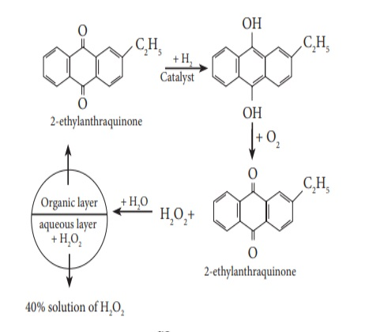
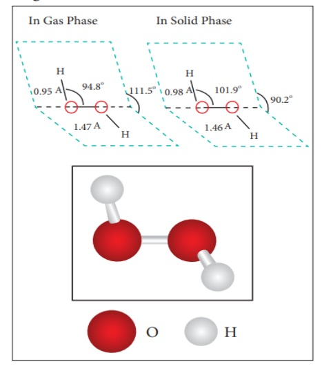

Hydrogen peroxide (H₂O₂) is one of the most important peroxides. It can be prepared by treating metal peroxide with dilute acid.


\text{BaO}_2 + \text{H}_2\text{SO}_4 \rightarrow \text{BaSO}_4 + \text{H}_2\text{O}_2 \\
\text{Na}_2\text{O}_2 + \text{H}_2\text{SO}_4 \rightarrow \text{Na}_2\text{SO}_4 + \text{H}_2\text{O}_2


On an industrial scale, hydrogen peroxide is now prepared exclusively by autoxidation of 2-alkyl anthraquinol.

# Physical properties:

Pure hydrogen peroxide is almost a colorless liquid (pale blue), less volatile and more viscous than water.

A 30 % solution of hydrogen peroxide is marketed as ‘100-volume’ hydrogen peroxide indicating that at S.T.P., 100 ml of oxygen is liberated by 1 ml of this solution on heating.

# Chemical properties:

Hydrogen peroxide is highly unstable and the aqueous solution spontaneously

  

disproportionates to give oxygen and water. The reaction is, however, slow but is explosive when catalyzed by metal. If it is stored in glass container, it dissolves the alkali metals from the glass, which catalyzes the disproportionation reaction. For this reason, H₂O₂ solutions are stored in plastic bottles.


\text{H}_2\text{O}_2 \rightarrow \text{H}_2\text{O} + \frac{1}{2}\text{O}_2


Hydrogen peroxide can act both as an oxidizing agent and a reducing agent. Oxidation is usually performed in acidic medium while the reduction reactions are performed in basic medium

**In acidic conditions:**


\text{H}_2\text{O}_2 + 2\text{H}^+ + 2e^- \rightarrow 2\text{H}_2\text{O} \quad (E^0 = +1.77 \, \text{V})


For example


2\text{FeSO}_4 + \text{H}_2\text{SO}_4 + \text{H}_2\text{O}_2 \rightarrow \text{Fe}_2(\text{SO}_4)_3 + 2\text{H}_2\text{O}


In basic conditions:


\text{HO}_2^- + \text{OH}^- \rightarrow \text{O}_2 + \text{H}_2\text{O} + 2e^- \quad (\text{E}^0 = +0.08 \, \text{V})


For Example,


2\text{KMnO}_4 (\text{aq}) + 3\text{H}_2\text{O}_2 (\text{aq}) \rightarrow 2\text{MnO}_2 + 2\text{KOH} + 2\text{H}_2\text{O} + 3\text{O}_2 (\text{g})


# Uses of hydrogen peroxide:

The oxidizing ability of hydrogen peroxide and the harmless nature of its products, i.e., water and oxygen, lead to its many applications. It is used in water treatment to oxidize pollutants, as a mild  

antiseptic, and as bleach in textile, paper and hair-care industry.

Hydrogen peroxide is used to restore the white colour of the old paintings which was lost due to the reaction of hydrogen sulphide in air with the white pigment Pb3(OH)2(CO3)2 to form black colored lead sulphide. Hydrogen peroxide oxidises black coloured lead sulphide to white coloured lead sulphate, there by restoring the colour.


\text{PbS} + 4\text{H}_2\text{O}_2 \rightarrow \text{PbSO}_4 + 4\text{H}_2\text{O}


# Structure of hydrogen peroxide:

Both in gas-phase and solid-phase, the molecule adopts a skew conformation due to repulsive interaction of the OH bonds with lone-pairs of electrons on each oxygen atom. Indeed, it is the smallest molecule known to show hindered rotation about a single bond.

**Figure 4.5 structure of H₂O₂**

  

H₂O₂ has a non-planar structure. The molecular dimensions in the gas phase and solid phase differ as shown in figure 4.5. Structurally, H2O2 is represented by the dihydroxyl formula in which the two OH- groups do not lie in the same plane. One way of explaining the shape of hydrogen peroxide is that the hydrogen atoms would lie on the pages of a partly opened book, and the oxygen atoms along the spine. In the solid phase of molecule, the dihedral angle reduces to 90.2o due to hydrogen bonding and the O-O-H angle expands from 94.8 º to 101.9o.