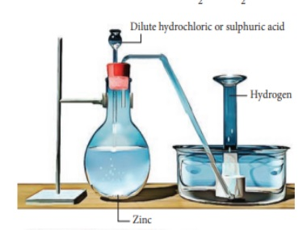

**4.2 Preparation of Hydrogen**

High purity hydrogen (>99.9%) is obtained by the electrolysis of water containing traces of acid or alkali or the electrolysis of an aqueous solution of sodium hydroxide or potassium hydroxide using a nickel anode and iron cathode. However, this process is not economical for large-scale production.

**At anode:**

2 \text{OH}^- \rightarrow \text{H}_2\text{O} + \frac{1}{2} \text{O}_2 + 2e^-


**At cathode:**

2 \text{H}_2\text{O} + 2e^- \rightarrow 2 \text{OH}^- + \text{H}_2


**Overall reaction:**

\text{H}_2\text{O} \rightarrow \text{H}_2 + \frac{1}{2} \text{O}_2


**4.2.1 Laboratory Preparation**

Hydrogen is conveniently prepared in the laboratory by the reaction of metals, such as zinc, iron, tin with dilute acid.


\text{Zn} + 2 \text{HCl} \rightarrow \text{ZnCl}_2 + \text{H}_2\uparrow


**Figure 4.2 Laboratory preparation of hydrogen**  

**4.2.2 Industrial Production**

In large-scale production, hydrogen is produced by steam-reforming of hydrocarbons. In this method, a hydrocarbon such as methane is mixed with steam and passed over a nickel catalyst in the range of 800-900 °C and 35 atm pressures.


\text{CH}_4 + \text{H}_2\text{O} \rightarrow \text{CO} + 3\text{H}_2


In another process, steam is passed over red-hot coke to produce carbon monoxide and hydrogen. The mixture of gases produced in this way is known as _water gas (CO+H2)_, also called syngas (Synthetic gas), used in the synthesis of organic compounds such as methanol and simple hydrocarbons.


\text{C} + \text{H}_2\text{O} \rightarrow \text{CO} + \text{H}_2


**Conversion of Carbon monoxide in water gas to Carbon dioxide:**

The carbon monoxide of the water gas can be converted to carbon dioxide by mixing the gas mixture with more steam at 400°C and passing it over a shift converter containing iron/copper catalyst. This reaction is called the water-gas shift reaction.


\text{CO} + \text{H}_2\text{O} \rightarrow \text{CO}_2 + \text{H}_2


The CO₂ formed in the above process is absorbed in a solution of potassium carbonate.


\text{CO}_2 + \text{K}_2\text{CO}_3 + \text{H}_2\text{O} \rightarrow 2 \text{KHCO}_3


 **4.2.3 Preparation of Deuterium**

**Electrolysis of heavy water:**

Normal water contains 1.6 x 10^-4 percentage of heavy water. The dissociation of protium water H₂O is more than heavy water D₂O. Therefore, when water is electrolyzed, hydrogen is liberated much faster than  D₂. The electrolysis is continued until the resulting solution becomes enriched in heavy water. Further electrolysis of the heavy water gives deuterium.


2\text{D}_2\text{O} \xrightarrow{\text{Electrolysis}} 2\text{D}_2 + \text{O}_2


**4.2.4 Preparation of Tritium**

As explained earlier, tritium is present only in trace amounts. It can be artificially prepared by bombarding lithium with slow neutrons in a nuclear fission reactor. The nuclear transmutation reaction for this process is as follows.


^6_3\text{Li} + ^1_0\text{n} \rightarrow ^4_2\text{He} + ^3_1\text{T}


