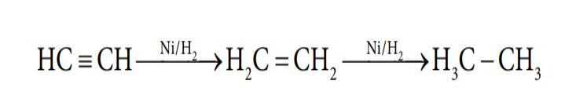

**4.3 Properties of Hydrogen**

**4.3.1 Physical Properties:**

Hydrogen is a colorless, odorless, tasteless, lightest and highly flammable gas. It is a non-polar diatomic molecule. It can be liquefied under low temperature and high pressure. Hydrogen is a good reducing agent. Various physical constants of hydrogen molecule are listed in Table 4.1.

**4.3.2 Chemical Properties:**

Hydrogen reacts with oxygen to give water. This is an explosive reaction and  

releases lot of energy. This is used in fuel cells to generate electricity.


2\text{H}_2 + \text{O}_2 \rightarrow 2\text{H}_2\text{O}


Similarly, hydrogen also reacts with halogens to give corresponding halides. Reaction with fluorine takes place even in dark with explosive violence while with chlorine at room temperature under light. It combines with bromine on heating and reaction with iodine is a photochemical reaction.


\text{H}_2 + \text{X}_2 \rightarrow 2 \text{HX} \quad (X = \text{F, Cl, Br, I})


In the above reactions the hydrogen has an oxidation state of +1. It also has a tendency to react with reactive metals such as lithium, sodium and calcium to give corresponding hydrides in which the oxidation state of hydrogen is -1.


2 \text{Li} + \text{H}_2 \rightarrow 2 \text{LiH}



2 \text{Na} + \text{H}_2 \rightarrow 2 \text{NaH}


These hydrides are used as reducing agents in synthetic organic chemistry. It is used to prepare other important hydrides such as lithium aluminium hydride and sodium boro hydride.


4 \text{LiH} + \text{AlCl}_3 \rightarrow \text{Li}[AlH_4] + 3 \text{LiCl}



4 \text{NaH} + \text{B(OCH}_3)_3 \rightarrow \text{Na}[BH_4] + 3 \text{CH}_3ONa


Hydrogen itself acts as a reducing agent. In the presence of finely divided nickel, it adds to the unsaturated organic compounds to form saturated compounds.

  

**4.3.3 Chemical properties of Deuterium**

Like hydrogen, deuterium also reacts with oxygen to form deuterium oxide called heavy water. It also reacts with halogen to give corresponding halides.


2 \text{D}_2 + \text{O}_2 \rightarrow 2 \text{D}_2\text{O}



\text{D}_2 + \text{X}_2 \rightarrow 2 \text{DX} \quad (X = \text{F, Cl, Br, I})


**Deuterium exchange reactions:**

Deuterium can replace reversibly hydrogen in compounds either partially or completely depending upon the reaction conditions. These reactions occur in the presence of deuterium or heavy water.


\text{CH}_4 + 2 \text{D}_2 \rightarrow \text{CD}_4 + 2 \text{H}_2



2 \text{NH}_3 + 3 \text{D}_2 \rightarrow 2 \text{ND}_3 + 3 \text{H}_2


**4.3.4 Properties of Tritium**

It is a β-emitter with a half-life period of 12.3 years .


^3_1\text{T} \rightarrow ^3_2\text{He} +^0_{-1}\text{e}


