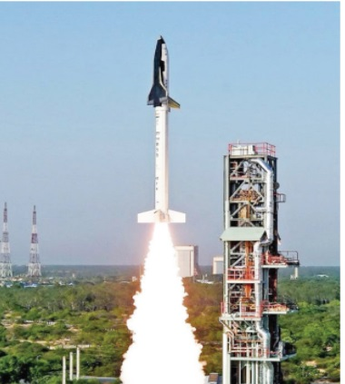

1\. Over 90 % hydrogen produced in industry is used for synthetic applications. One such process is Haber process which is used to synthesis ammonia in large scales. Ammonia is used for the manufacture of chemicals such as nitric acid, fertilizers and explosives.  

N_2 + 3H_2 \xrightleftharpoons[\text{200 atm/Fe}]{\text{380-450°C}} 2NH_3


2\. It can be used to manufacture the industrial solvent, methanol from carbon monoxide using copper as catalyst.


\text{CO} + 2\text{H}_2 \xrightarrow{\text{Cu}} \text{CH}_3\text{OH}


3\. Unsaturated fatty oils can be converted into saturated fats called Vanaspati (margarine) by the reduction reaction with Pt/H₂.

4\. In metallurgy, hydrogen can be used to reduce many metal oxides to metals at high temperatures.


\text{CuO} + \text{H}_2 \rightarrow \text{Cu} + \text{H}_2\text{O}



\text{WO}_3 + 3\text{H}_2 \rightarrow \text{W} + 3\text{H}_2\text{O}


5\. Atomic hydrogen and oxy-hydrogen torches are used for cutting and welding.

6\. Liquid hydrogen is used as a rocket fuel.

7\. Hydrogen is also used in fuel cells for generating electrical energy. The reversible uptake of hydrogen in metals is also attractive for rechargeable metal hydride battery.

  

**Figure 4.3: Application of rocket fuel**