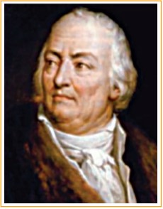

Claude Louis Berthollet, a Savoyard-French chemist, studied the mechanism of reversible chemical reaction and developed the theory of chemical equilibria. He also contributed to modern
chemical nomenclature. He was the first to demonstrate the bleaching action of chlorine gas, and developed a solution of sodium hypochlorite that acts as a bleaching agent.

**Learning Objectives**

After studying this unit, the students will be able to

• describe the meaning of equilibrium

• explain the dynamic nature of equilibrium     involved in physical and chemical processes

• state the law of mass action

• deduce the expression for equilibrium constants,
KC and KP

• establish the relationship between KP
 and KC

• predict the extent of reaction using equilibrium
constant

• state Le-Chatelier’s principle

• explain the effect of various factors that affect a system at equilibrium.

• derive Van't Hoff equation.
