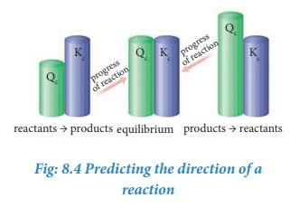

The knowledge of equilibrium constant helps us to
1. predict the direction in which the net reaction will take place
2. predict the extent of the reaction and
3. calculate the equilibrium concentrations of the reactants and products.
It is to be noted that these constants do not provide any information regarding the rates of
the forward or reverse reactions.

8.7.1 Predicting the extent of a reaction

The value of equilibrium constant, Kc
 tells us the extent of a reaction, i.e., it indicates
how far the reaction has proceeded towards product formation at a given temperature.
A large value of Kc
indicates that the reaction reaches equilibrium with high product yield. On the other hand, a low value of Kc
indicates that the reaction reaches equilibrium with low product yield. In general, if the Kc is greater than the 103, the reaction proceeds nearly to completion. If it is less than 10-3, the reaction rarely proceeds. If Kc is in the range 10-3 to103, significant amount of both reactants and products are present at equilibrium. 

**Table 8.2 Dependence of extent of reaction on Kc**

| Value of Kc |Kc  < 10-3 |10-3   < Kc < 103 |Kc  > 103 |
|------|------|------|------|
| Relative concentrations of reactants and products |[Products] << [Reactants] |Signicant quantity of Products and Reactants |[Products] >> [Reactants] |
| Extent of reaction |Reaction makes a little progress in the forward direction |Both the forward and backward reactions  make signicant progress |Reaction nearly goes to completion |
| Prediction |Reverse reaction is favoured |Neither for ward nor reverse reaction predominates |For ward reaction is favoured |
| Examples |Decomposition of water at 500K 2H2O(g)⇌2H2(g)+O2(g) Kc = 4.1 × 10-48 Oxidation of nitrogen at 1000 K N2(g)+O2(g)⇌2NO(g) Kc = 1× 10-30 |Dissociation of bromine monochloride at 1000 K 2BrCl(g)⇌Br2(g)+Cl2(g) Kc = 5 Formation of HI at 700K H2(g)+I2(g) ⇌ 2HI(g)      Kc = 57.0|Formation of HCl at 300K H2(g) + Cl2(g) ⇌ 2HCl (g) Kc = 4 × 1031 Oxidation of carbon monoxide at 1000 K 2CO(g)+O2(g)⇌2CO2(g) Kc = 2.2 × 1022 |

**Example**

Consider the following equilibrium reactions and relate their equilibrium constants

1. N2 + O2 ⇌ 2NO ; K1

2. 2NO + O2 ⇌ 2NO2; K2

3. N2 + 2O2 ⇌ 2NO2; K3
 

K_1 = \frac{[NO]^2}{[N_2][O_2]}            
\newline
K_2 = \frac{[NO_2]^2}{[N_2][O_2]}           
\newline
Now, K_1 × K_2 = \frac{[NO]^2}{[N_2][O_2]} × \frac{[NO_2]^2}{[N_2][O_2]} 
\newline
= \frac{[NO_2]^2}{[N_2][O_2]^2} = K_3
\newline
∴ K_3 = K_1 × K_2

|-----|

8.7.2 Predicting the direction of a reaction

From the knowledge of equilibrium constant, it is possible to predict the direction in which the net reaction is taking place for a given concentration or partial pressure of reactants and products.

Consider a general homogeneous reversible reaction,

xA + yB ⇌ lC + mD
|---------|

For the above reaction under non- equilibrium conditions, reaction quotient ‘Q’ is defined as the ratio of the product of active masses of reaction products raised to the respective stoichiometric coefficients in the balanced chemical equation to that of the reactants.

Under non-equilibrium conditions, the reaction quotient Q can be calculated using the following expression.

Q =[C]l [D]m / [A]x [B]y
|----|

As the reaction proceeds, there is a continuous change in the concentration of reactants and products and also the Q value until the reaction reaches the equilibrium. At equilibrium Q is equal to Kc at a particular temperature. Once the equilibrium is attained, there is no change in the Q value. By knowing the Q value, we can predict the direction of the reaction by comparing it with Kc.

• If Q = Kc, the reaction is in equilibrium state.

• If Q > Kc, the reaction will proceed in the reverse direction i.e., formation of reactants.

• If Q < Kc, the reaction will proceed in the forward direction i.e., formation of products.

Example 1

The value of Kc for the following reaction at 717 K is 48.

Hc(g) + Ic(g) ⇌ 2HI(g)
|----|

At a particular instant, the concentration of H2, I2and HI are found to be 0.2 mol L-1, 0.2 mol L-1 and 0.6 mol L-1 respectively. From the above information we can predict the direction of reaction as follows.

Since Q<Kc, the reaction will proceed in the forward direction.


Q = \frac{[HI]^2}{[H_2][I_2]} = \frac{0.6 \times 0.6}{0.2 \times 0.2} = 9

|----|

Example 2

The value of Kc for the reaction

N2O4 (g) ⇌ 2NO2(g)
|---|

Kc = 0.21 at 373 K. The concentrations N2O4 and NO2 are found to be 0.125 mol dm-3 and 0.5 mol dm-3 respectively at a given time. From the above information we can predict the direction of reaction as follows.


Q = \frac{[NO_2]^2}{[N_2][O_4]} = \frac{0.5 \times 0.5}{-0.125} = 2

|----|

The Q value is greater than Kc. Hence, the reaction will proceed in the reverse direction until the Q value reaches 0.21

**Evaluate Yourself**  

3)The following water gas shift reaction is an important industrial process for the production of hydrogen gas. CO(g) + H2O(g) ⇌ CO2(g) + H2(g) At a given temperature Kp = 2.7. If 0.13 mol of CO, 0.56 mol of water, 0.78 mol of CO2 and 0.28 mol of H2 are introduced into a 2 L flask, and find out in which direction must the reaction proceed to reach equilibrium
|-----|

**8.7.3 Calculation of concentration of reactants and products at equilibrium**

If the equilibrium concentrations of reactants and products are known for a reaction, then the equilibrium constant can be calculated and vice versa.

Let us consider the formation of HI in which, ‘a’ moles of hydrogen and ‘b’ moles of iodine gas are allowed to react in a container of volume V. Let ‘x’ moles of each of H2 and I2 react together to form 2x moles of HI.

H2 (g)+ I2 (g) ⇌ 2HI(g)
|----|

| |H2 |I2 |HI |
|------|------|------|------|
| Initial number of moles |a |b |0 |
| number of moles reacted |x |x |0 |
| Number of moles at equilibrium |a-x |b-x|2x |
| Active mass or molar concentration at equilibrium |a-x/V |b-x/V |2x/V |

Applying law of mass action,

The equilibrium constant Kp can also be calculated as follows:

We know the relationship between the Kc and Kp

Kp = KC(RT)Δng
|----|

Here the

Δng = np – nr = 2 – 2 = 0
|---|

Hence Kp = Kc

Kp = 4x2/(a-x)(b-x)
|----|

**Solved Problem**

One mole of H2 and one mole of I2 are allowed to attain equilibrium in 1 lit container. If the equilibrium mixture contains 0.4 mole of HI. Calculate the equilibrium constant.

**Given data:**

[H2] = 1 mol L-1 [I2] = 1 mol L-1 

At equilibrium, [HI] = 0.4 mol L-1 Kc= ?

**Solution:**

H2(g) + I2(g) ⇌ 2HI(g)

| | H2 |I2 |HI |
|------|------|------|------|
| Initial number of moles |1 |1 |- |
| Number of moles at equilibrium |1-x |1-x |2x = 0.4.x=0.2 |
| | 0.8 |0.8 |0.4 |

**Dissociation of PCl5:**

Consider that ‘a’ moles of PCl5 is taken in a container of volume V. Let ‘x’ moles of PCl5 be dissociated into x moles of PCl3 and x moles of Cl2.  

PCl5(g) ⇌ PCl3(g) + Cl2(g)
|--|

| |PCl5 |PCl3 |Cl2 |
|------|------|------|------|
| Initial number of moles |a |0 |0 |
| number of moles dissociated |x |0 |0 |
| Number of moles at equilibrium |a-x |x |x |
| Active mass or molar concentration at equilibrium |a-x/V |x/V |x/V |

Applying law of mass action,

The equilibrium constant Kp can also be calculated as follows:

We know the relationship between the Kc and Kp

Kp = KC(RT)Δng
|----|

Here the

Δng = np – nr = 2 – 1 = 1
|---|

Hence Kp = Kc (RT)

We know that PV = nRT

RT = PV/n
|----|

Where n is the total number of moles at equilibrium. 

n = (a-x) + x + x = (a+x)

**Synthesis of ammonia:**

Let us consider the formation of ammonia in which, ‘a’ moles nitrogen and ‘b’ moles hydrogen gas are allowed to react in a container of volume V. Let ‘x’ moles of nitrogen react with 3x moles of hydrogen to give 2x moles of ammonia.

N2(g) + 3H2(g) ⇌ 2NH3(g)

| |N2 |H2 |NH3 |
|------|------|------|------|
| Initial number of moles |a |b |0 |
| number of moles reacted |x |3x |0 |
| Number of moles at equilibrium |a-x |b-3x |2x |
| Active mass or molar concentration at equilibrium |a-x/V |b-X/3V |2xV |

Applying law of mass action,

The equilibrium constant Kp can also be calculated as follows:

Kp = KC(RT)Δng
|----|

Δng = np – nr = 2 – 4 = -2
|---|

Total number of moles at equilibrium,

n= a-x + b-3x+ 2x = a+b-2x

**Solved Problems:**

1\. The equilibrium concentrations of NH3, N2 and H2 are 1.8 × 10-2 M, 1.2 × 10-2 M and 3 × 10-2M respectively. Calculate the equilibrium constant for the formation of NH3 from N2 and H2.

\[Hint: M= mol lit-1\]

**Given data:**

\[NH3\] = 1.8 × 10-2 M
|--|
\[N2\] = 1.2 × 10-2 M
\[H2\] = 3 × 10-2 M
KC = ?

**Solution:**

N2(g) + 3H2(g) ⇌ 2NH3(g)

2\. The equilibrium constant at 298 K for a reaction is 100.

A + B ⇌ C + D

If the initial concentration of all the four species is 1 M, the equilibrium concentration of D (in mol lit-1 ) will be

**Given data:**

\[A\] = \[B\] = \[C\]= \[D\] =1 M

Kc  = 100

\[D\]eq = ?

**Solution:**

Let x be the no moles of reactants reacted

| |A |B| C| D|
|--|--|--|--|---|
| Initial concentration |1 |1 |1 |1|
|At equilibrium (as per reaction stoichiometry)|1-x |1-x |1-x |1-x|

**Evaluate Yourself**

4)1 mol of PCl5, kept in a closed container of volume 1 dm3 and was allowed to attain equilibrium at 423 K. Calculate the equilibrium composition of reaction mixture.(The KC value for PCl5 dissociation at 423 K is 2)
|----|

