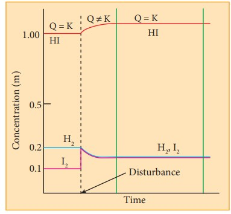
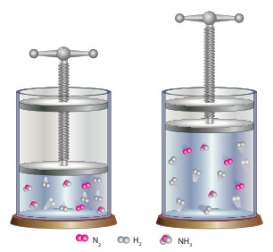

Many chemical reactions that have industrial importance such as synthesis of ammonia are reversible in nature. It is important to know the reaction conditions to produce maximum yield. If a system at equilibrium is disturbed by modifying the reaction conditions, then the system adjusts itself the new conditions to re-establish the equilibrium.

The effect of change in reaction conditions such as temperature, pressure and concentration etc. on a system at equilibrium can be predicted by Le Chatelier-Braun principle.

It states that “If a system at equilibrium is disturbed, then the system shifts itself in a direction that nullifies the effect of that disturbance.”

**8.8. 1 Effect of concentration**

At equilibrium, the concentration of the reactants and the products does not change. The addition of more reactants or products to the reacting system at equilibrium causes an increase in their respective concentrations.

According to Le Chatelier’s principle, the effect of increase in concentration of a substance is to shift the equilibrium in a direction that consumes the added substance.

Let us consider the reaction

H2(g) + I2(g) ⇌ 2HI(g)
|--|

The addition of H2 or I2 to the equilibrium mixture, disturbs the equilibrium. In order to minimize the stress, the system shifts the reaction in a direction where H2and I2 are consumed. i.e., the formation of additional HI would balance the effect of added reactant. Hence, the equilibrium shifts to the right (forward direction) i.e. the forward reaction takes place until the equilibrium is re-established. Similarly, removal of HI (product) also favours the forward reaction.

If HI is added to the equilibrium mixture, the concentration HI is increased, and system proceeds in the reverse direction to nullify the effect of increase in concentration of HI .  

Let us explain the effect change in concentration by considering the formation of HI from H2 and I2. At equilibrium, the concentrations of HI, H2 and I2 are 1 M, 0.2 M and 0.1 M respectively.


K_c = \frac{[HI]^2}{[H_2][I_2]} = \frac{1 \times 1}{0.2 \times 0.1} = 50

|----|

The equilibrium was disturbed by adding 0.1 M iodine to the reaction mixture. After sometime, the concentration of HI is found to be 1.092 M. Let us verify whether the system proceeds to re-establish the equilibrium according to Le Chatelier’s principle.

| |H2 |I2 |HI |
|------|------|------|------|
| Concentration at equilibrium |0.2 |0.1 |1 |
| Disturbance (Addition of 0.1 M iodine) | |+0.1 |
| Concentration immediately afer the addition of iodine |0.2 |0.2 |1 |
| Change in concentration |-x |-x |2x |
| New concentration |0.2-x |0.2-x |1+2x |
  

Now,

Concentration of HI = 1+2x = 1.092 M

2x = 0.092

x = 0.046 M

Therefore, the concentration of hydrogen and iodine at this stage,

[H2] = 0.2 – X = 0.2 -0.046 = 0.154
|---|
[I2] = 0.2 – X = 0.2 -0.046 = 0.154

The reaction quotient Q at this stage,


K_c = \frac{[HI]^2}{[H_2][I_2]} = \frac{1.092 \times 1.092}{0.154 \times 0.154} = 50

|----|

The Q value is equal to Kc value.

So, we can conclude that the system has reestablished the equilibrium at this stage and
the addition of iodine results in the increase in the HI concentration. 

**Do you know?**
In the large scale of production of CaO from CaCO2,constant removal of CO2 from the kiln drives the reaction to completion. As in the case of manufacture of NH3 by the Haber's process, NH3 is liquefied and removed so that the reaction keeps moving in forward direction.
|----|

**8.8.2 Effect of pressure**

The change in pressure has significan gaseous components. When the pressure on th proportionately and the system responds by sh fewer moles of gaseous molecules.

Let us consider the synthesis of ammonia from nitrogen and hydrogen.

N2(g) + 3H2(g) ⇌ 2NH3(g)
|---|

Let the system be allowed to attain
equilibrium in a cylinder with a piston. If
we press the piston down to increase the
pressure, the volume decreases. The system
responds to this effect by reducing the
number of gas molecules. i.e. it favours the
formation of ammonia. If we pull the piston
upwards to reduce the pressure, the volume
increases. It favours the decomposition of
ammonia

 
However, when the total number of the moles of the gaseous reactants and the gaseous products are equal, the change in pressure has no effect on system at equilibrium.

Let us consider the following reaction

H2(g) + I2 (g) ⇌ 2HI(g)
|--|
2 moles of reactants ⇒ 2 moles of products

Here, the number of moles of reactants and products are equal. So, the pressure has no effect on such equilibrium with Δng = 0.  

**8.8.3 Effect of temperature**

If the temperature of a system at equilibrium is changed, the system responds by shifting the equilibrium in the direction that attempts to nullify the effect of temperature.

Let us consider the formation of ammonia.


N_2 (g)+3H_2(g) \rightleftharpoons 2NH_3(g) ΔH=-92.2 kJ


In this equilibrium, the forward reaction is exothermic i.e. heat is liberated while the reverse reaction is endothermic i.e. heat is absorbed.

If the temperature of the system is increased (by supplying heat energy), the system responds by decomposing some of the ammonia molecules to nitrogen and hydrogen by absorbing the supplied heat energy. Similarly, the system responds to a drop in the temperature by forming more ammonia molecules from nitrogen and hydrogen, which releases heat energy.

We have already learnt that the change in pressure or concentration causes a change in the equilibrium concentration such that the equilibrium constant remains the same. However, in case of change in temperature, the equilibrium is reestablished with a different equilibrium constant.

**8.8.4 Effect of a catalyst**

Addition of a catalyst does not affect the state of the equilibrium. The catalyst increases the rate of both the forward and the reverse reactions to the same extent. Hence, it does not change the equilibrium composition of the reaction mixture.

However, it speeds up the attainment of equili lower activation energy. 

For example, in the synthesis of NH3 by Similarly, in the contact process of f manufacturing SO3, platinum or V2O5 is used as a catalyst.

**8.8.5 Effect of inert gas** 

When an inert gas (i.e, a gas which doe equilibrium) is added to an equilibrium system of gases present in the container increases, tha partial pressure of the reactants and the produc addition of inert gas has no effect on equilibrium

Table 8.3: Effect of concentration, pressure, temperature, catalyst and Inert gas on equilibrium

| Condition |Stress |Direction in which equilibrium shifts |
|------|------|------|
| Concentration |Addition of reactants (increase in reactant concentration)  Removal of products (decrease in product concentration)|Forward reaction | 
| | Addition of products (increase in product concentration)  Removal of reactants  (decrease in reactant concentration)  |Reverse reaction |
| Pressure |Increase of pressure (Decrease in volume) Decrease of pressure (Increase in volume) |Reaction that favours fewer moles of the gaseous molecules Reaction that favours more moles of the gaseous molecules |
| Temperature(Alters equilibrium constants) |Increase (High T) decrease (Low T) |Towards endothermic reaction Towards exothermic reaction |
| Catalyst (Speeds up the attainment of equilibrium) |Addition of catalyst |No effect |
| Inert gas |Addition of inert gas at constant volume |No effect |
  