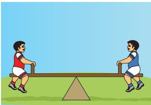

There are different types of equilibrium. For example, if two persons with same weight sit on opposite sides of a see-saw at equal distance from the fulcrum, then the see-saw will be stationary and straight and it is said to be in equilibrium.  

Another example of a state of equilibrium is the game of "tug-of-war." In this game a rope is pulled taut between two teams. There may be a situation when both the teams are pulling the rope with equal force and the rope is not moving in either direction. This state is said to be in equilibrium.

In reversible processes, the rate of two opposing reactions equals at a particular stage. At this stage the concentration of reactants and products do not change with time. This condition is not static and is dynamic, because both the forward and reverse reactions are still occurring with the same rate.

**8.2.1 Physical equilibrium**

A system in which the amount of matter constituting different phases does not change with time is said to be in physical equilibrium. This involves no perceptible physical change in the system. To understand the physical equilibrium let us analyse the following phase changes.

**Solid-liquid equilibrium**

Let us consider the melting of ice in a closed container at 273 K. This system will reach a state of physical equilibrium in which the amount of water in the solid phase and liquid phase does not change with time. In the process the total number of water molecules leaving from and returning to the solid phase at any instant are equal.

If some ice-cubes and water are placed in a thermos flask (at 273K and 1 atm pressure), then there will be no change in the mass of ice and water.

At equilibrium,

Rate of melting of ice = Rate of freezing of water

H2O (s) ⇌ H2O (l)
|------|

The above equilibrium exists only at a particular temperature and pressure. The temperature at which the solid and liquid phases of a substance are at equilibrium is called the melting point or freezing point of that substance.

**Liquid - Vapour equilibrium**

Similarly, there exists an equilibrium between the liquid phase and the vapour phase of a substance. For example, liquid water is in equilibrium with its vapour at 373 K and1 atm pressure in a closed vessel.

H2O (l) ⇌ H2O (g)
|---|

Here

Rate of evaporation = Rate of condensation

The temperature at which the liquid and vapour phases of a substance are at equilibrium is called the boiling point and condensation point of that substance.

**Solid - Vapour equilibrium**

Consider a closed system in which the solid sublimes to vapour. In this process also, equilibrium can be established between these two phases. When solid iodine is placed in a closed transparent vessel, after sometime,the vessel gets filled up with violet vapour due to sublimation of iodine. Initially, the intensity of the violet colour increases, after sometime it decreases and finally it becomes constant, as the following equilibrium is attained.

I2 (s) ⇌ I2(g)
|----|

**More examples**

Camphor (s) ⇌ Camphor (g)
|---|
NH4Cl (s) ⇌ NH4 Cl (g)

**8.2.2 Equilibrium involving dissolution of solids or gases in liquids**

**Solid in liquids**

When you add sugar to water at a particular temperature, it dissolves to form sugar solution. If you continue to add much sugar, you will reach a stage at which the added sugar remains as solid and the resulting solution is called a saturated solution. Here, as in the previous cases a dynamic equilibrium is established between the solute molecules in the solid phase and in the solution phase.

Sugar (Solid) ⇌ Sugar (Solution)
|---|

In this process

Rate of dissolution of solute = Rate of crystallisation of solute

**Gas in liquids**

When a gas dissolves in a liquid under a given pressure, there will be an equilibrium between gas molecules in the gaseous state and those dissolved in the liquid.

**Example:**

In carbonated beverages the following equilibrium exists.

CO2 (g) ⇌ CO2 (Solution)
|---|

Henry’s law is used to explain such gas-solution equilibrium processes.
