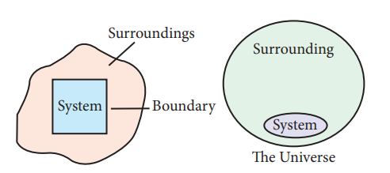
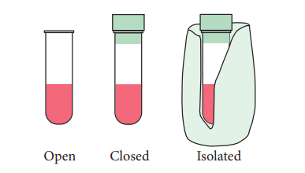

**7.2 System and Surrounding**

Before studying the laws of thermodynamics and their applications, it is important to understand the meaning of a few terms used frequently in thermodynamics.

**System:**

The universe is divided into two parts, the system and its surroundings. The system is the part of universe which is under thermodynamic consideration. It is separated from the rest of the universe by real or imaginary boundaries.

**Figure 7.1 System, surrounding & boundary Homogeneous and heterogeneous systems**

**Example:**

The system may be water in a beaker, a balloon filled with air, an aqueous solution of glucose etc.

On the basis of physical and chemical properties, systems can be divided into two types.

A system is called homogeneous if the physical state of all its constituents are the same. Example: a mixture of gases, completely miscible mixture of liquids etc.

A system is called heterogeneous, if physical state of all its constituents is not the same.

Example: mixture of oil and water

**Surrounding:**

Everything in the universe that is not the part of the system is called surroundings.

**Boundary:**

Anything which separates the system from its surrounding is called boundary.

**7.2.1 Types of systems:**

There are three types of thermodynamic systems depending on the nature of the boundary.

Open Closed Isolated

**Figure 7.2 Types of Systems**  

**Isolated system:**

A system which can exchange neither matter nor energy with its surroundings is called an isolated system. Here boundary is sealed and insulated. Hot water contained in a thermos flask, is an example for an isolated system. In this isolated system both energy (heat) and matter (water vapour) neither enter nor leave the system.

**Closed system:**

A system which can exchange only energy but not matter with its surroundings is called a closed system. Here the boundary is sealed but not insulated. Hot water contained in a closed beaker is an example for a closed system. In this system energy (heat) is transferred to the surroundings but no matter (water vapour) can escape from this system. A gas contained in a cylinder fitted with a piston constitutes a closed system.

**Open system:**

A System which can exchange both matter and energy with its surrounding is called an open system. Hot water contained in an open beaker is an example for open system. In this system both matter (water vapour) and energy (heat) is transferred to the surrounding.

All living things and chemical reactions are open systems because they exchange matter and energy with the surroundings.

**7.2.2 Properties of the system:**

**Intensive and extensive properties**

Some of the properties of a system depend on its mass or size whereas other properties do not depend on its mass or size. Based on this, the properties of a system are grouped as **_extensive_** property and **_intensive_** property.

**Extensive properties:**

The property that depends on the mass or the size of the system is called an extensive property.

**Examples:** Volume, Number of moles, Mass, Internal energy, etc.,

**Intensive properties:**

The property that is independent of the mass or the size of the system is called an intensive property.

**Examples :** Refractive index, Surface tension, density, temperature, Boiling point, Freezing point, molar volume, etc.,

**Table: 7.1 Typical List of Extensive and Intensive properties**
| Extensive properties |Intensive properties |
|------|------|
| volume, mass, amount of substance (mole), energy, enthalpy, entropy, free energy, heat capacity |molar volume, density, molar mass, molarity, mole fraction, molality, specific heat capacity   |

**7.2.3 Thermodynamic processes**

The method of operation which can bring about a change in the system is called thermodynamic process. Heating, cooling, expansion, compression, fusion, vaporization etc., are some examples of a thermodynamic process.

**Types of processes:**

A thermodynamic process can be carried out in different ways and under different conditions. The processes can be classified as follows:

**Reversible process:**

The process in which the system and surrounding can be restored to the initial state from the final state without producing any changes in the thermodynamic properties of the universe is called a reversible process. There are two important conditions for the reversible process to occur. Firstly, the process should occur infinitesimally slowly and secondly throughout the process, the system and surroundings must be in equilibrium with each other.

**Irreversible Process:**

The process in which the system and surrounding cannot be restored to the initial state from the final state is called an irreversible process. All the processes occurring in nature are irreversible processes. During the irreversible process the system and surroundings are not in equilibrium with each other.

**Adiabatic process:**

An adiabatic process is defined as one in which there is no exchange of heat (q) between the system and surrounding during the process. Those processes in which no heat can flow into or out of the system are called **_adiabatic processes._** This condition is attained by thermally insulating the system. In an adiabatic process if work is done by the system its temperature decreases, if work is done on the system its temperature increases, because, the system cannot exchange heat with its surroundings.

For an adiabatic process q = 0

**Isothermal process :**

An isothermal process is defined as one in which the temperature of the system remains constant, during the change from its initial to final state. The system exchanges heat with its surrounding and the temperature of the system remains constant. For this purpose the experiment is often performed in a thermostat.

For an isothermal process dT = 0

**Isobaric process**

An isobaric process is defined as one in which the pressure of the system remains constant during its change from the initial to final state.

For an isobaric process dP = 0 .

**Isochoric process**

An isochoric process is defined as  

the one in which the volume of system remains constant during its change from initial to final state. Combustion of a fuel in a bomb calorimeter is an example of an isochoric process.

For an isochoric process, dV = 0.

**Cyclic process:**

When a system returns to its original state after completing a series of changes, then it is said that a cycle is completed. This process is known as a cyclic process.

For a cyclic process dU = 0, dH = 0, dP=0, dV=0, dT=0

**Table: 7.2 Overview of the process and its condition**
| Process |C ondition |
|------|------|
| Adiabatic |q = 0 |
| Isothermal |dT= 0 |
| Isobaric |dP= 0 |
| Isochoric |dV= 0 |
| Cyclic |dE = 0, dH  = 0, dP =0, dV =0 , dT =0 |

**State functions, path functions:**

**State function**

A thermodynamic system can be defined by using the variables P, V, T and ̀ n'. A state function is a thermodynamic property of a system, which has a specific value for a given state and does not depend on the path (or manner) by which the particular state is reached.

  

**Example :** Pressure (P), Volume (V), Temperature(T), Internal energy (U), Enthalpy (H), free energy (G) etc.

**Path functions:**

A path function is a thermodynamic property of the system whose value depends on the path by which the system changes from its initial to final states.

**Example: Work(w), Heat (q).**

Work (w) will have different values if the process is carried out reversibly or irreversibly.

**Internal Energy (U)**

The internal energy is a characteristic property of a system which is denoted by the symbol U. The internal energy of a system is equal to the energy possessed by all its constituents namely atoms, ions and molecules. The total energy of all molecules in a system is equal to the sum of their translational energy (Ut), vibrational energy (Uv), rotational energy (Ur), bond energy (Ub), electronic energy (Ue) and energy due to molecular interactions (Ui).

**Thus:**

U = Ut + Uv + Ur+ Ub+ Ue+ Ui

The total energy of all the molecules of the system is called internal energy. In thermodynamics one is concerned only with the change in internal energy (ΔU) rather than the absolute value of energy.  

**Importance of Internal energy**

The internal energy possessed by a substance differentiates its physical structure. For example, the allotropes of carbon, namely, graphite (Cgraphite) and diamond (Cdiamond), differ from each other because they possess different internal energies and have different structures.

**Characteristics of internal energy (U):**

• The internal energy of a system is an extensive property. It depends on the amount of the substances present in the system. If the amount is doubled, the internal energy is also doubled.

• The internal energy of a system is a state function. It depends only upon the state variables (T, P, V, n) of the system. The change in internal energy does not depend on the path by which the final state is reached.

• The change in internal energy of a system is expressed as ΔU= Uf – Ui

• In a cyclic process, there is no internal energy change. ΔU(cyclic) = 0

• If the internal energy of the system in the final state (Uf) is less than the internal energy of the system in its initial state (Ui), then ΔU would be negative.

ΔU=Uf − Ui = −ve (Uf Ui)

• If the internal energy of the system in the final state (Uf) is greater than the internal energy of the system in its initial state(Ui), then ΔU would be positive.

ΔU=Uf − Ui = +ve (Uf \> Ui)
