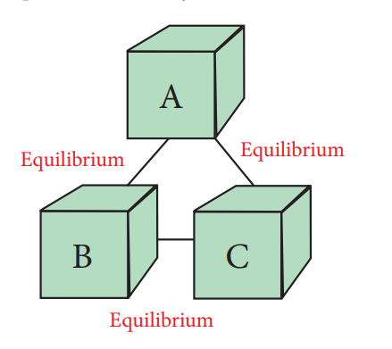

**7.3 Zeroth law of thermodynamics:**

The zeroth law of thermodynamics, also known as the law of thermal equilibrium, was put forward much after the establishment of the first and second laws of thermodynamics. It is placed
  

before the first and second laws as it provides a logical basis for the concept of temperature of the system.

**Figure : 7.5** **Zeroth law of thermodynamics:**

The law states that \`If two systems are separately in thermal equilibrium with a third one, then they tend to be in thermal equilibrium with themselves'.

According to this law, if systems B and C separately are in thermal equilibrium with another system A, then systems B and C will also be in thermal equilibrium with each other. This is also the principle by which thermometers are used.
